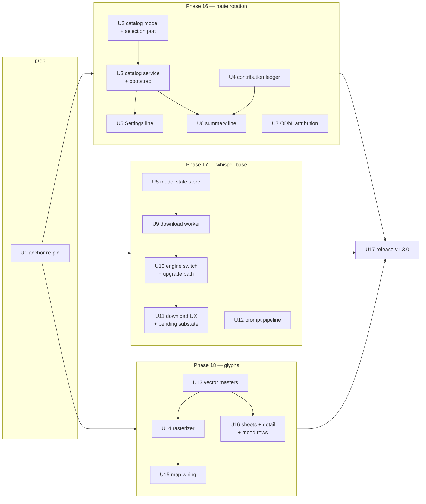

# feat: iOS v1.9.0 parity port — route rotation, whisper base, map glyphs

## Summary

Port iOS v1.9.0's three features as Phases 16–18 in 17 dependency-ordered units, each iOS-facing unit preceded by an `/ios-parity port` spec pinned at `9a418e4`. Route rotation ports the fmix32 daily-selection math pinned against the shared iOS/web test vectors and mirrors the voice-guide manifest-service pattern plus a new bundled-bootstrap layer; the Whisper tiny→base switch builds a dedicated resumable download worker and a probe-based model-state repository feeding a new pending-UI substate; map glyphs import the eight vector masters as VectorDrawables and rasterize them through the existing waypoint-bitmap seam. Everything ships in a single Android v1.3.0 release.

---

## Problem Frame

Android v1.2.0 sits at exact parity with iOS `c1745e8`; iOS has since shipped v1.9.0 (collective route rotation, whisper base + prompt pipeline, SVG map glyphs). Full framing, feature inventory, and the re-triage decision live in the origin document.

---

## Requirements

Carried from origin (see origin: docs/brainstorms/2026-07-22-ios-v190-parity-retarget-requirements.md):

- R1. Re-pin the frozen parity anchor to `pilgrim-ios` @ `9a418e4`; update `CLAUDE.md`, the `ios-parity` skill anchor, and stale references.
- R2. The fold-in rule carries forward: pre-release iOS deltas re-diff and triage into owning phases; headline features/reverts/redesigns go to user re-triage.
- R3. Phase 16 ports the end-state route rotation: daily selection, bundled + fetched/cached catalog, contribution ledger, attribution, live Settings line.
- R4. The bundled route catalog is reused from the iOS repo's assets, not re-generated.
- R5. Same backend contract as iOS; fetch failure or empty response falls back to the bundled catalog.
- R5a. Android's daily-route selection passes iOS's cross-implementation parity vectors (`CollectiveRouteCatalogTests`: 62 webPicks/webLines vectors + the two-route fixture) plus a month-agreement check against the production artifact.
- R6. Model bumps tiny→base at full precision — multilingual `ggml-base` matching iOS's `openai_whisper-base`; tier-level quality parity; no quantized variant at ship, subject to the R14 low-RAM gate.
- R7. Delivery switches to on-demand download: first-launch trigger, unmetered-by-default with an explicit cellular affordance, byte progress surfaced, variant-keyed storage, stale tiny cleanup.
- R8. Recordings persist and transcription queues until the model lands; the pending UI distinguishes "waiting on model download" from "queued for processing".
- R9. Prompt-pipeline upgrade ports onto `core/prompt`: shared standard preamble, walk-character note, attend-to directives, practice lexicon, response contract, pauses/elevation/light-crossings context.
- R10. Eight vector masters ported from iOS assets and rasterized for Mapbox (Android analogue of `MapGlyphImageBuilder`); spec sources: iOS `docs/brainstorms/2026-07-21-svg-map-glyphs-requirements.md` + `docs/plans/2026-07-21-001-feat-svg-map-glyphs-plan.md`.
- R11. Glyph surfaces match iOS at the pin: map whispers/cairns, add-a-stone sheet (becoming tier), cairn detail, whisper mood rows, including the #57 size doubling.
- R12. Every stage gets an `/ios-parity port` spec with Swift quotes pinned to `9a418e4` before implementation.
- R13. Unit tests per house rules, including the platform-object builder Robolectric rule for the download surface.
- R14. Consolidated per-phase device QA (OnePlus 13); Phase 17 adds the fresh-install offline path, the v1.2.0→v1.3.0 upgrade path, and the transcription envelope on a low-RAM device; Phase 18 adds a forced-density check.
- R15. Single v1.3.0 release; Android versioning independent of iOS.

**Origin acceptance examples:** AE1 (fresh install offline → recordings transcribe when model lands; covers R7/R8), AE2 (v1.2.0 upgrade routes through base download, no data loss; covers R7), AE3 (tag-time delta folds in; covers R2), AE4 (catalog fetch failure degrades invisibly; covers R5).

---

## Scope Boundaries

Carried from origin: anything iOS ships after `9a418e4` except R2 fold-ins; iOS-only chores; quantized variants (contingency only, gated on the R14 low-RAM validation); a bundled tiny fallback (download replaces bundling wholesale); WhisperKit/CoreML mechanics (parity is behavioral, not architectural).

Plan-local:

- No conversion of existing waypoint/photo pins to Mapbox named style images — glyphs stay on the per-annotation-bitmap path.
- No Mapbox SDK version bump — existing annotation and bitmap APIs suffice; the deferred 16 KB alignment warning stays deferred.
- No Room schema change expected — the contribution ledger lives in DataStore, mirroring iOS's device-local UserDefaults; revisit only if the R12 spec contradicts this.
- No share-payload/`PilgrimPackageConverter` changes — the ledger is a local surface, not a walk field (audited in U4; escalate if the parity spec adds walk fields).

### Deferred to Follow-Up Work

- Backend/worker changes: none required — the catalog artifact and counter contract already serve iOS; publishing `ggml-base` to the CDN is an operational step in U17, not code.
- Any fold-in deltas from the R2 re-diff at release time: routed to owning phases per origin R2.

---

## Context & Research

### Relevant Code and Patterns

- `app/src/main/java/org/walktalkmeditate/pilgrim/data/voiceguide/VoiceGuideManifestService.kt` — CDN fetch + filesDir JSON cache (atomic tmp+rename, version-gated rewrite), `initialLoad: Deferred<Unit>`, `compareAndSet` sync dedup. Template for the catalog service (U3); the bundled-bootstrap tier is new.
- `data/voiceguide/VoiceGuideDownloadWorker.kt` / `VoiceGuideDownloadScheduler.kt` — worker/scheduler shape (unique work KEEP, `.tmp` + atomic rename, `observe(): Flow`). Constraints are hardcoded `CONNECTED`; progress is file-count; verification is size-only — all three change for the model download (U9).
- `data/voiceguide/VoiceGuidePackState.kt` + `VoiceGuideCatalogRepository` — `@Immutable` sealed state composed from filesystem × DataStore × WorkManager overlay; the pattern for `WhisperModelState` (U8).
- `audio/WhisperModelInstaller.kt` — the bundled-asset installer this plan deletes; its probe-based "presence = file + expected size" philosophy carries into U8.
- `audio/WhisperCppEngine.kt` (`ensureLoaded` under `nativeLock`), `audio/TranscriptionScheduler.kt` (expedited unique `transcribe-walk-<id>`, KEEP), `audio/TranscriptionRunner.kt` (`ModelLoadFailed` → retry) — the transcription stack U10 rewires.
- `ui/walk/VoiceRecordingsSection.kt` (renders `transcription_pending` when `transcription == null`) — the surface gaining the substate matrix (U11).
- `data/collective/CollectiveRepository.kt` — fetch mutex + TTL, opt-in gate, pending-delta ledger with clamp semantics; `recordWalk` is the single decision point U4 extends.
- `ui/settings/PracticeSummaryHeader.kt` (`collectiveStatsLine`), `ui/settings/SettingsViewModel.kt` — the Settings line swap site (U5).
- `ui/walk/PilgrimMap.kt` — `renderWaypointGlyphBitmap` (VectorPainter → bitmap), `rememberWhisperGlyphBitmaps` / `rememberCairnGlyphBitmap` (the swap sites), `LaunchedEffect(mapView, styleUri)` teardown + rebuild gates, 3s style-timeout fade-in.
- `ui/walk/StonePlacementSheet.kt`, `CairnDetailSheet.kt`, `WhisperPlacementSheet.kt` — the three sheet surfaces (U16).
- `data/PilgrimDatabase.kt` — Room v8; untouched by this plan.
- `data/seek/DataStoreSeekPreferencesRepository.kt` — DataStore repo pattern with iOS-verbatim keys; template for the ledger (U4).
- `app/src/test/java/org/walktalkmeditate/pilgrim/audio/WorkManagerTranscriptionSchedulerTest.kt` — the platform-object builder Robolectric precedent U9's scheduler test mirrors.

### Institutional Learnings

- Expedited + BatteryNotLow crashed at runtime through 6 review cycles because fakes hid the builder — every new WorkRequest gets a Robolectric `.build()` test (CLAUDE.md convention; Stage 2-F memory).
- Stage 5-D download lessons: terminal-state handlers re-read the filesystem (reactive-join staleness); workers `.await()` `initialLoad` after process death; delete paths drive through the same path function as writes; cancel in-flight producers before deleting output; long-lived `collect {}` bodies defend every suspend call.
- Stage 8-B collective lessons: TTL bypass inside the fetch mutex; clear pending only on all-fields-empty; `ReplaceFileCorruptionHandler` + `CoroutineExceptionHandler` on every DataStore factory; Cloudflare edge caches GETs up to ~3h.
- Stage 13-B/13-D Mapbox lessons: style reload drops annotation managers and must reset every rebuild gate (the same bug shipped three times); bitmap caches keyed on exactly the inputs the draw reads.
- Stage 6-A/3-D determinism lessons: hand-verify ported constants against the canonical source; `require` fail-fast over silent degeneration; UTC-vs-local encoded in the type; `Locale.US`/`Locale.ROOT` for anything entering a hash or URL.
- OEM-kill memory: OxygenOS kills backgrounded processes regardless of WorkManager — long downloads must resume, not restart.
- CI flake policy: timing-sensitive tests use `TestRealTimeDispatcher` / `FakePreferencesDataStore`; never widen timeouts.

### External References

- iOS `docs/plans/2026-07-18-001-feat-collective-route-rotation-plan.md` — selection algorithm shape, fixture-bound vector warning, canonical pool order, manifest-service mirroring rationale.
- iOS `docs/plans/2026-07-21-001-feat-svg-map-glyphs-plan.md` — asset workflow, builder pattern, tier thresholds (3/7/12/42/77/108), becoming-tier semantics, square-canvas sizing rule.
- `../pilgrim-landing/js/collective-routes.js` + `js/collective-routes.test.js` — the canonical algorithm and its pinned vectors.

---

## Key Technical Decisions

- **Model hosted on the existing Cloudflare R2 CDN** (`cdn.pilgrimapp.org`), published via the documented manual `wrangler r2 object put` form (same as the whisper manifest and routes artifact): zero egress fees, no third-party availability dependency, SHA-256 + byte size pinned in app config. Rejected: upstream whisper.cpp model hosts (rate limits, availability outside our control).
- **Dedicated download worker, not the voice-guide pipeline**: the pack pipeline's file-count progress, hardcoded `CONNECTED` constraint, and size-only verification all mismatch a single 148MB checksum-verified transfer. The new worker reuses the pipeline's *patterns* (unique work KEEP, atomic rename, `initialLoad` await) with byte progress, `UNMETERED` default, and streamed SHA-256.
- **HTTP Range resume with a persisted partial** — a deliberate divergence from the house tmp-delete-on-cancel pattern: WorkManager stoppage (OEM kill, constraint drop) surfaces as cancellation, and restarting 148MB from byte 0 on OxygenOS-class devices may never converge. Partial deleted only on checksum mismatch or ETag change.
- **Plain worker, no dataSync foreground service, no system notification**: expedited quota can't cover 148MB; a dataSync FGS adds a manifest type and Android 15's 6h/day cap. WorkManager reschedule + Range resume gives OEM-kill survivability without either. Progress lives in-app (pending rows + Settings), matching iOS's quiet download.
- **Upgrade path keeps tiny serving until base is verified**: the installed tiny in filesDir survives the app upgrade even though the APK no longer bundles it; the engine's variant resolver prefers verified base but transitionally accepts the legacy tiny file, so upgraders have zero no-model window and the pre-upgrade backlog keeps transcribing. Tiny is deleted only after the atomic switch (strengthens AE2).
- **Model-ready re-kick with REPLACE**: `transcribe-walk-<id>` retries back off up to 5h, and KEEP makes re-enqueue a no-op against a backoff chain — on download success the worker re-enqueues pending walks with REPLACE (gated on the auto-transcribe preference). Retranscribe affordances are disabled unless the model is READY, because they null the transcript before scheduling.
- **Model presence is a filesystem probe, never a flag**: device-to-device transfer and partial restores can deliver DataStore state without the file (or vice versa); probe = file exists + expected size/SHA marker, preserving the installer's philosophy.
- **Per-annotation bitmaps for glyphs, not named style images**: the literal `MapGlyphImageBuilder` translation (style.addImage) dies on every style reload — a documented triple-shipped bug class. The annotation plugin owns image lifecycles; only the bitmap *source* changes.
- **Glyph rasterization at dp × display density**: the existing fixed-px `Density(1f)` convention renders ~2× oversized on mdpi and undersized on 640dpi; the doubled #57 sizes magnify the spread. New glyphs rasterize density-correct; existing waypoint/photo pins are out of scope.
- **Ledger in DataStore with iOS-verbatim keys** at the same decision point that queues the POST (`recordWalk`'s opt-in read), day-anchored to the walk-start UTC date: one decision point keeps ledger and counter consistent under toggle races; the walk-start anchor keeps a midnight-spanning walk on the route its walker saw. Summary resolution matches iOS (live catalog by walk date, no snapshot) — catalog-roster drift on old walks is iOS-accepted behavior.
- **Catalog service mirrors `VoiceGuideManifestService` + a bundled-bootstrap tier**: three-tier precedence (fetched > cached > bootstrap), content-version `!=` compare so rollbacks apply, corrupt cache falls back to bootstrap. This creates the repo's first bundled-JSON + CDN-overlay pattern.

---

## Open Questions

### Resolved During Planning

- Model download host: `cdn.pilgrimapp.org` R2 mirror (see Key Technical Decisions).
- Voice-guide pipeline reuse vs dedicated path: dedicated worker/scheduler, patterns reused (see Key Technical Decisions).
- Route catalog cache location: filesDir JSON mirroring the manifest services, not Room/DataStore.
- Vector asset format: direct SVG→VectorDrawable translation — the masters' flat-vector subset (iOS plan R8) maps 1:1 onto viewport attributes and `pathData`; Android Studio's Vector Asset Studio is an optional cross-check only (not installed in this environment). Rasterization through the existing VectorPainter seam.
- Day anchor and ledger truth condition: walk-start UTC date; "contributed" = opted-in and queued at finalize (verified against the R12 spec in U4).

### Deferred to Implementation

- Base-model performance envelope numbers: latency + peak memory on OnePlus 13 and a low-RAM device, measured in U10 against the tiny baseline (3 recordings / 12s); quantized base is the pre-agreed contingency if the envelope fails (origin Scope Boundaries).
- whisper.cpp language parameter for the multilingual model (pin to iOS's WhisperKit behavior in the U10 spec — auto-detect vs forced English).
- Exact per-tier raster sizes and the #57 doubling ratios: tuned on device once U13 assets exist, per the parity spec's threshold table.
- Whether iOS's fresh-install nil-collective-total handling suppresses or reshapes the Settings line: the U5 spec quotes the shipped Swift and Android matches it.
- ETag/If-Range support on the R2 CDN for resume: verified against the real endpoint during U9; fallback is restart-from-zero with the partial discarded.

---

## High-Level Technical Design

> *This illustrates the intended approach and is directional guidance for review, not implementation specification. The implementing agent should treat it as context, not code to reproduce.*

**Unit dependency graph:**



The three phases are mutually independent and can proceed as parallel tracks; U12 and U7 are independent within their phases.

**Model delivery state machine (directional):**

```
ABSENT → ENQUEUED → WAITING_UNMETERED ⇄ DOWNLOADING(bytes/total) → VERIFYING → READY
                          ↓ (precheck)                                ↓ (mismatch, attempt cap)
                    FAILED_STORAGE                                  FAILED_CHECKSUM(terminal, user retry)
Transient network failures are not a state: the worker returns retry, WorkManager backs off
internally, and the UI re-presents ENQUEUED/WAITING_UNMETERED until bytes flow again.
Upgrade overlay: legacy tiny serves the engine in every pre-READY state; atomic switch + tiny delete on READY.
```

---

## Implementation Units

**Parity-spec workflow (R12):** for every unit that ports an iOS surface (U2–U16), the implementer authors the `/ios-parity port` spec — shipped-Swift quotes pinned to `9a418e4`, landed in `docs/parity/` — as the first step of that unit, before any Kotlin. U1 and U17 carry no Swift surface and need no spec.

### U1. Anchor re-pin and fold-in machinery

**Goal:** The frozen parity anchor is `9a418e4` everywhere tooling and docs read it, and the fold-in rule is live for the v1.3.0 window.

**Requirements:** R1, R2

**Dependencies:** None

**Files:**
- Modify: `CLAUDE.md` (parity-scope section, phasing note)
- Modify: `docs/parity/2026-05-15-parity-ledger.md` (anchor note)

**Approach:**
- Update the parity-scope block to name `9a418e4` (2026-07-21) and the Phases 16–18 scope; carry the R2 fold-in wording forward with v1.3.0 as the gate.
- Operational (outside the repo, same session): update the `ios-parity` skill's pinned anchor and the project memory entries that name `c1745e8` as current.

**Test scenarios:**
- Test expectation: none — documentation/config only.

**Verification:**
- No doc or skill description still names `c1745e8` as the *current* target (historical references stay).

---

### U2. Route catalog model and daily selection port

**Goal:** A pure, deterministic Kotlin selection + phrasing layer that provably agrees with iOS and the web.

**Requirements:** R3, R5a

**Dependencies:** U1 (spec pin). Developable against the web fixture before U3 exists.

**Files:**
- Create: `app/src/main/java/org/walktalkmeditate/pilgrim/data/collective/routes/CollectiveRoute.kt`
- Create: `app/src/main/java/org/walktalkmeditate/pilgrim/data/collective/routes/CollectiveRouteCatalog.kt`
- Create: test fixtures under `app/src/test/resources/collective/` (web two-route fixture + production artifact snapshot)
- Test: `app/src/test/java/org/walktalkmeditate/pilgrim/data/collective/routes/CollectiveRouteCatalogTest.kt`

**Approach:**
- Port the web algorithm faithfully: UTC-day seed from date components, fmix32 scramble verbatim, seasonal weighting with the peak bonus gated behind the in-season bonus, weighted pool in canonical order (routes sorted by identifier ascending, horizons appended in artifact order — a curator reorder must not desync surfaces).
- Routes and horizons decode as separate arrays, concatenated into one entry type with an explicit kind; lossy decode drops unparseable entries and keeps the rest (kotlinx.serialization).
- Selection and phrasing live on the catalog type (predicates-on-the-struct convention, mirrored from iOS); contribution phrasing is a second function on the same type so both surfaces derive from one source.
- All eight phrasing branches; only the sub-one-percent horizon branch renders a distance, and it goes through the existing measurement formatting with the pilgrim's unit preference.
- Break the weighting arithmetic into named intermediates; `Locale.ROOT`/`Locale.US` for anything entering the seed.

**Execution note:** Test-first — the pinned vectors exist before any Kotlin does. Port both fixtures: the web's two-route fixture (which owns the single published pick and the October distribution count) and the production-artifact snapshot (which owns the 62 webPicks/webLines, per iOS's `CollectiveRouteCatalogTests`). Pairing a vector with the wrong fixture is the documented most-likely first failure.

**Patterns to follow:**
- `domain/seek/SeekChainGeneratorTest.kt` — the cross-platform invariant-pinning test style.
- iOS `UnitTests/CollectiveRouteCatalogTests.swift` at the pin — the authoritative vector list.

**Test scenarios:**
- Happy path (covers R5a): the 62 webPicks/webLines vectors pass unmodified against the production-artifact snapshot fixture, entry-for-entry across both pinned months (Oct 2026 + Jan 2027) — the same fixture iOS's `CollectiveRouteCatalogTests` asserts them against.
- Happy path: the two-route fixture reproduces the web's published vector (7 Oct 2026 → Kumano Kodo) and its October in-season distribution count.
- Happy path: same UTC date → same entry across repeated calls; two timestamps in different local zones on the same UTC day → same entry.
- Happy path: shuffling input array order does not change selection.
- Happy path: each phrasing branch (multiple completions, single completion, percentage, horizon ≥1%, horizon reached once/multiple, sub-1% horizon with unit formatting, zero-distance beginning).
- Edge case: consecutive UTC days differ often enough that the scramble is demonstrably working.
- Edge case: peak-month-but-not-best-month confers no bonus; empty catalog returns no entry; horizons-only catalog still selects.
- Error path: unrecognized kind dropped, rest still decodes and selects; entry missing its distance dropped without failing the catalog.

**Verification:**
- Parity vectors green with no Android-side tolerance; fixture list matches iOS's test file at the pin.

---

### U3. Catalog service: bundled bootstrap + CDN fetch/cache

**Goal:** The catalog is available offline from first launch and refreshes from the CDN without touching the launch path's latency.

**Requirements:** R3, R4, R5

**Dependencies:** U2

**Files:**
- Create: `app/src/main/java/org/walktalkmeditate/pilgrim/data/collective/routes/CollectiveRouteCatalogService.kt`
- Create: `app/src/main/assets/collective/collective-routes-bootstrap.json` (copied from the iOS repo's bundled artifact — R4)
- Modify: `app/src/main/java/org/walktalkmeditate/pilgrim/di/NetworkModule.kt` (or a sibling module) for providers
- Test: `app/src/test/java/org/walktalkmeditate/pilgrim/data/collective/routes/CollectiveRouteCatalogServiceTest.kt`

**Approach:**
- Mirror `VoiceGuideManifestService`: filesDir JSON cache with atomic tmp+rename, content-version `!=` gate (rollback applies), `initialLoad: Deferred<Unit>`, `compareAndSet` sync dedup, `Eagerly` + `.catch` StateFlow.
- New third tier: bundled-asset bootstrap under the cache — precedence fetched > cached > bootstrap; corrupt cache falls back to bootstrap, not empty.
- CDN URL constant for `https://cdn.pilgrimapp.org/collective/routes.json` (watch the voice-guide double-path 404 trap); Cloudflare ~3h edge staleness accepted — resolution behavior matches iOS (live catalog, no per-day pinning).

**Execution note:** Test-first on the three-tier precedence — the hardest behavior to notice regressing by hand (iOS plan's own call).

**Patterns to follow:**
- `data/voiceguide/VoiceGuideManifestService.kt` and its test — structure, atomicity, initial-load await.

**Test scenarios:**
- Happy path: no cache → bootstrap serves; cache present → beats bootstrap; fetched version-differs → replaces cache and publishes.
- Edge case: equal version no-op; older version applies (rollback); lookups before `initialLoad` return empty without blocking.
- Error path (covers AE4): failed/non-success fetch keeps the current catalog; corrupt cached file falls back to bootstrap.
- Error path (covers R5): a successful fetch whose catalog decodes to zero entries keeps the current catalog, matching the iOS service behavior quoted in the parity spec.

**Verification:**
- Airplane-mode fresh install resolves a daily route from the bootstrap.

---

### U4. Contribution ledger

**Goal:** "This walk was contributed" is a durable per-walk fact recorded at the same instant the contribution is queued, with the walk-start UTC date as its anchor.

**Requirements:** R3

**Dependencies:** U1 (spec pin); independent of U2/U3.

**Files:**
- Create: `app/src/main/java/org/walktalkmeditate/pilgrim/data/collective/routes/ContributionLedger.kt`
- Modify: `app/src/main/java/org/walktalkmeditate/pilgrim/data/collective/CollectiveRepository.kt` (`recordWalk` decision point)
- Modify: `app/src/main/java/org/walktalkmeditate/pilgrim/di/` (qualified DataStore provider)
- Test: `app/src/test/java/org/walktalkmeditate/pilgrim/data/collective/routes/ContributionLedgerTest.kt`

**Approach:**
- DataStore-backed, storage keys verbatim from the iOS spec (house pattern: cross-platform key parity); `ReplaceFileCorruptionHandler` + `CoroutineExceptionHandler` per the collective-store convention.
- Written inside `recordWalk` at the same opt-in read that queues the POST — one decision point, so the ledger and the counter cannot diverge under toggle races; ledger truth is "opted-in and queued", independent of POST outcome (an offline finish still earns the line).
- Entry carries the walk-start UTC date so a midnight-spanning walk resolves the route its walker saw.
- Audit during implementation: confirm the R12 spec adds no walk-entity fields; if it does, the share-payload/`PilgrimPackageConverter` surface joins this unit (Stage 12 lesson).

**Patterns to follow:**
- `data/seek/DataStoreSeekPreferencesRepository.kt` — iOS-verbatim keys, Eagerly + catch.
- `data/collective/CollectiveCacheStore.kt` — qualified DataStore + JSON-string values.

**Test scenarios:**
- Happy path: contributed walk records with its start-date anchor; non-contributed walk records nothing.
- Edge case: opt-in toggled off after contribution — ledger entry (and the summary line) persists.
- Edge case: toggle-timing matrix (on→off and off→on around finalize) — ledger agrees with what was actually queued in all four cells.
- Edge case: walk crossing UTC midnight anchors to the start date.
- Error path: corrupted DataStore file returns empty preferences, no crash.

**Verification:**
- Ledger and pending-POST queue agree after every cell of the toggle matrix.

---

### U5. Settings line swap

**Goal:** The Settings header renders the day's route entry, live to unit-preference changes, replacing the current static collective line content.

**Requirements:** R3

**Dependencies:** U2, U3

**Files:**
- Modify: `app/src/main/java/org/walktalkmeditate/pilgrim/ui/settings/PracticeSummaryHeader.kt`
- Modify: `app/src/main/java/org/walktalkmeditate/pilgrim/ui/settings/SettingsViewModel.kt`
- Test: existing settings VM/section tests extended

**Approach:**
- Per the U5 parity spec: the line renders the day's entry with progress phrased against the collective total; renders nothing until both the catalog and the collective total are available (iOS end-state — the offline-fresh-install nil-total handling is quoted from shipped Swift and matched exactly).
- Unit preference formatting through the existing measurement path (`Locale.US` numerics); explicit truncation contract (line limit + scale factor) since phrasing is curator-editable after ship.

**Test scenarios:**
- Happy path: catalog + stats present → day's entry renders; matches U2's phrasing for the same inputs.
- Edge case: stats null (fresh install offline) → the iOS-specified degraded state, pinned by test.
- Edge case: unit toggle updates the line without leaving the screen; UTC day change re-resolves.

**Verification:**
- Same UTC date shows the same entry as the web and iOS (spot-check against the production artifact).

---

### U6. Walk summary collective line

**Goal:** A contributed walk's summary places its distance against the day's entry; a non-contributed walk shows nothing.

**Requirements:** R3

**Dependencies:** U2, U3, U4

**Files:**
- Create: `app/src/main/java/org/walktalkmeditate/pilgrim/ui/walk/CollectiveTrailSection.kt`
- Modify: `app/src/main/java/org/walktalkmeditate/pilgrim/ui/walk/WalkSummaryScreen.kt`
- Modify: `app/src/main/java/org/walktalkmeditate/pilgrim/ui/walk/WalkSummaryViewModel.kt`
- Test: `app/src/test/java/org/walktalkmeditate/pilgrim/ui/walk/CollectiveTrailSectionTest.kt`

**Approach:**
- New section component, conditionally rendered; gate is a pure function of (ledger entry for this walk, catalog loaded) — unit-testable without a view.
- Resolution anchored to the walk's own start-date UTC entry against the current catalog (matches iOS; roster-drift on old walks is iOS-accepted behavior).
- The line renders without the collective total (walk distance + baked company sentence — iOS end-state); positioned and revealed per the parity spec (subordinate to the personal milestone, second-beat reveal, reduced-motion honored); own truncation contract; new models `@Immutable`.

**Test scenarios:**
- Happy path: contributed walk → gate true; non-contributed → false; contributed but catalog not loaded → false (no partial line).
- Happy path: personal milestone and collective line render together when both apply.
- Edge case: walk reopened weeks later resolves its own start date's entry, not today's.
- Edge case: midnight-spanning walk uses the start day.
- Edge case: horizon entries produce a line (every kind phrases).

**Verification:**
- Contributed walk shows the line after the milestone beat; disabling contribution *before* a walk hides it for that walk only.

---

### U7. ODbL attribution

**Goal:** The route dataset is attributed in Settings → About → Data Sources.

**Requirements:** R3

**Dependencies:** None

**Files:**
- Modify: `app/src/main/java/org/walktalkmeditate/pilgrim/ui/settings/about/AboutScreen.kt`

**Approach:**
- Entry matching the existing Open-Meteo attribution's structure (prose + link, in-app browser handling per the existing pattern).

**Test scenarios:**
- Test expectation: none — static content.

**Verification:**
- Reachable in the same tap depth as the weather attribution.

---

### U8. Model state store and variant resolver

**Goal:** A single probe-based source of truth for "which model is usable, and what is the download doing", feeding the engine, the worker, and the UI.

**Requirements:** R6, R7

**Dependencies:** U1 (spec pin)

**Files:**
- Create: `app/src/main/java/org/walktalkmeditate/pilgrim/audio/model/WhisperModelState.kt`
- Create: `app/src/main/java/org/walktalkmeditate/pilgrim/audio/model/WhisperModelStore.kt`
- Create: `app/src/main/java/org/walktalkmeditate/pilgrim/audio/model/WhisperModelConfig.kt` (variant name, expected SHA-256 + byte size, CDN URL)
- Modify: `app/src/main/java/org/walktalkmeditate/pilgrim/di/TranscriptionModule.kt`
- Test: `app/src/test/java/org/walktalkmeditate/pilgrim/audio/model/WhisperModelStoreTest.kt`

**Approach:**
- `@Immutable` sealed state (Absent / Enqueued / WaitingUnmetered / Downloading(bytes, total) / Verifying / Ready / FailedChecksum / FailedStorage) composed from filesystem probe × WorkInfo × a ConnectivityManager unmetered-availability read — WorkInfo alone can't distinguish "waiting for Wi-Fi" from "starting". Transient network failures are deliberately not a sealed state: the worker retries internally and the flow re-presents Enqueued/WaitingUnmetered; only checksum and storage failures are user-actionable terminals.
- Presence is a filesystem probe (file + size/SHA marker), never a DataStore flag — D2D transfers and partial restores deliver inconsistent halves.
- Variant-keyed layout under `filesDir/whisper-model/`; `readyModelPath()` prefers verified base and transitionally accepts the legacy tiny file when base isn't READY (upgrade window).

**Patterns to follow:**
- `data/voiceguide/VoiceGuidePackState.kt` + `VoiceGuideCatalogRepository` — the composition pattern.

**Test scenarios:**
- Happy path: verified base file → Ready(base); legacy tiny only → Ready(tiny, transitional); neither → Absent.
- Edge case: marker present but file missing (restore artifact) → Absent; file present but size mismatch → Absent.
- Edge case: WorkInfo ENQUEUED + no unmetered network → WaitingUnmetered; with unmetered → Enqueued.
- Happy path: byte progress from the worker surfaces through the state flow.

**Verification:**
- "Clear app storage" produces a clean Absent → fresh-install re-entry with no stuck flags.

---

### U9. Model download worker and scheduler

**Goal:** A resumable, checksum-verified 148MB download that survives OEM kills and never restarts from zero on cancellation.

**Requirements:** R7, R13

**Dependencies:** U8

**Files:**
- Create: `app/src/main/java/org/walktalkmeditate/pilgrim/audio/model/WhisperModelDownloadWorker.kt`
- Create: `app/src/main/java/org/walktalkmeditate/pilgrim/audio/model/WhisperModelDownloadScheduler.kt`
- Modify: `app/src/main/java/org/walktalkmeditate/pilgrim/di/TranscriptionModule.kt`
- Test: `app/src/test/java/org/walktalkmeditate/pilgrim/audio/model/WorkManagerWhisperModelDownloadSchedulerTest.kt` (Robolectric `.build()` — mandatory per house rule)
- Test: `app/src/test/java/org/walktalkmeditate/pilgrim/audio/model/WhisperModelDownloadWorkerTest.kt` (MockWebServer)

**Approach:**
- Plain `@HiltWorker CoroutineWorker` (not expedited, no foreground service), unique work with KEEP; enqueued from the first foreground Activity resume on v1.3.0 (not `Application.onCreate` — widget/broadcast process starts must not trigger it), and re-enqueued from the transcription path when the model is Absent.
- Constraint from a sticky cellular-override DataStore flag: `UNMETERED` default, `CONNECTED` when overridden; flag flip re-enqueues with REPLACE (lossless because of resume).
- Resume: download to a persisted `.part` with HTTP Range + If-Range/ETag; the partial survives cancellation (deliberate divergence from the voice-guide tmp-delete — WorkManager stoppage is cancellation, and 148MB-from-zero on OxygenOS never converges). Partial discarded on ETag change or checksum failure.
- `.part` writers serialize through a process-local mutex owned by the store: a worker acquires it before opening the partial and re-probes the partial's length after acquisition, so a REPLACE-cancelled writer fully unwinds before its replacement appends — async cancellation would otherwise interleave two writers and fail the checksum on exactly the paths designed to be lossless (override flip, user retry).
- Streamed SHA-256 during write, with the write bounded by the config's expected byte size — a response whose Content-Length or streamed byte count exceeds it aborts before filling storage; verify + atomic rename on completion; `runAttemptCount` cap (~3) on checksum failure → terminal FailedChecksum awaiting explicit user retry (REPLACE).
- StatFs precheck (~160MB headroom) at enqueue and worker start → FailedStorage with actionable copy.
- Byte-level `setProgress`; on success: trigger the U10 variant switch, then enumerate walks holding null-transcription recordings and re-enqueue `transcribe-walk-<id>` with REPLACE (breaking the 5h backoff), gated on the auto-transcribe preference.
- Awaits the store's `initialLoad` before variant lookups (process-death rescheduling lesson).

**Execution note:** Test-first on resume and checksum-failure paths — MockWebServer can script Range responses and corrupt payloads precisely.

**Patterns to follow:**
- `data/voiceguide/VoiceGuideDownloadWorker.kt` / scheduler + tests — worker/scheduler/test structure, MockWebServer usage.
- `audio/WorkManagerTranscriptionSchedulerTest.kt` — the builder-test shape.

**Test scenarios:**
- Happy path: full download → SHA verified → atomic rename → success; byte progress observed en route.
- Happy path: interrupted transfer resumes with a Range request from the partial's length; completed file passes checksum.
- Edge case: ETag changed since partial → partial discarded, restart from zero.
- Edge case: constraint flip mid-download (REPLACE) preserves the partial; KEEP dedupes a second enqueue.
- Edge case: a replacement worker blocks on the writer mutex until the cancelled worker unwinds; the partial's byte count and hash agree after the handoff.
- Error path: an oversized response (Content-Length or streamed bytes beyond the expected size) aborts without filling storage.
- Error path: corrupt payload → checksum fails → retry → terminal FailedChecksum at the cap, partial deleted.
- Error path: precheck below headroom → FailedStorage without network traffic.
- Integration: success re-enqueues pending transcription with REPLACE; auto-transcribe off → no re-kick.
- Robolectric: scheduler `.build()` does not throw; unique work registered with expected constraints.

**Verification:**
- On-device: airplane-mode mid-download, process kill, and network restore all converge to Ready without restarting from zero.

---

### U10. Engine switch, model swap, and upgrade path

**Goal:** The engine transcribes with multilingual base once verified, upgraders keep transcribing on tiny until then, and the bundled asset is gone.

**Requirements:** R6, R7, R8

**Dependencies:** U8, U9

**Files:**
- Modify: `app/src/main/java/org/walktalkmeditate/pilgrim/audio/WhisperCppEngine.kt`
- Modify: `app/src/main/java/org/walktalkmeditate/pilgrim/audio/TranscriptionRunner.kt`
- Delete: `app/src/main/java/org/walktalkmeditate/pilgrim/audio/WhisperModelInstaller.kt` (and every call site)
- Delete: `app/src/main/assets/models/ggml-tiny.en.bin`
- Modify: `app/build.gradle.kts` (drop the asset's `noCompress` entry if `.bin` is otherwise unused)
- Test: engine/runner tests extended; migration-shaped test for the upgrade path

**Approach:**
- `ensureLoaded()` resolves through `WhisperModelStore.readyModelPath()` under the existing `nativeLock`; `WhisperModelInstaller` deleted in the same change so no call path can throw on the missing asset.
- Upgrade sequencing: legacy tiny keeps serving until base is SHA-verified; then atomic variant switch, tiny deleted (through the same path function the resolver reads — the write/delete coupling lesson). Fresh installs: Absent until base lands (accepted, AE1).
- `TranscriptionRunner` gains a model-absent pre-check that re-enqueues the download (KEEP) and returns retry — the "spin forever on ModelLoadFailed" path becomes self-healing.
- whisper.cpp language parameter pinned to iOS's WhisperKit behavior in the parity spec (multilingual auto-detect expected).
- Perf envelope measurement (deferred-to-implementation research): batch-transcription latency + peak memory on OnePlus 13 and a low-RAM device vs the tiny baseline; envelope miss triggers the pre-agreed quantized contingency, not a re-plan.

**Test scenarios:**
- Happy path: base Ready → engine loads base; tiny-only (upgrade window) → engine loads tiny; both absent → ModelLoadFailed and the download is (re-)enqueued.
- Happy path: after verified base, tiny is deleted and subsequent loads use base.
- Edge case: pre-upgrade pending backlog transcribes during the download window (on tiny) without waiting.
- Integration (covers AE2): simulated upgrade — tiny in filesDir, no bundled asset — transcription works throughout; no data lost.
- Error path: repository-wide search proves no `WhisperModelInstaller` references remain (clean build).

**Verification:**
- Release AAB is ~78MB smaller than v1.2.0's; upgrade device QA (R14) covers the full window.

---

### U11. Download UX and the pending-transcription substate

**Goal:** A user whose recordings are waiting on the model can see why, watch progress, and unblock themselves over cellular — from the place they feel the pain.

**Requirements:** R7, R8

**Dependencies:** U8, U9, U10

**Files:**
- Modify: `app/src/main/java/org/walktalkmeditate/pilgrim/ui/walk/VoiceRecordingsSection.kt`
- Create: `app/src/main/java/org/walktalkmeditate/pilgrim/ui/walk/ModelDownloadSheet.kt`
- Modify: `app/src/main/java/org/walktalkmeditate/pilgrim/ui/walk/WalkSummaryViewModel.kt` and the recordings-list ViewModel (gates + state plumbing)
- Modify: `app/src/main/java/org/walktalkmeditate/pilgrim/ui/settings/SettingsScreen.kt` (voice section row)
- Test: `VoiceRecordingsSectionTranscriptionTest` extended + VM tests

**Approach:**
- Substate is a function of (auto-transcribe pref × model state × work state): pref off → plain pending with the manual affordance (never "waiting on download" — that would be a lie); pref on → waiting-on-download (with byte progress or waiting-for-Wi-Fi), queued-for-processing, or failure states.
- The waiting substate row is tappable → sheet: download size, live progress, waiting-for-Wi-Fi explanation, sticky "Use mobile data" override, retry for terminal failures, and a Data Saver note when `getRestrictBackgroundStatus` restricts background cellular.
- Same sheet reachable from the Settings voice row (the passive surface).
- Retranscribe affordances disabled unless model state is Ready — they null the transcript before scheduling, which is silent data loss during the window.

**Patterns to follow:**
- `data/voiceguide/` progress-overlay composition; existing pending-string rendering in `VoiceRecordingsSection`.

**Test scenarios:**
- Happy path: each matrix cell renders its substate (pref off/on × Absent/Waiting/Downloading/Verifying/Ready/Failed states).
- Happy path: override tap flips the constraint (scheduler REPLACE observed) and the sheet reflects it.
- Edge case: pref-off rows never show download language; manual transcribe affordance disabled pre-Ready.
- Edge case: Data Saver restricted → sheet copy includes the note.
- Error path: FailedChecksum/FailedStorage rows expose retry / free-space copy respectively.

**Verification:**
- On-device cellular-only walkthrough: fresh install → walk with recordings → pending row explains itself → override → transcription completes (R14).

---

### U12. Prompt pipeline upgrade

**Goal:** Android's generated prompts carry iOS v1.9.0's upgraded template — preamble, walk character, attention directives, practice lexicon, response contract, and the pause/elevation/light-crossing context.

**Requirements:** R9

**Dependencies:** U1 (spec pin); independent of U8–U11.

**Files:**
- Modify: `app/src/main/java/org/walktalkmeditate/pilgrim/core/prompt/PromptAssembler.kt`
- Modify: `app/src/main/java/org/walktalkmeditate/pilgrim/core/prompt/ContextFormatter.kt`
- Modify: `app/src/main/java/org/walktalkmeditate/pilgrim/core/prompt/PromptsCoordinator.kt` (context assembly)
- Create: `app/src/main/java/org/walktalkmeditate/pilgrim/core/prompt/AttentionDirectives.kt` and `WalkCharacter.kt` (mirroring the iOS file split where it aids spec traceability)
- Test: `app/src/test/java/org/walktalkmeditate/pilgrim/core/prompt/` — extend `PromptAssemblerTest`/`ContextFormatterTest`, add `AttentionDirectivesTest`, `WalkCharacterTest`, `PracticeLexiconTest`, `PromptResponseContractTest`

**Approach:**
- Port the iOS end-state template: shared standard preamble + per-walk-character preamble note, attend-to directives derived from this walk's patterns, practice lexicon teaching wander/seek vocabulary, response contract closing every prompt (built-ins and customs), and pauses/elevation/light-crossings joining the context.
- Light crossings are pure formatting over startDate + duration + pauseDuration — the spec quotes `ContextFormatter.formatMetadata` so no phantom sensor gets invented.
- Preserve the documented Android divergences (no animals/saliency/narrative-arc) and pin any newly-dropped iOS lines with regression tests, per the assembler's existing convention.

**Execution note:** Test-first in the house exact-string style — the iOS test files at the pin enumerate the expected sections.

**Patterns to follow:**
- `core/prompt/PromptAssembler.kt`'s 15-section parity template and its byte-for-byte test discipline.

**Test scenarios:**
- Happy path: exact-string pins for each new section against fixed inputs; response contract closes every prompt style including customs.
- Happy path: wander and seek walks produce their lexicon terms; a plain walk produces neither.
- Edge case: light-crossing phrases at evening/night boundaries from fixed timestamps; pause and elevation lines appear only when the walk has them.
- Edge case: divergence regression pins (dropped iOS lines stay dropped).

**Verification:**
- Prompt output for a fixture walk matches the spec's expected assembly section-for-section.

---

### U13. Vector masters import

**Goal:** The eight glyph masters exist as VectorDrawables, tint-correct and renderable.

**Requirements:** R10

**Dependencies:** U1 (spec pin)

**Files:**
- Create: `app/src/main/res/drawable/glyph_whisper_wisp.xml`
- Create: `app/src/main/res/drawable/glyph_cairn_faint.xml` … `glyph_cairn_eternal.xml` (7 tiers)
- Test: `app/src/test/java/org/walktalkmeditate/pilgrim/ui/walk/map/GlyphAssetTest.kt`

**Approach:**
- Translate the iOS repo's SVG masters directly to VectorDrawable XML — the flat-vector subset (iOS plan R8) maps 1:1 (viewBox → viewport dimensions, path `d` → `pathData`, fills → fill colors); Vector Asset Studio is an optional cross-check only, since Android Studio is not installed in this environment. Wisp stays monochrome/tintable, cairn tiers carry their baked fixed-hex palette (never adaptive colors — dark-basemap legibility is a device check).
- Normalize path data if the importer rejects any construct; masters are square-canvas, sized at call sites.

**Test scenarios:**
- Happy path: all eight drawables inflate via resource lookup (catches name/wiring drift).
- Happy path: the wisp renders differently under two tints (template behavior intact).

**Verification:**
- Device render of all eight; adjacent cairn tiers distinguishable at map sizes; nothing washes out on the dark map style.

---

### U14. Glyph rasterizer

**Goal:** A cached, density-correct VectorDrawable→Bitmap path for map annotations, replacing the Material-icon glyph sources.

**Requirements:** R10, R11

**Dependencies:** U13

**Files:**
- Create: `app/src/main/java/org/walktalkmeditate/pilgrim/ui/walk/map/MapGlyphBitmaps.kt`
- Modify: `app/src/main/java/org/walktalkmeditate/pilgrim/ui/walk/PilgrimMap.kt` (`rememberWhisperGlyphBitmaps` / `rememberCairnGlyphBitmap` reimplemented over the new source)
- Test: `app/src/test/java/org/walktalkmeditate/pilgrim/ui/walk/map/MapGlyphBitmapsTest.kt`

**Approach:**
- Rasterize through the existing VectorPainter→Canvas seam at **dp × display density** (the fixed-px `Density(1f)` convention under-/over-sizes across densities and the #57 doubling magnifies it); existing waypoint/photo pins keep their current path.
- Synchronous rasterization inside `remember` (eight small vectors — no async gate needed), cache keyed on exactly the inputs the draw reads: glyph id, tint/theme, density, size.
- Wisp tinted per whisper category color at raster time; cairn tiers rendered as-authored; tier size progression as ratios over the parity spec's threshold table, doubling per #57.

**Execution note:** Test-first — mistints or dimension drift here silently affect every pin.

**Patterns to follow:**
- `renderWaypointGlyphBitmap` in `PilgrimMap.kt` (the seam); Stage 13-D bitmap-cache keying lesson.

**Test scenarios:**
- Happy path: output dimensions equal dp × density across at least two densities; each category tint and each tier produce distinct, non-null bitmaps.
- Edge case: repeated request with identical keys returns the cached instance; theme flip produces a different key for theme-sensitive glyphs only.
- Error path: missing drawable id degrades to null/fallback without crashing.

**Verification:**
- No behavior change to waypoint/photo pins; unit dimensions proven, visuals deferred to U15's device pass.

---

### U15. Map annotation wiring

**Goal:** Map whispers and cairns render the vector masters at every rebuild site, correctly across theme flips, style timeouts, and densities.

**Requirements:** R11

**Dependencies:** U13, U14

**Files:**
- Modify: `app/src/main/java/org/walktalkmeditate/pilgrim/ui/walk/PilgrimMap.kt` (whisper/cairn branches at the summary-annotation and live-proximity rebuild sites)

**Approach:**
- Call-site substitution: the annotation branches consume the new bitmaps; `withIconImage(Bitmap)` per annotation stays (no named style images — the style-reload trap never exists).
- Audit every snapshot-equality rebuild gate the new state can re-fire, and confirm gates reset in the `LaunchedEffect(styleUri)` teardown (the triple-shipped Stage 13 bug class); glyph work must also run when the style callback fires late after the 3s timeout fade-in.
- Tier size ratios + #57 doubling per the parity spec; `iconSize` stays ratio-only.

**Test scenarios:**
- Test expectation: rendering is covered by U14's unit tests — this unit is call-site substitution verified on device.

**Verification:**
- Device: whisper pins match mood guide colors on light *and* dark map styles; faint vs eternal cairns read as the same presence at different ages; theme flip mid-walk with pins present redraws correctly; forced-density check (`adb shell wm density`) at two densities; token-less/timeout path unaffected.

---

### U16. Sheets, cairn detail, and mood rows

**Goal:** The add-a-stone sheet shows the tier the cairn becomes, the detail sheet shows the current tier's art, and mood rows carry the tinted wisp.

**Requirements:** R11

**Dependencies:** U13

**Files:**
- Modify: `app/src/main/java/org/walktalkmeditate/pilgrim/ui/walk/StonePlacementSheet.kt`
- Modify: `app/src/main/java/org/walktalkmeditate/pilgrim/ui/walk/CairnDetailSheet.kt`
- Modify: `app/src/main/java/org/walktalkmeditate/pilgrim/ui/walk/WhisperPlacementSheet.kt`
- Test: becoming-tier threshold test beside the Android tier model (add if absent)

**Approach:**
- Becoming tier = tier(stoneCount + 1) with thresholds 3/7/12/42/77/108; a nil/new cairn yields the first tier without special-casing. Ghost treatment for the not-yet-placed state via view alpha (tints no-op on baked art).
- Detail sheet swaps the Material glyph for tier art, keeps the kanji watermark and tier scaling, adopts the #57 doubled sizes per spec; mood rows insert the wisp (~20dp, category-tinted) beside the label.
- Accessibility: becoming-tier art carries a content description naming the tier it becomes; detail hero names its tier; mood-row wisp is decorative (null description — the row carries the mood name). Compose surfaces are density-correct by construction — no rasterizer involvement.

**Test scenarios:**
- Happy path (spec AEs): count 6 → becomes medium (threshold crossed); count 8 → medium (no crossing); no cairn → first tier.
- Edge case: every threshold boundary (2, 6, 11, 41, 76, 107 as count+1 crossings; 107+1 = 108 exactly hits eternal); threshold table pinned directly.
- Happy path: Compose test — sheet renders becoming art for both existing-cairn and new-cairn sections.

**Verification:**
- Device pass over all seven tiers in the detail sheet and all eight mood rows, light and dark.

---

### U17. Release v1.3.0

**Goal:** All three phases ship as one staged production release, with the CDN artifacts live and the fold-in check clean.

**Requirements:** R15, R2

**Dependencies:** U2–U16 complete; per-phase R14 device QA green.

**Files:**
- Modify: `app/build.gradle.kts` (versionName 1.3.0, versionCode bump)
- Modify: `CHANGELOG.md` + Play release notes (`scripts/release-notes.sh` inputs)

**Approach:**
- Operational preconditions, in order: publish `ggml-base` to the R2 bucket and verify the SHA against `WhisperModelConfig`; fetch `routes.json` from the CDN and confirm it parses (origin dependency); run the R2 re-diff (`9a418e4..iOS-tip`) and triage any deltas per origin R2 before tagging.
- Release mechanics per the established pipeline (one `production.yml` dispatch, staged rollout); note the AAB size drop in release notes.
- No Mapbox bump occurred, so the deferred 16 KB alignment item stays deferred.

**Test scenarios:**
- Test expectation: none — release mechanics; correctness established by the R14 QA passes and the operational checks above.

**Verification:**
- Fresh-install and upgrade QA paths green on-device; CDN model URL serves the pinned SHA; staged rollout live.

---

## System-Wide Impact

- **Interaction graph:** launch gains one catalog sync (detached, mirrors the manifest services); first Activity resume gains the model-download enqueue; download success fans into the variant switch and transcription re-kicks; Settings header and walk summary both observe the catalog; the recordings surfaces observe model state.
- **Error propagation:** catalog fetch failure is silent (last-known-good, then bootstrap); model download failures are typed states surfaced in-app, never notifications; `ModelLoadFailed` now self-heals by re-enqueueing the download instead of spinning.
- **State lifecycle risks:** the `.part` partial and the variant switch are the two partial-write surfaces — both resolve through atomic renames and probe-based reads; the ledger writes at one decision point to avoid toggle races.
- **API surface parity:** no backend contract changes; the walk-worker counter POST, share payload, and Room schema are untouched (audited in U4).
- **Integration coverage:** cross-layer paths unit tests won't prove — fresh-offline-install bootstrap rotation, the full upgrade window (tiny → base switch under real WorkManager), style-reload glyph redraws, and the cellular-only override path — are all named in unit verifications and the R14 device passes.
- **Unchanged invariants:** transcription KEEP idempotency and the finishWalk bounded-wait handshake; waypoint/photo pin rendering; voice-guide and soundscape pipelines; collective counter TTL/clamp semantics (the ledger reads the same decision point but changes no POST behavior).

---

## Risk Analysis & Mitigation

| Risk | Likelihood | Impact | Mitigation |
|------|-----------|--------|------------|
| Download never converges on aggressive OEMs (kill + restart-from-zero loop) | Med | High | Range resume with persisted partial; WorkManager reschedule; on-device kill/resume QA (U9) |
| Base perf envelope fails on low-RAM devices | Med | Med | Pre-agreed quantized contingency (origin); envelope measured in U10 on both device classes before ship |
| Selection math diverges from iOS/web (silent collective split) | Low | High | 62 pinned vectors + fixture + production-artifact month-agreement test (U2); fixture-bound-vector trap documented |
| Glyphs vanish or mis-render after theme flip | Med | Med | Per-annotation bitmaps (no style-image registration); rebuild-gate audit + device theme-flip QA (U15) |
| Corrupt hosted model burns bandwidth in a retry loop | Low | Med | Streamed SHA-256, attempt cap → terminal state with explicit user retry (U9) |
| Upgrade window strands the pre-v1.3.0 transcription backlog | Low | High | Tiny keeps serving until base verified; backlog re-kick with REPLACE on success (U9/U10) |
| iOS lands fold-in deltas during the long build window | High | Low | Origin R2 machinery; re-diff gate in U17 before tagging |
| CDN artifact staleness (Cloudflare ~3h edge cache) splits surfaces briefly | Low | Low | Matches iOS behavior; version-gated cache; accepted per origin |

---

## Phased Delivery

### Phase 16 — Collective route rotation (U2–U7)
Selection math first (pure, vector-pinned), then the service tier, then surfaces. Independent of the other phases.

### Phase 17 — Whisper base + prompts (U8–U12)
Store → worker → engine switch → UX, strictly ordered; the prompt upgrade (U12) is parallel to all of it.

### Phase 18 — Map glyphs (U13–U16)
Assets → rasterizer → map wiring, with the sheet surfaces (U16) parallel to the map track after assets land.

Phases are mutually independent and can interleave; U17 gates on all three plus per-phase device QA. Per origin R15 there are no intermediate production releases.

---

## Documentation / Operational Notes

- Two new manual CDN publishes: `ggml-base` (one-time per model change) and awareness that `routes.json` is published from `pilgrim-landing` — document beside the existing whisper-manifest publish procedure.
- `CLAUDE.md` parity section, `ios-parity` skill anchor, and project memory update in U1; phasing note updates at release.
- Release notes should mention the smaller download (bundled model removed) and the one-time model download on first launch.
- Device QA fleet: OnePlus 13 + one low-RAM device (Phase 17 envelope + R14), forced-density pass for Phase 18.

---

## Sources & References

- **Origin document:** [docs/brainstorms/2026-07-22-ios-v190-parity-retarget-requirements.md](../brainstorms/2026-07-22-ios-v190-parity-retarget-requirements.md)
- iOS spec sources at `9a418e4`: `docs/brainstorms/2026-07-18-daily-rotating-pilgrimage-routes-requirements.md` + plan, `docs/brainstorms/2026-07-21-svg-map-glyphs-requirements.md` + plan (in `pilgrim-ios`)
- Canonical selection algorithm: `../pilgrim-landing/js/collective-routes.js` + test vectors
- Prior parity-port plan (structure precedent): `docs/plans/2026-07-14-001-feat-seek-mode-journal-scenery-plan.md`
- Parity workflow: `docs/parity/parity-sweep-recipe.md`, `/ios-parity` skill
