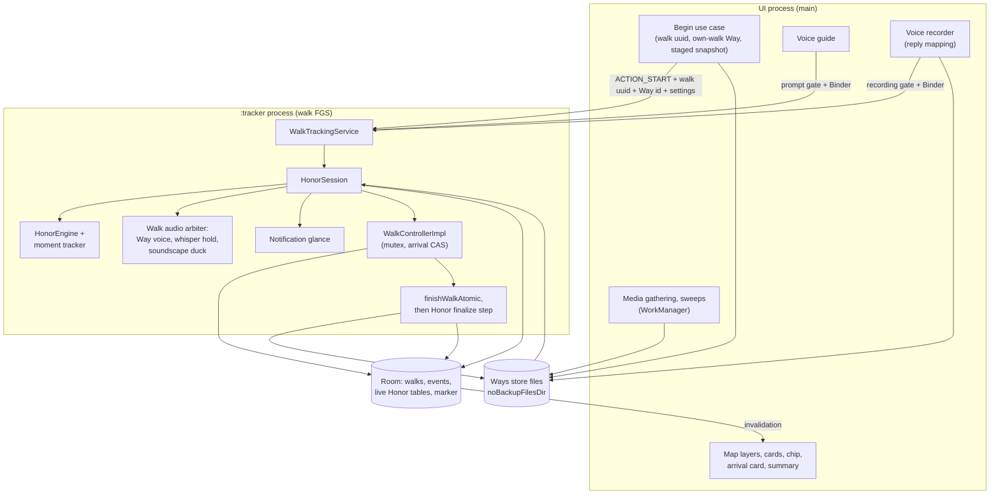
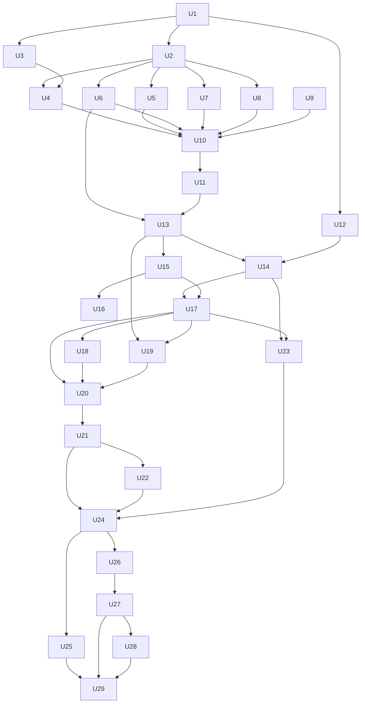

# feat: Honor — iOS v2.0.0 parity, Stages 21-0 and 21-1 (Phase 21)

> **For agentic workers:** execute unit by unit (one unit or one named cluster per PR) via superpowers:subagent-driven-development or the house autopilot pattern. Never auto-merge; the owner merges.
>
> **Authority order:** the `/ios-parity port` specs produced in U2, U11, and U26 (Swift quotes pinned at `7c200bf`) outrank this plan wherever they disagree; this plan outranks memory. Requirements: `docs/brainstorms/2026-09-28-ios-v200-parity-retarget-requirements.md` (R1–R25, AE1–AE14, post ce-doc-review round 1).

**Goal:** Stage 21-0 merges to main first (groundwork every walk benefits from, device-checked before Honor builds on it); Stage 21-1 lands Honor with your own walks and shared walks on main behind the release flag, proven on the OnePlus 13 in a pocket, with Seek moved onto the same survivable mechanism. Nothing ships before 2.0.0 (owner decision, 2026-09-29): Stage 21-0 reaches users inside it.

**Architecture:** Honor runs as a session inside the walk's `:tracker` foreground-service process, built like `BackgroundWhisperAutoPlayer`: the Way id and settings arrive on the start intent and are persisted in new live-session Room tables; a pure `HonorEngine` reads the walk's accuracy-gated location stream before the reducer; one in-process arbiter plays the Way voice, holds whisper autoplay, and ducks the soundscape in iOS's order, honoring gates the UI publishes for voice-guide prompts and recordings (the guide stays in the UI); the UI draws the ghost line, pins, and cards from Room; durable Way data lives in files under `noBackupFilesDir`.

**Tech Stack:** Kotlin + coroutines, Jetpack Compose, Hilt, Room (migrations 8→9→10→11), kotlinx.serialization, WorkManager, OkHttp, Media3 ExoPlayer, Mapbox Maps `android-ndk27:11.23.1`, Play Install Referrer 2.2, JUnit4 + Turbine + Robolectric + MockWebServer.

## Global Constraints

- Parity pin: `pilgrim-ios` @ `7c200bf` (the v2.0.0 tag). Read iOS with `git -C ../pilgrim-ios show v2.0.0:<path>`. Shipped Swift outranks iOS design docs (R4); iOS defects are matched as shipped and filed upstream (R5).
- Path aliases used below: `P/` = `app/src/main/java/org/walktalkmeditate/pilgrim/`, `T/` = `app/src/test/java/org/walktalkmeditate/pilgrim/`, `TD/` = `app/src/testDebug/java/org/walktalkmeditate/pilgrim/` (tests of debug-only code, compiled only for the debug variant), `D/` = `app/src/debug/`.
- SPDX header only (`// SPDX-License-Identifier: GPL-3.0-or-later`); no OutRun references anywhere; package root `org.walktalkmeditate.pilgrim`.
- **Release flag (U12):** every Honor entry point and surface, every flag-dark change to shipped behavior (Seek into `:tracker`; the audio gates and arbiter that change whisper timing), link routing, and the install-referrer read check the one flag. The App Links filter exists only in `D/AndroidManifest.xml` until the 2.0.0 flip. A flag-off release build behaves exactly like 1.5.0 plus Stage 21-0.
- **`:tracker` rules:** never read UI-process DataStore there for anything the user can change (reads freeze in a cached process); UI→tracker only through `WalkActionPublisher` intents (fire-and-forget, with a stop-if-no-pipeline guard); Honor command and gate intents are never redelivered after a kill; a redelivered Honor start is resolved by the walk uuid its Begin minted — adopted while that walk is unfinished (the OS's redelivery is the main revival after an OEM kill), stopped once the walk or its Honor marker shows it finished, and inserted only when the uuid is new; tracker→UI only through Room; each row type has exactly one writer process (the Honor finalize step's cleanup is the one named exception); tracker DAOs use targeted UPDATEs or upserts, never `REPLACE` (it deletes and cascades); persist before ritual (rows before sounds or haptics); treat a cached `Finished` snapshot as stale per the three existing start gates; collectors run on an injected dispatcher as children of the service scope and are `cancelAndJoin`ed on teardown; new service dependencies are injected as `Provider<T>`; no Mapbox and no WorkManager enqueues in `:tracker`.
- **Audio:** one focus request per consumer (existing players keep theirs; the arbiter decides who may start), `USAGE_MEDIA`, manual ducks (the OS does not auto-duck our ExoPlayer setup), a manual BECOMING_NOISY receiver when `handleAudioFocus=false`; haptics fire only after playback has actually started.
- **Map:** runtime layers install idempotently relative to the named route layers, reinstall after the annotation managers on every style reload, and self-heal via a `layerExists` probe; annotation z-order is manager creation order.
- **Logging:** never log shared content — manifest text, exception messages from decoding it (kotlinx errors embed input), transcripts, titles, coordinates, or share ids. Debug dumps print ids of local rows, fracs, and phases only.
- **Tests:** JUnit4 + Turbine + Robolectric. House builder rule: every `WorkRequest`, `Intent`, `AudioFocusRequest`, `NotificationChannel`, `MediaItem`, and install-referrer client built in production code gets at least one Robolectric test that builds the real object. Fakes block like the real API. Golden fixtures are synthetic only. A release-variant CI job (U12) covers flag-off wiring.
- **Room:** additive migrations in the `PilgrimDatabase` companion (`MIGRATION_N_N+1`) with `IF NOT EXISTS` DDL, one migrations array shared by `P/di/DatabaseModule.kt` and the tests, schema exported to `app/schemas/`. Every migration test builds the previous version from its exported schema, runs the production array, and opens the result through `Room.databaseBuilder` so Room's identity check runs; U6 builds the shared helper that does this (Robolectric cannot load the exported schemas as assets, so the helper replays each schema JSON's `createSql` statements from the module directory at `user_version = N`). A schema version is frozen once merged; later changes take the next version. Forward-only: no destructive fallback on downgrade (cloud backup excludes the database, so a wipe would be unrecoverable).
- `viewModelScope` defaults to Main — hop to IO at repository and file seams. Navigation decisions read hot flows, never a `WhileSubscribed` `.value`.
- Suite green before every commit: `export PATH="$HOME/.asdf/shims:$PATH" && ./gradlew :app:testDebugUnitTest`. Never put a `[skip ci]` commit at the head of a push that carries code beneath it.
- Commit style `feat(honor):` / `fix(<area>):` / `chore:` / `docs:`.

---

## Summary

The plan builds Honor the way the whisper auto-player is built — a session inside the walk's tracking process that takes its Way and settings from the start intent, writes its state to Room for the UI to draw, and plays voices through one in-process arbiter that honors the UI's guide and recording gates — and proves it on the OnePlus with a debug replayer before the UI, shared walks, and the Seek move build on it. Stage 21-0 (U1–U10) merges first, with no release of its own; Stage 21-1 (U11–U29) lands on main behind the release flag. Stages 21-2, 21-3, and the gate/release get their own plans, and everything ships together as 2.0.0.

---

## Problem Frame

The product scope is settled in the origin document (see origin: `docs/brainstorms/2026-09-28-ios-v200-parity-retarget-requirements.md`). What makes this port harder than iOS's build, found in planning research:

- The walk runs in `:tracker`; the UI, Seek, the voice guide, bells, and the recorder run in the main process; whispers and the soundscape already play from `:tracker`. `PilgrimApp.onCreate` returns early in `:tracker`, Hilt graphs are per process, UI→tracker is fire-and-forget intents, and tracker→UI is Room invalidation only. The only cross-process audio coordination today is OS focus, which carries no priority.
- During a walk the UI process cannot become cached or frozen: `:tracker`'s Room multi-instance-invalidation binding into the main process keeps it alive, and restarts it without an activity if an OEM kills it. The pocket-bar risk is therefore an OEM kill, not the freezer.
- The service returns `START_REDELIVER_INTENT` for every action and never calls `stopSelf(startId)`, so after a `:tracker` kill every delivered start replays, not just the walk start.
- Finalize runs through `finishWalkAtomic` from three call sites (two in `:tracker`, one in UI recovery, which runs on the main thread); the UI-only `WalkFinalizationObserver` skips its first emission and misses walks that finish or recover with no UI.
- #223 reaches further than filed: the metrics cache sums the empty `activity_intervals` table, so every native walk with a sitting has zero meditation seconds cached, feeding seals, totals, milestones, exports, and prompts.
- Already true on main: #219's follow-puck fix landed in `8b44b023` (only verification remains); discarding mid-recording already deletes the partial file and releases focus; Android seals never got iOS's ghost-route watermark (Stage 4-A deferral); there is no deep-link, clipboard-paste, route-projection, feature-flag, or offline-map code, and pull-request CI builds and tests only the debug variant.

---

## Requirements

Origin R1–R25 and AE1–AE14 are the contract. This plan covers:

| Units | Origin requirements |
|---|---|
| U1 | R1, R2, R3 |
| U2 | R22 (Stage 21-0 spec), R4, R5 |
| U3 | R7 (Mapbox engine line) |
| U4 | R7 (camera fits), R9 (#219) |
| U5 | R7 (recording coordinates, caption), AE7 |
| U6 | R8, R9 (#223), AE6 |
| U7 | R7 (About credits), R9 (#221, #225) |
| U8 | R7 (audits, CombineExt class) |
| U9 | R18 (worker verification file, interim copy) |
| U10 | R21 (Stage 21-0 device pass), R23 |
| U11 | R22 (own-walk spec), R4, R5, R6 |
| U12 | R21 (flag, release-variant CI) |
| U13–U16 | R10, R12, R22, AE2 |
| U17 | R12, R16, AE1, AE8 (link and finalize parts) |
| U18 | R9 (whisper over guide), R16, R17, AE11 |
| U19 | R20 |
| U20, U24 | R16, R17, R21, R23 |
| U21–U23 | R5, R6, R10, R12, AE1, AE12 |
| U25 | R21, R24 (Seek row), AE14 |
| U26–U29 | R11, R18, R19, R23, AE3, AE4, AE5 |

Deferred to the Stage 21-2, 21-3, and gate/release plans: R13, R14, R15, the gate itself (R24, including the voice guide's pocket-bar row), R25, AE9, AE10, AE13, and the stage parts of AE8.

---

## Scope Boundaries

- Everything in the origin's Scope Boundaries holds: iOS's slice four, everything iOS deferred inside its slices, the Android extras not chosen, a whole-app sweep, App Links for `walk.pilgrimapp.org`, populating shared-walk transcripts, and iOS-only machinery.
- Not in this plan: Stage 21-2 (pilgrimages), Stage 21-3 (offline maps), the parity gate, the flag flip, and the 2.0.0 release.
- The voice guide stays in the UI process (owner decision, 2026-09-29); it survives a UI kill only as far as the UI process restarts. The owner re-decides its placement at U20 from the measured restart behavior, before U21 starts; the gate records the verdict.
- Seal: only the ghost-route watermark ports (the walk's line on every seal, plus the Way's line on an honor walk). The other Stage 4-A seal deferrals — weather, elevation ring, curved outer text — stay deferred and reach the gate as dated re-justify rows.
- The Honor sheet's pilgrimage door and every stage surface arrive in Stage 21-2.

### Deferred to Follow-Up Work

- **Stage 21-2 plan** (catalog, packages, ledger, walking a stage): after its port spec; U17's finalize step is where the ledger will hook.
- **Stage 21-3 plan** (offline tiles): after its port spec; U3's SDK line and U14's storage directory already fit it.
- **Gate and 2.0.0 release plan:** the R2 re-diff at gate start, the R24 matrix, the flag flip (release field on, App Links filter moved to the main manifest), restoring the worker's honor-page copy, deleting the UI-process Seek path, the install-referrer device check on the first flag-on Play build (the release candidate), the Play listing, and Data Safety, listing every new-to-Android data flow this plan adds: the install referrer (a new no-tap import path), shared-walk import (U26–U29, the first time Android stores another person's route, photos, and voice recordings), and each recording's coordinate in outbound shares (U5). It also owns an on-device upgrade from a Play-installed 1.5.0 to the release candidate (2.0.0 carries migrations 8→9→10→11 at once), and the what's new, which carries Stage 21-0's user-facing changes too: sittings counted again (totals may grow), long-sitting walks sharing, whole-route framing on small screens, and the returned-to-the-trail block with Share again.
- **`activity_intervals` after 2.0.0:** once U6 lands, nothing reads it for sittings; it still carries the non-meditation activities iOS packages hold through import and export, so retiring it needs another home for those.
- **A multi-process DataStore migration** for the preference files both processes read — the lasting fix for frozen `:tracker` preferences.
- **Android issues to file:** the meditation screen's soundscape mute targets the UI process, where the soundscape never plays (`MeditationOptionsViewModel`); units preferences freeze in a cached `:tracker`; existing command intents such as mark-waypoint replay after a `:tracker` kill; UI recovery plus a redelivered start can create a phantom walk; Android lacks iOS's live voice-guide volume and duck-level preferences.
- **iOS issues to file (R5):** the stage lock-screen "their way, walked"; the stale "map tiles need a connection" note; overview temperature ignoring the unit setting; Way deletion dropping past deltas; the unenforced 60 MB share total; the Mapbox logo and attribution covered by the overview card; iOS's split Mapbox pins (workspace 11.20.0, project 11.23.1); the launch expiry sweep running before crash recovery re-links; recovery never linking a first honoring of an own walk (`rebindWay` links only a Way already saved, so the recovered walk reads as honoring a removed way); walked shares keeping transcripts in `way.json` past expiry; the arrival label carrying the sharer's title into later shares (rejected over 100 characters) and prompts; anything the port specs find.

---

## Context & Research

### Relevant Code and Patterns

- **`:tracker` precedents:** `P/service/BackgroundWhisperAutoPlayer.kt` (a service-scope child with an injected dispatcher and clock, idempotent start); `P/audio/soundscape/SoundscapeOrchestrator.kt` and `P/audio/soundscape/ExoPlayerSoundscapePlayer.kt` (configuration by intent; LOSS_TRANSIENT pause, GAIN resume, manual duck driven by other consumers' MAY_DUCK requests).
- **Walk start and mode:** `P/walk/WalkActionPublisher.kt` (`EXTRA_WALK_MODE`, `publishSeekGlance`), `P/domain/WalkReducer.kt` (the SEEK_MODE start effect), `P/walk/WalkControllerImpl.kt` (dispatch mutex, `startWalk`, `recordWaypoint`, the FinalizeWalk effect), `P/domain/WalkEventReplay.kt` (`walkModeFromEvents`), `P/domain/WalkMode.kt` (`fromWire` fallback), `P/walk/WatchdogReceiver.kt` (bare ACTION_START revival).
- **Service decisions:** `decideStartAction`, `decideStateAction`, `notificationFingerprint`, `shouldNotify` in `P/service/WalkTrackingService.kt` (the start decision runs inside the location job after a suspending restore), pinned by `T/service/WalkTrackingServiceDecisionTest.kt` and `T/service/WalkTrackingServiceSeekGlanceTest.kt`; `P/service/WalkNotificationFactory.kt`.
- **Finalize and recovery:** `P/data/WalkRepository.kt` `finishWalkAtomic` (returns true even for an already-finished walk), `P/walk/UiWalkController.kt` `recoverStaleWalks` (run inside `runBlocking` on the main thread from `P/PilgrimApp.kt` and `P/MainActivity.kt`), `P/walk/WalkFinalizationObserver.kt` (UI-only).
- **Seek:** `P/domain/seek/SeekEngine.kt` (`updateArrivalDebounce`, pinned by `T/domain/seek/SeekEngineTest.kt`), `P/walk/seek/SeekOrchestrator.kt`, `P/walk/seek/SeekSessionStore.kt`, `P/di/SeekModule.kt` (the ping gate reads UI-local players), `P/ui/seek/SeekSetupViewModel.kt`, `P/ui/walk/SeekWalkViewModel.kt`, `P/audio/seek/SeekSoundPlayer.kt`.
- **Audio seams:** `P/audio/voiceguide/VoiceGuideOrchestrator.kt` (UI process), `P/data/whisper/WhisperPlayer.kt` (plays in both processes), `P/di/AudioModule.kt` (`@TalkRecordingActive`), the voice recorder behind `WalkViewModel` and `WalkLifecycleObserver`.
- **Map:** `P/ui/walk/PilgrimMap.kt` (manager creation order is z-order; route layer ids `pilgrim-route-casing` / `pilgrim-route-line`; four camera call sites), `P/ui/walk/map/SeekFogRenderer.kt` (fakeable style interface, reinstall on style reload, self-heal probe), `T/ui/walk/PilgrimMapFollowViewportTest.kt`, `T/ui/walk/FollowViewportDecisionTest.kt`.
- **Summary, journal, seals, prompts:** `P/ui/walk/summary/SeekSummaryModel.kt` + `SeekSummarySection.kt`, `P/ui/walk/WalkSummaryViewModel.kt`, `P/ui/home/WalkSnapshot.kt` (`isSeek`), `P/ui/home/HomeViewModel.kt`, `P/ui/home/WalkModeFootprints.kt`, `P/ui/home/scenery/SceneryGenerator.kt`, `P/ui/goshuin/GoshuinMilestones.kt`, `P/ui/goshuin/GoshuinViewModel.kt`, `P/ui/design/seals/SealRenderer.kt`, `P/core/prompt/PromptAssembler.kt` (`practiceLexicon`), `P/core/prompt/ActivityContext.kt` (`PracticeMode`, the practice model), `P/core/prompt/PromptsCoordinator.kt`.
- **Metrics (#223):** `P/data/walk/WalkMetricsCache.kt`, `P/data/walk/WalkMetricsMath.kt`, `P/data/walk/WalkMetricsBackfillCoordinator.kt` (fills nulls only), `P/data/walk/ActivityIntervalReplay.kt` (`deriveActivityIntervals`; the last START wins; events sort by timestamp alone).
- **Share:** `P/data/share/SharePayload.kt`, `P/data/share/TourBuilder.kt`, `P/data/share/SharePayloadBuilder.kt` (`computeInteractiveRoute` and its kept window), `P/ui/walk/share/InteractiveShareSection.kt`, `T/data/share/SharePayloadTourTest.kt` (key-absence assertions).
- **`.pilgrim`:** `P/data/pilgrim/builder/PilgrimPackageConverter.kt`, `PilgrimPackageBuilder.kt`, `PilgrimPackageImporter.kt` (the archive strip deletes child tables explicitly; a re-import re-inserts walks under new ids).
- **Downloads:** `P/audio/model/WhisperModelDownloadWorker.kt` (tmp + rename, free-space probe, attempt cap), `T/audio/WorkManagerTranscriptionSchedulerTest.kt` (real builder).
- **Debug-only:** `D/AndroidManifest.xml` and the `ThreadsFieldReport` receiver in the debug source set (its test, `ThreadsFieldReportTest`, sits in the shared `T/` set, so a release-variant test compile fails until U12 moves it); `P/ui/seek/SeekQaOverrides.kt` (a runtime debug gate).
- **Deep links:** `P/widget/DeepLinkTarget.kt` (trusts widget extras from any intent), `P/MainActivity.kt` (`pendingDeepLink`, singleTop).
- **Golden fixtures:** `app/src/test/resources/threads/golden/` (README rules, `capture-harness.patch`).
- **Room and backup:** `P/data/PilgrimDatabase.kt` (v8), `P/di/DatabaseModule.kt` (migration registration, `enableMultiInstanceInvalidation`), `app/schemas/`, `T/data/PilgrimDatabaseMigrationTest.kt` (does not exercise Room's open-time check today, and records that Robolectric cannot find the exported schemas, which `app/build.gradle.kts` adds only to the `androidTest` assets), `P/data/Converters.kt` (in-place downgrades unsupported), `app/src/main/res/xml/data_extraction_rules.xml` (device transfer includes every file and the database; `no_backup/` is never included) and `backup_rules.xml`.
- **CI and release:** `.github/workflows/build.yml` (pull requests run only `assembleDebug`, `lintDebug`, `testDebugUnitTest`), `.github/workflows/production.yml` (version input; versionCode from commit count; bump commit to main), `scripts/release-notes.sh` with `app/src/main/play/release-notes/en-US/whatsnew.txt`.

### Institutional Learnings

- A cached `:tracker` carries the last walk's `Finished` into the next start; every orchestrator started from `startTracking` must tolerate double starts and tear down on a different walk id (cached-`:tracker` second-walk race; survived six review cycles).
- Revival replays "once-only" behavior unless per-walk progress is persisted — the guide replayed its opening prompt after a UI kill until its played set was saved per walk.
- DataStore is single-process and reads freeze in `:tracker` (the soundscape picker bug); anything the user sets reaches `:tracker` by intent.
- OEM kills ignore foreground-service status; `:tracker` targets about 50 MB. Hosting more there grows the process that must survive — measure it in the pocket passes.
- The OS does not auto-duck our ExoPlayer setup: duck manually and restore on GAIN. Android never sends GAIN after a permanent LOSS. Phone-call LOSS vs LOSS_TRANSIENT is still unverified on a device.
- Fakes at a platform boundary hide runtime crashes (Expedited + BatteryNotLow crashed at `WorkRequest.build()` through six review cycles).
- Mapbox draws in creation and insertion order; a style reload wipes runtime layers, managers, and images; two camera writers fight; iOS and Android SDK defaults differ (follow-puck bearing and pitch).
- Room nested `withTransaction` is not a savepoint on framework SQLite — one failure dooms the batch. `AtomicFile` is not multi-process safe.
- Omit missing keys rather than sending null; new serializable classes need R8 keep rules; required fields must not have defaults under `encodeDefaults=false`.
- "Handle once" flags must be decided atomically and only once the outcome is decided (the battery-exemption prompt bug).
- Real walks find bug classes reviews cannot (Stage 5-G, Phase 19): test finalize paths and every entry point, cold and warm, on the device.
- `whatsnew.txt` must be written fresh per release; `assembleRelease` does not lint — run lint for manifest and backup-rule changes, and test a minified release build when adding a dependency.

### External References

- Mapbox Maps Android changelog 11.12–11.23 (tile-pack v2, TileStore eviction and cleanup fixes, annotation leak fixes, location ANR fix) and the attribution rule ("You may move these elements … but they must stay on the map view"): https://github.com/mapbox/mapbox-maps-android/blob/main/CHANGELOG.md, https://docs.mapbox.com/help/getting-started/attribution/
- Mapbox NDK 27 (16 KB page) artifacts: https://docs.mapbox.com/android/maps/guides/#ndk-support
- Play Install Referrer 2.2 (read once; available 90 days; still readable after an update; the install-referrer broadcast no longer fires): https://developer.android.com/google/play/installreferrer/library
- FusedLocationProviderClient mock mode (affects clients in other processes): https://developers.google.com/android/reference/com/google/android/gms/location/FusedLocationProviderClient
- Emulator GPX playback (honors `<time>`): https://developer.android.com/studio/run/emulator-extended-controls
- Manifest merge rules: https://developer.android.com/build/manage-manifests; App Links verification: https://developer.android.com/training/app-links/verify-android-applinks
- Process importance, bindService flags, cached-app freezer: https://developer.android.com/guide/components/activities/process-lifecycle, https://source.android.com/docs/core/perf/cached-apps-freezer

---

## Key Technical Decisions

- **Honor session in `:tracker`, whisper-auto-player shaped, started inside the location job** after the restore and `decideStartAction` (whisper and soundscape start synchronously earlier, but the session is keyed to the walk id, which is only settled there). *Rejected:* the engine in the UI process with its state in Room, relying on the Room binding to restart a killed UI — OEMs delay or block that restart, and the ~440 MB UI is the process they kill.
- **Configuration by start intent, then Room, guarded by the walk uuid Begin mints:** Begin mints the new walk's uuid and passes it, the Way id, and every user-set Honor value through the existing start chain (`WalkViewModel.startWalk` for the overview, then `UiWalkController.startWalk` → `WalkController.startWalk` → `WalkRepository.startWalk(uuid = …)`), so the permission check, the 5 s start await, the watchdog, weather, and the greeting run unchanged; the session row is written inside `startWalk`'s mutex; revival (the watchdog's START has no extras) rebuilds from Room alone. The uuid is the replay guard: a redelivered START whose walk is unfinished is adopted like any restored walk; one whose walk or Honor marker shows it finished stops; only a new uuid inserts, so a replay never trips the unique uuid index. *Rejected:* a separate per-Begin nonce (finalize deletes the session row that would hold it, and "a used nonce stops" would also stop the OS's own redelivery, the main revival after an OEM kill); a UI-written pending-start row (two writers); and a multi-process DataStore (every shared preference file would have to migrate).
- **Honor commands and gates are never redelivered:** they use a non-redelivering start mode or carry sequence ids stored in the session row, so a revived tracker never replays a skip, a rate change, or a recording gate. Verified on device in U20. Existing commands (mark waypoint) keep today's behavior and go to an Android issue.
- **Live-session Room tables in migration 9→10, deleted at finalize:** a session row keyed by walk and per-moment rows, written only by `:tracker`, plus a UI-owned card-state table; after finalize only a small marker row remains (finished-at and finish kind — no share id, no numbers), keyed by the walk's uuid like its link file and never cascaded from the walk row, so a web-editor re-import (the same uuid under a new Room id) keeps it. *Rejected:* a checkpoint file like iOS's `WalkCheckpoint` — arrival's facts can be one transaction only if the session shares SQLite with events and waypoints, and deleting live rows keeps the sharer's id and the arrival numbers out of device transfer.
- **Durable Way data in files under `noBackupFilesDir`, with one link file per walk keyed by the walk's uuid:** Way JSON, media, replies, and each walk's link (Way id plus arrival delta), written as unique temp file, fsync, rename; readers ignore temp files. A Room marker written after the link file gates summary reads, because files raise no invalidation. Deleting or archiving a walk keeps its link, since iOS removes links only when their Way is deleted, so a walked shared Way stays walked for the expiry sweep. *Rejected:* iOS's single `index.json` (three writers across two processes, and one bad read followed by a write erases every link) and `AtomicFile` (not multi-process safe). The platform never includes `no_backup/` in backup or transfer, so link and delta drop on transfer, recovery, and Way deletion exactly as on iOS.
- **The engine reads the service's existing accuracy-gated collector, tapped before the reducer:** iOS feeds its engine the walk's `$currentLocation`, gated `isFirst || checkForAppropriateAccuracy`, and keeps publishing while paused — the same 20 m ceiling as Android's fixed gate (iOS's threshold adapts below it) — while the reducer drops fixes when paused or meditating. A characterization test pins the unchanged route pipeline. *Rejected:* a second raw subscription for Honor. Seek (U25) keeps its own ungated subscription, which diverges from iOS: at the pin both iOS engines read the one filtered `$currentLocation` (`LocationManagement.swift:282-288`), though Seek's port spec (D2) read it as raw; U25 records the divergence for the gate.
- **Persist before ritual; arrival is a compare-and-set:** one transaction re-checks that the walk is unfinished, flips the session phase, and only then inserts the event and the reserved waypoint with the arrival numbers; a revival after arrival starts arrived.
- **Honor finalize hooks the repository, not the call sites:** keyed by walk; run by the tracker inside its FinalizeWalk effect before the state flips (so SelfStop cannot cancel it) and by recovery off the main thread; the finish kind is recorded by a guarded update inside `finishWalkAtomic`'s transaction; each sub-step repeats to the same content; live rows are deleted last, so a finished walk still holding a live row means a retry is pending at the next launch; a missing Way counts as done. Recovery links only a Way already listed, with no delta, as iOS's `rebindWay` does. *Rejected:* running inside `finishWalkAtomic`'s transaction — not a savepoint, and a failing Honor write would stop the walk from ending.
- **Audio: one arbiter in `:tracker` for the Way voice, whisper autoplay, and the soundscape duck, honoring UI gates; the voice guide stays in the UI** (owner decision). iOS's order holds: a guide prompt outranks a Way voice, which outranks a whisper. A prompt starting mid-voice reaches the Way voice player through the OS as a transient duck; the player pauses for a duck only when the arbiter ties it to the guide (a prompt gate held or arriving within a short window), since speech never ducks under speech, and the prompt gate then holds the voice until the prompt ends while the arbiter keeps the soundscape ducked across the hand-over. The soundscape's own focus requests go through the arbiter and never pause a voice; otherwise a looping soundscape would hold focus and the paused voice would wait for a GAIN that never comes. The Way voice player requests `AUDIOFOCUS_GAIN_TRANSIENT_MAY_DUCK`, as the guide and the soundscape do (a plain `AUDIOFOCUS_GAIN` would send the soundscape a permanent loss, which stops it). *Rejected:* moving the guide into `:tracker` — about ten per-process seams (six settings writers, the guide's pause control and pack name, meditation-ring features, the recording-active signal, Seek's ping gate). *Consequences:* a prompt and a voice starting in the same instant can overlap until the gate lands; after an OEM kill the guide is silent until the UI process restarts.
- **Gates via Binder death links from single observers:** the UI publishes prompt state from the guide's player and recording state from one observer of the recorder's recording flag (walk-end auto-stops included), each with a Binder token and a sequence id; `:tracker` links to its death; "ended", a dead Binder, a `RemoteException` on link, or a stale sequence id clears the gate. Gates are state, so revival cannot rebuild them from Room: each session start and revival bumps a gate generation in the session row, the UI publisher re-sends its current gates with fresh Binders whenever the generation changes, and the arbiter treats both gates as held until that refresh arrives or a short fixed wait passes (a dead UI sends nothing). *Rejected:* bounded timeouts — a long take would unmute voices mid-recording.
- **Flag-dark by construction:** Seek's `:tracker` placement and the gates' effect on whispers run only with the flag on; placement decisions are pure functions tested with both flag values; new service dependencies are `Provider<T>`, never resolved with the flag off; the mode derivation returns Honor only with the flag on, so flag-off builds render imported honor walks as plain walks; a release-variant CI job asserts the merged manifest and runs the release unit tests.
- **Own-walk Way staged per honor walk by a Begin use case (U17):** the UI builds the Way and stages it under the walk uuid Begin mints; a clean finalize promotes it by writing the listed Way only if absent (never renaming folders); a discard removes only the staging; recovery leaves it, and a launch sweep removes orphaned staging past a grace period, never on the 5 s start timeout — so the one copy an upstream fix to iOS's recovery could re-link survives recovery. *Rejected:* rebuilding from Room at every start — the source walk can change or be deleted mid-walk.
- **Migrations:** v9 is U6's #223 repair, v10 the Honor tables (U14), v11 the Seek tables (U25); each is frozen once merged, and all three reach users together in 2.0.0. A migration cannot hide behind the flag, so nothing is released from main before 2.0.0: an emergency fix to 1.5.0 is cut from the `v1.5.0` tag. *Rejected:* one squashed Honor-plus-Seek migration — merged schemas reach the owner's debug install during the device milestones, and editing one after it has opened forces a wipe.
- **Release flag = BuildConfig per build type plus a debug-only manifest filter:** runtime gates read one injected accessor; the App Links filter lives in `D/AndroidManifest.xml` until the flip, which manifest merge adds to `MainActivity` cleanly.
- **Mapbox `android-ndk27:11.23.1`:** the last line before 11.24's one-tile-store-per-process change, carrying every offline fix Stage 21-3 needs, both ANR fixes, annotation leak fixes, and 16 KB page alignment (Play blocks non-compliant updates from 2027-02-01). Fallback: 11.21.10.
- **Camera fits:** one pure decision helper; the async `cameraForCoordinates` form that waits for the map size; record a fit only on a non-empty result.
- **Seal watermark ports:** the walk's ghost route on every seal, plus the Way's line for honor walks, per iOS's `SealRenderer`.
- **Mapbox ornaments stay visible on the Honor overview**, lifted above its card, because Mapbox's terms require them on the map view — a dated divergence (R6) with an iOS issue filed.
- **Links tapped before setup are held in memory and opened when setup completes** (shipped iOS `pendingShareId`); the origin's R18, AE4, and scope line were corrected to match (R4).
- **Install referrer behind an interface:** read on first launch only when setup is incomplete; parsed by the same whole-id parser as a tapped link after one decode; lands exactly like a tap (the overview, never an automatic Begin); "consumed" saved before acting and surviving a process death during onboarding; DISCONNECTED and UNAVAILABLE retried with a fresh client and bounded backoff; never read with the flag off.
- **Validation parity, bound for bound:** iOS's manifest, id, media-path, byte, and host checks port exactly, each with a rejecting test (Kotlin conversions saturate where Swift traps, so a missed bound yields garbage instead of "unavailable"); fetch URLs are built from a constant base plus a validated id; redirects to another host are refused; `WalkTrackingService` stays unexported and accepts a Way id only if `WayStore` validates and loads it.
- **Debug simulator = GPX export plus an FLP mock-mode replayer in `:tracker`**, in the debug source set behind an interface whose release implementation is a no-op; mock mode reaches every FLP client in every process, including the map puck, and is reset by the debug implementation.
- **Golden engine traces are synthetic**, captured with an iOS harness patch applied in a throwaway worktree (the Thought Threads precedent); the distance function per iOS call site is pinned before capture.
- **Media downloads and sweeps enqueue from the UI process:** WorkManager is not initialized in `:tracker`.
- **#223 single source is `walk_events`:** export and the metrics cache derive intervals the way the summary and share already do; import writes meditation events; a one-time repair migration converts orphaned MEDITATING intervals and recomputes cached meditation for every walk with a sitting; non-meditation activities keep round-tripping through `activity_intervals`.

---

## Open Questions

### Resolved During Planning

- **Where the engine, voices, and link/ledger writes live (origin Outstanding Questions):** `:tracker`, per the decisions above; the UI never owns a write the pocket bar depends on.
- **Where the voice guide runs:** the UI process, publishing a prompt gate to the arbiter (owner decision after deepening), re-decided at U20 from the measured UI restart.
- **Release-flag mechanism:** BuildConfig per build type plus a debug-only manifest filter (U12, U27).
- **Mapbox terms for the overview's ornaments:** keep them visible (divergence).
- **Ways storage shape and transfer:** files under `noBackupFilesDir`, which the platform never backs up or transfers; live session state in Room, deleted at finalize.
- **#219 blast radius:** already fixed on main by `8b44b023`; this plan verifies and closes it, and audits the other camera paths for the #89 bug class.
- **The engine's location input:** the existing accuracy-gated collector, tapped before the reducer (iOS's `$currentLocation` equivalent; U11 confirms).
- **Downgrades:** forward-only; no destructive fallback.
- **iOS capture harness:** the threads precedent (U16).
- **On-device playback:** FLP mock mode in `:tracker` (U19).
- **Whether "Sit?" auto-ends a sitting:** it does not on iOS — `suggestedMinutes` feeds only the "they sat here N minutes" caption.
- **Whether iOS drops links tapped during setup:** it holds them (`pendingShareId`); requirements corrected.

### Deferred to Implementation

- **The engine's timer clock** (wall-clock vs fix time for the 120 s re-acquire and soft-tap timers): U11 quotes the Swift; U15–U17 follow it.
- **Distance function per call site** (moment radii, voice drop, arrival) and the threshold-crossing allowance: measured in U16 before capture.
- **Whether the UI process restarts on its own after an OEM kill, and how fast:** measured in U20; it decides how quiet the guide goes in a pocket, and the owner decides the guide's placement from it there, before U21 starts.
- **The exact non-redelivery mechanism for Honor commands on the target OEM build:** U17 tests plus the U20 device check.
- **Lock-screen visibility of the Honor glance:** built like Seek's today (private); adjudicated with Seek's at the gate.
- **Whether a Binder in intent extras and its death link behave on the target OEM build:** U18's test plus the U20 device proof; fall back to a sequence-checked gate refreshed by the UI if not.
- **`:tracker` memory headroom** with the arbiter, the Way voice player, and (later) Seek: measured in U20 and U24.
- **iOS's playback rate persisting across walks** (a shared player singleton): U11 decides whether that is a defect to file or behavior to match.
- **"Sit?" while paused** and the card compass's heading source: U11 checks iOS and matches it.
- **How UI-started whispers wait for a Way voice** (iOS queues every whisper play): U11 pins iOS's semantics; U18 implements them against the persisted Way-voice state.
- **Stripping control and bidirectional characters from the sharer's title** before it reaches the arrival label: U26 decides whether that is platform hardening recorded at the gate (R6) or iOS parity plus an upstream issue.

---

## High-Level Technical Design

> *This illustrates the intended approach and is directional guidance for review, not implementation specification. The implementing agent should treat it as context, not code to reproduce.*

Where each piece lives:

| Piece | Process | Writes | Reaches the other process via |
|---|---|---|---|
| Honor engine, moment tracker | `:tracker` | session and moment rows | Room |
| Way voice, whisper autoplay hold, soundscape duck, arbiter, haptics | `:tracker` | — | — |
| Voice guide | UI | prompt gate | intent with Binder token |
| Recorder | UI | recording rows, recording gate, reply mapping | Room, intent with Binder token, files |
| Arrival (compare-and-set on phase, event, waypoint, numbers) | `:tracker`, controller mutex | events, waypoints, session row | Room |
| Finalize step (link file, marker, promotion, live-row cleanup) | `:tracker` FinalizeWalk effect; UI recovery off Main | link file, snapshot, marker; deletes live rows | files, Room |
| Notification glance | `:tracker` | — | — |
| Begin (walk uuid, own-walk Way, staged snapshot) | UI use case | staged snapshot | files, ACTION_START via the existing start chain |
| Map layers, cards, chip, arrival card, card compass, summary | UI | card-state table only | reads Room and files |
| Chip and card commands | UI → `:tracker` | — | intents, never redelivered |
| "Your reply" (a card button on a later honoring) | UI → `:tracker`, played by the Way voice player | — | intent, never redelivered |
| UI-started whispers (tap, preview, Seek reveal) | UI | — | reads the persisted Way-voice state |
| Media gathering, expiry sweep, snapshot sweep | UI (WorkManager, launch) | Ways store | files |
| Seek, flag on (U25) | `:tracker`; pre-departure boot in UI | Seek session rows | ACTION_START, Room |

---

## Implementation Units

### Phase A — Stage 21-0: groundwork (merges first; ships in 2.0.0)

### U1. Anchor re-pin, versioning rule, fold-in window

**Goal:** The repo and tooling name `7c200bf` as the parity target; Android versions track iOS's major.minor; the fold-in window closes at gate start.

**Requirements:** R1, R2, R3.

**Dependencies:** None.

**Files:**
- Modify: `CLAUDE.md` — parity scope (`7c200bf` = v2.0.0; iOS re-pointed `v1.11.0` to `bcdf538`; #80 closed without a code change, `intentionEcho` unfixed on both platforms); fold-in text scoped to Android 2.0.0, closing at gate start with later deltas going to 2.0.1; the versioning convention replacing "Do not mirror iOS version numbers"; the phasing note (Phase 21 in progress, this plan); the long-session note corrected from `START_STICKY` to the `START_REDELIVER_INTENT` the service actually returns.
- Modify (outside the repo): the `ios-parity` skill's pinned anchor; memory entries naming `33b0dbc` as current.

**Approach:**
- Grep `docs/` for `33b0dbc` claims of currency; leave dated historical records alone.
- A docs-only commit, pushed alone.

**Test expectation:** none — documentation and tooling only.

**Verification:**
- No current-target reference to `33b0dbc` remains; the `ios-parity` skill resolves `7c200bf`.

### U2. Port spec 0 — Stage 21-0 slice

**Goal:** A `/ios-parity port` spec with Swift quotes at `7c200bf` for every iOS-sourced Stage 21-0 behavior, plus the three audit verdicts with Android evidence.

**Requirements:** R22, R4, R5.

**Dependencies:** U1.

**Files:**
- Create: `docs/parity/2026-09-…-stage21-0-groundwork-port.md` (path assigned by the skill).

**Approach:**
- Cover: `PilgrimMapView` bounds, inset, and `roomForRoute` semantics (#81/#89); `TourBuilder`/`SharePayload` recording coordinates and key omission; the `InteractiveShareSection` caption; `AboutView` credit order and URLs; `PilgrimPackageConverter` honor event names and the reserved icon; how iOS exports and imports sittings (activities only; no meditation event type); `WalkSharingButtons` expired-share block (#225); the reliquary denial revert (#221).
- Record the U8 audit verdicts (whisper-behind-guide, discard cleanup, teardown race) naming the subsystem and bug class checked, with file:line evidence.

**Test expectation:** none — specification document.

**Verification:**
- Every behavior U4–U8 implements appears as a Swift quote; no paraphrase stands in for a constant or string.

### U3. Mapbox to `android-ndk27:11.23.1`

**Goal:** The Maps SDK moves from `android:11.11.0` to the 16 KB-aligned `android-ndk27:11.23.1` with no behavior change.

**Requirements:** R7 (Mapbox engine line).

**Dependencies:** U1.

**Files:**
- Modify: `gradle/libs.versions.toml` (version and artifact), `app/build.gradle.kts` (if the alias changes).
- Modify: `P/ui/walk/PilgrimMap.kt` only where deprecations require.
- Test: `T/ui/walk/PilgrimMapFollowViewportTest.kt` and the existing route, puck, and overlap tests.

**Approach:**
- Confirm the artifact on the Mapbox Maven by fetching its pom (a GitHub tag is not a Maven release).
- Re-read iOS's and Android's follow-puck defaults after the bump; the builder test pins ours.
- Confirm the telemetry opt-out still reaches `setUserTelemetryRequestState(false)` (the R2 check for iOS #92).
- Keep Mapbox initialization gated to the main process.
- Run the 16 KB alignment check on the release bundle.

**Patterns to follow:**
- The dependency bump discipline in `docs/plans/2026-07-23-001-feat-ios-v190-parity-port-plan.md` (pin exact, verify, then build on it).

**Test scenarios:**
- Integration: the full unit suite passes on the new SDK with no test expectation changed.
- Integration: the follow-puck builder test still asserts the pinned zoom, pitch, and bearing; a changed SDK default fails it.

**Verification:**
- Debug and release builds succeed; the release bundle passes 16 KB alignment; map screens render on device (U10).

### U4. Camera-fit semantics and #219

**Goal:** Every map camera fit follows iOS #81/#89 — ease only when bounds or inset change, skip while the view has no room, clamp the inset, and count a fit as applied only after it lands — and #219 is verified and closed.

**Requirements:** R7 (camera), R9 (#219).

**Dependencies:** U2, U3.

**Files:**
- Create: `P/ui/walk/map/CameraFitDecision.kt`.
- Modify: `P/ui/walk/PilgrimMap.kt` (the reveal fit path, the update-lambda fit block and its `didFitBounds` flag, `cameraOptionsForFitBounds`/`cameraOptionsForBounds`, the follow-viewport inset).
- Test: `T/ui/walk/map/CameraFitDecisionTest.kt`.

**Approach:**
- One pure decision over bounds, inset, view size, and the last applied fit returns skip, fit with a clamped inset, or no change, using iOS's padding formula as U2 quotes it.
- Use the async `cameraForCoordinates` form that waits for the map size; record only a non-empty result.
- Audit all four call sites (reveal, update-lambda fit, initial centre, follow viewport).
- #219: a device check that pan and pinch disengage follow on 11.23.1, then close the issue with the evidence.

**Patterns to follow:**
- `T/ui/walk/FollowViewportDecisionTest.kt` (pure camera decisions tested on the JVM).

**Test scenarios:**
- Happy path: new bounds with room → fit with the clamped inset; the same bounds and inset again → no change.
- Edge case: a zero-height view → skip, nothing recorded; the next pass with room → fit.
- Edge case: an inset taller than the view allows → clamped to the formula's maximum.
- Edge case: the inset changes with the same bounds → refit.
- Error path: the camera computation yields no result → the last applied fit is unchanged and the next pass retries (the iOS #89 regression pin).

**Verification:**
- A short-screen summary never shows the zoomed-out globe on device; #219 closed with evidence.

### U5. Recording coordinates and the interactive caption

**Goal:** Interactive shares carry each recording's coordinate and the "walk it there" caption, so iOS Honor walkers hear Android-shared voices where they were spoken.

**Requirements:** R7, AE7.

**Dependencies:** U2.

**Files:**
- Modify: `P/data/share/SharePayload.kt` (optional recording `lat`/`lon`), `P/data/share/TourBuilder.kt` (`tourItems` takes full-resolution samples and the kept window), `P/data/share/SharePayloadBuilder.kt` (passes both before downsampling), `P/ui/walk/share/InteractiveShareSection.kt` and `app/src/main/res/values/strings.xml` (the caption, first inside the interactive block).
- Test: `T/data/share/SharePayloadTourTest.kt`, `T/data/share/TourBuilderTest.kt`.

**Approach:**
- The coordinate is the full-resolution sample nearest the recording's start; it is omitted (never null) when the start falls outside the inclusive kept window; with no window, every recording carries one.
- Encode through the `explicitNulls = false` Json.

**Patterns to follow:**
- The kept-window filtering already applied to waypoints and photos in `SharePayloadBuilder.kt`; key-absence assertions in `SharePayloadTourTest.kt`.

**Test scenarios:**
- Covers AE7. The third recording starts inside the trimmed doorstep → its coordinate keys are absent; the others carry coordinates.
- Edge case: trim not applied → every recording carries coordinates.
- Edge case: the nearest sample is a full-resolution point the 200-point downsample dropped → that point is used.
- Edge case: a walk with no samples → keys absent; the payload stays valid.
- Error path: the encoded JSON never contains a literal null coordinate.

**Verification:**
- Tests green; optionally, a share from a Stage 21-0 build honored on an iOS 2.0.0 phone places voices at their spots (U10).

### U6. Honor events in `.pilgrim` and the #223 single source

**Goal:** HONOR_MODE and HONOR_ARRIVAL exist, persist by name, and round-trip under iOS's names; sittings come from one source everywhere they are read, and existing data is repaired once.

**Requirements:** R8, R9 (#223), AE6.

**Dependencies:** U2.

**Files:**
- Modify: `P/domain/WalkEventType.kt`, `P/domain/WalkEventReplay.kt`, `P/data/walk/ActivityIntervalReplay.kt`, `P/data/walk/WalkMetricsCache.kt`, `P/data/walk/WalkMetricsMath.kt`, `P/core/prompt/PromptsCoordinator.kt`, `P/data/pilgrim/builder/PilgrimPackageConverter.kt`, `P/data/pilgrim/builder/PilgrimPackageBuilder.kt`, `P/data/pilgrim/builder/PilgrimPackageImporter.kt`, `P/ui/settings/data/JourneyViewerViewModel.kt`, `P/data/WalkRepository.kt`, `P/data/PilgrimDatabase.kt` (`MIGRATION_8_9`, the repair), `P/di/DatabaseModule.kt` (shared migrations array).
- Create: `T/data/MigrationTestDatabases.kt` (the shared schema-replay helper U14 and U25 reuse).
- Test: `T/data/pilgrim/builder/PilgrimPackageConverterTest.kt`, `T/data/pilgrim/builder/PilgrimPackageImporterTest.kt`, `T/data/walk/ActivityIntervalReplayTest.kt`, `T/data/walk/WalkMetricsCacheTest.kt`, `T/data/PilgrimDatabaseMigrationTest.kt` (8→9 through Room's open-time check).

**Approach:**
- New enum values are stored by name; the exhaustive `when` sites gain them; `walkModeFromEvents` reads HONOR_MODE as Wander until U14 adds the flag-gated mode, so flag-off imports render as plain walks and keep their events.
- The converter maps `honorMode`/`honorArrival` both ways; the `signpost.right.fill` waypoint icon round-trips; MEDITATION_* stay out of `workoutEvents`.
- #223: `walk_events` is the source. Export and the metrics cache derive sittings with `deriveActivityIntervals`, as the summary and share do; the derivation first normalizes (sort, merge overlaps, END before START on ties). Import turns package "meditation" activities into MEDITATION_START/END events; iOS packages carry sittings only as activities, and packages from Android 1.5.0 or earlier carry none, so nothing is invented. Every other activity (iOS's "unknown", stored as WALKING) is still written to `activity_intervals`, and export still re-emits it as "unknown", so an iOS-imported walk re-exports unchanged.
- Migration 8→9 is a one-time, idempotent repair. For walks holding MEDITATING intervals but no meditation events, it inserts the events (minting uuids) — never from WALKING rows, which would invent sittings. Then it nulls cached meditation seconds on every finished walk with meditation events or MEDITATING intervals, since native walks cache 0 rather than null and the backfill fills nulls only. Nothing reads `activity_intervals` for sittings afterwards.
- The shared migration-test helper builds version N by replaying the `createSql` statements in `app/schemas/org.walktalkmeditate.pilgrim.data.PilgrimDatabase/N.json` (read from the module directory) at `user_version = N`, then runs the production migrations array and opens the result through `Room.databaseBuilder`.

**Test scenarios:**
- Covers AE6. An iOS 2.0.0 package with an honor walk re-exports `honorMode`, `honorArrival`, and the `signpost.right.fill` waypoint.
- Edge case: an unknown future event name still maps to UNKNOWN and survives.
- Happy path: exporting a native walk with a sitting carries it in `activities` and in the meditation total (both empty or zero today).
- Happy path: importing a package with activities yields meditation events and the same sittings the summary derives.
- Edge case: a package from Android 1.5.0 or earlier imports with no sittings and no invented events.
- Edge case: overlapping activities, or one ending in the millisecond the next starts, normalize to the right sittings.
- Integration: the repair migration run on a v8 database with intervals-only walks yields events and non-zero recomputed meditation; running it again adds nothing; a walk with both an interval and events counts once in metrics, seals, summary, and export.
- Integration: a v8 native walk with MEDITATION_START/END events and a cached 0 recomputes to its real sitting after the migration and backfill.
- Edge case: an iOS-imported walk with WALKING intervals gains no events, keeps its meditation total, and re-exports its "unknown" activities unchanged.
- Integration: the migrated database, built from schema 8 by the shared helper, opens through Room's identity check with the production migrations array.

**Verification:**
- A real exported walk with a meditation shows non-empty activities; seals and totals show the sitting on device.

### U7. Reliquary revert, expired-share block, About credits

**Goal:** #221 and #225 close, and About credits Mapbox and OpenStreetMap as iOS does.

**Requirements:** R7 (About), R9 (#221, #225).

**Dependencies:** U2.

**Files:**
- Modify: `P/ui/settings/SettingsScreen.kt` and its ViewModel, `P/ui/walk/summary/WalkSharingButtons.kt`, `P/ui/walk/WalkSummaryScreen.kt`, `P/ui/settings/about/AboutScreen.kt`, `app/src/main/res/values/strings.xml`.
- Test: a ViewModel test for the revert; `T/ui/walk/summary/WalkSharingBlockLogicTest.kt`.

**Approach:**
- #221: revert the setting in the permission callback on denial, and correct the comment that claims otherwise.
- #225: stop collapsing an expired cached share into "never shared"; render iOS's "This walk has returned to the trail" block with Share again.
- About: "© Mapbox" and "© OpenStreetMap contributors" rows with iOS's links, between the weather and routes rows.

**Test scenarios:**
- #221: enable → permission denied → setting off and the denied note shown; granted → stays on.
- #225: an expired cached share → the returned-to-the-trail block with Share again; an active share → the existing block; no share → Share Journey.
- About: both credit rows present in iOS order with iOS's URLs.

**Verification:**
- Tests green; visual check in U10.

### U8. Audits: whisper behind guide, discard cleanup, teardown race

**Goal:** R7's audits close with evidence, and the invariants they rest on are pinned by tests.

**Requirements:** R7.

**Dependencies:** U2.

**Files:**
- Test: `T/walk/WalkLifecycleObserverTest.kt` (partial file deleted and focus abandoned on discard); the location collector's test (a late callback after cancellation).
- Modify: only where the audit finds a real bug.

**Approach:**
- Whisper behind guide: Android has no pending-whisper queue behind a guide prompt, so iOS's stuck-whisper bug class is absent; the larger overlap is R9's fifth gap, closed in U18.
- Discard: already clean (`VoiceRecorder.stop()` abandons focus; the orphan sweeper deletes the partial file); add the missing assertions.
- Teardown (CombineExt class): a location callback delivered after `removeLocationUpdates` while the collector cancels must neither crash nor emit.

**Test scenarios:**
- Discard mid-recording → partial file deleted, focus abandoned, no row inserted.
- A callback delivered after cancellation → no emission, no exception.

**Verification:**
- Verdicts recorded in U2's spec with file:line evidence.

### U9. Worker: App Links verification file and interim Android copy

**Goal:** `honor.pilgrimapp.org` serves Android's verification file, and its Android block stops telling visitors to re-tap a link Android cannot yet follow.

**Target repo:** `pilgrim-worker` (paths below are relative to it).

**Requirements:** R18.

**Dependencies:** The owner supplies the Play app-signing and upload SHA-256 fingerprints and the debug certificate fingerprint.

**Files:**
- Modify: `src/handlers/honor.ts` (serve `/.well-known/assetlinks.json`), `src/honor-constants.ts` (the statements), `src/generators/honor-page.ts` (the Android block).
- Test: the worker's handler and page tests.

**Approach:**
- Two statements: `org.walktalkmeditate.pilgrim` (app signing and upload) and `org.walktalkmeditate.pilgrim.debug` (debug certificate); `application/json`, no redirects, HEAD supported; the walk host is untouched. The honor host stays the only auto-verify host (Android 9–11 verify all hosts together).
- The release fingerprint is taken from a Play-installed app's certificate, not a local build — a wrong fingerprint fails silently, and the release statement is not exercised on a device before the release candidate.
- The Android block's install-then-tap-again line becomes "walking a shared walk arrives with Pilgrim 2.0 for Android"; the Play button and its referrer stay. Restoring the line belongs to the release plan.
- Deploy is manual (`npm run deploy`).

**Test scenarios:**
- GET and HEAD of the verification file on the honor host → 200 JSON with both statements.
- The walk host still answers 404 for that path.
- The honor page's Android block shows the interim line; the iOS and desktop blocks are unchanged.

**Verification:**
- Live responses and Google's Digital Asset Links check return both statements, and the release statement matches the Play-installed certificate.

### U10. Stage 21-0 device pass

**Goal:** Every map screen and every Stage 21-0 change is checked on the new SDK before Phase B builds on it. There is no 1.5.1: Stage 21-0 reaches users inside 2.0.0 (owner decision, 2026-09-29).

**Requirements:** R21, R23.

**Dependencies:** U3–U8; U9 deployed.

**Files:**
- Create: `docs/qa/2026-…-stage21-0-map-pass.md`.

**Approach:**
- OnePlus 13 pass on a debug build: active-walk follow and gestures (#219), the summary reveal on a short screen, seek fog and crescent, whisper and cairn pins, lock/unlock and a theme flip, a `.pilgrim` export with a sitting, seal and totals showing sittings after the repair migration (upgrading the owner's schema 8 debug install), About credits.
- Phase B merges to main only after the pass is recorded.
- What a 1.5.1 would have carried moves to the gate and 2.0.0 release plan: the Data Safety re-check for U5's recording coordinates, the Play notes for Stage 21-0's changes, the Play-installed upgrade, and the staged-rollout soak.

**Test expectation:** none — device-QA unit.

**Verification:**
- The QA doc is complete before any Phase B merge.

### Phase B — Stage 21-1a: Honor on your own walks (the proving vertical)

### U11. Port spec A — own-walk slice

**Goal:** A `/ios-parity port` spec at `7c200bf` for everything U13–U23 builds, plus this plan's placement table verified row by row.

**Requirements:** R22, R4, R5, R6.

**Dependencies:** U10.

**Files:**
- Create: `docs/parity/2026-…-honor-own-walk-port.md`.

**Approach:**
- Cover: `Way`, `WayGeometry`, `OwnWalkWayBuilder`; `HonorEngine`, `HonorMomentTracker`, `HonorTuning`, `ArrivalDebounce`; `WayVoicePlayer` with its `AudioPriorityQueue` and `VoiceGuidePlayer` interplay (including how iOS queues every whisper play); `ActiveWalkViewModel+Honor` (events, cards, replies, checkpoint fields, where replies are filed before the Way folder exists); ghost line, companion, pin rendering and colours; the card header's heading tick (`HeadingProvider`); the own-walk door of `HonorWaysSheet` and `HonorOverviewView`; `WayPlaceCard`, the listening chip, the arrival card, and the `WalkStatsSheet` caption; the summary (`voiceCount` as "voices along the way"), journal, scenery, seal, milestones, and prompt lexicon; the glance; persistence vocabulary; `WayGPXExporter`; the `MeditationView` caption; iOS's own-walk Way save at walk end and its recovery re-link rule; the accessibility labels, values, and hints of every Honor surface.
- Pin: the engine's location publisher and accuracy filter, recording once that iOS feeds Honor and Seek the same filtered `$currentLocation` (`LocationManagement.swift:282-288`; the threshold adapts from recent accuracy, capped at 20 m unless the walker set a GPS-accuracy preference); whether its timers read wall-clock or fix time; "Sit?" behavior while paused; the playback-rate lifetime; `playReply` (it stops the active voice and plays the reply through the same player) and whether a reply counts as the active voice for the gates and "heard"; what a place card shows when its voice fails to play.
- File each iOS defect found (R5) and link it from the spec.

**Test expectation:** none — specification document.

**Verification:**
- Every constant, string, threshold, and ordering used by U13–U23 appears as a Swift quote.

### U12. Release flag and release-variant CI

**Goal:** One release flag — on in debug, off in release — read wherever Honor or a flag-dark change appears, and a CI job that proves the flag-off build stays clean.

**Requirements:** R21.

**Dependencies:** U1.

**Files:**
- Modify: `app/build.gradle.kts` (a per-build-type BuildConfig field), `.github/workflows/build.yml` (a pull-request job on the release variant).
- Move: `T/core/threads/ThreadsFieldReportTest.kt` to `TD/core/threads/` (it tests a debug-only class, so the release-variant test compile fails while it sits in the shared set).
- Create: `P/core/flags/ReleaseFlags.kt` and its Hilt binding.
- Test: `T/core/flags/ReleaseFlagsTest.kt`.

**Approach:**
- Runtime gates read one injected accessor: the mode slot and mode derivation, Honor surfaces, "walk this again", the Ways row, link routing, the referrer read, the audio gates, and Seek's `:tracker` placement. Placement decisions are pure functions over the flag.
- The release-variant job asserts the merged manifest (no mock-location permission, no DUMP-protected or honor-filtered component, only allow-listed permissions — the referrer library adds one), that compiled code carries no debug-only Honor classes or mock-mode calls, and compiles the release unit tests. It runs only the release-contents checks (`core.flags`): Compose UI tests cannot run on release, because Robolectric reads the manifest from the test resource APK, which AGP packages without `ui-test-manifest`'s host activity, and shipping that activity is not an option. Flag-off behavior is tested in the debug suite with an injected flag.
- The build-time half (the App Links filter only in `D/AndroidManifest.xml`) lands with U27.
- Tests of debug-only code live in `TD/`, which only the debug variant compiles; `testDebugUnitTest` still runs them.

**Test scenarios:**
- Debug → flag on; release variant → flag off.
- Integration: the release-variant unit tests compile — no test in `T/` references a debug-only class.
- Happy path: each placement decision returns the flag-off answer with the flag off and the flag-on answer with it on.
- Integration: the release-variant job fails when a debug-only permission or component is added to the main manifest.

**Verification:**
- A release build from main behaves as 1.5.0 plus Stage 21-0, and the release-variant job runs on every pull request.

### U13. Way model, geometry, and own-walk builder

**Goal:** A pure Kotlin port of the Way model, `WayGeometry`, and `OwnWalkWayBuilder`, JSON-compatible with iOS's `way.json`.

**Requirements:** R10, R12, AE2.

**Dependencies:** U11, U6.

**Files:**
- Create: `P/domain/honor/Way.kt`, `P/domain/honor/WayGeometry.kt`, `P/domain/honor/OwnWalkWayBuilder.kt`.
- Test: `T/domain/honor/WayGeometryTest.kt`, `T/domain/honor/OwnWalkWayBuilderTest.kt`, `T/domain/honor/WayCodecTest.kt`.

**Approach:**
- kotlinx.serialization with iOS's field names and date format, so iOS fixtures decode unchanged (Stage 21-2's stage files share this format); optional fields sit last and unknown fields are ignored; R8 keep rules for the new serializable classes.
- Geometry is haversine at 6,371 km, as iOS's pure-Swift `WayGeometry` is.
- Builder rules from U11: route of at least 20 m, stride-sampled to 4,000 points; voices at the full-resolution fix nearest their start, carrying the transcription; photos at their own coordinates; user waypoints minus reserved icons; pauses of 180 s or more as rests; sittings from U6's `walk_events` derivation; spans. Ids derive from the source walk as iOS's do.

**Execution note:** port iOS's Honor model and builder tests first, then implement until they pass.

**Test scenarios:**
- Happy path: frac, coordinate, and elapsed round-trip along a straight route.
- Edge case: nearest point on a looping route; a windowed search on an out-and-back fixture with overlapping legs finds the leg the window allows.
- Happy path: the builder places voices, photos, rests, and sittings at the right fracs, with `at` taken from full-resolution samples before downsampling.
- Edge case: reserved waypoint icons are excluded; a route under 20 m yields no Way.
- Edge case: a transcript's card line is its first sentence, cut at a word boundary past 120 characters.
- Integration: an iOS-generated `way.json` fixture decodes and re-encodes stably.

**Verification:**
- The ported tests pass.

### U14. Mode, persistence vocabulary, Ways store, session tables

**Goal:** Honor becomes a flag-gated walk mode with its file store, its live-session tables, and one delete path that removes what the walk owns and keeps what iOS keeps.

**Requirements:** R10, R11 (exclusion), R12, R16, AE12.

**Dependencies:** U12, U13, U6.

**Files:**
- Modify: `P/domain/WalkMode.kt` (Honor takes the Together slot), `P/domain/WalkEventReplay.kt` (HONOR_MODE → Honor only with the flag on), `P/ui/walk/WaypointMarkingSheet.kt` (the arrival icon), `P/data/PilgrimDatabase.kt` (v10 entities and `MIGRATION_9_10`), `P/di/DatabaseModule.kt`, `P/data/WalkRepository.kt` (one walk-delete path), `P/data/pilgrim/builder/PilgrimPackageImporter.kt` (the archive strip covers the new tables).
- Create: `P/domain/honor/HonorPersistence.kt` (reserved icon, labels), `P/data/honor/WayStore.kt`, `P/data/honor/HonorSessionEntity.kt`, `P/data/honor/HonorMomentStateEntity.kt`, `P/data/honor/HonorCardStateEntity.kt`, `P/data/honor/HonorWalkMarkerEntity.kt`, `P/data/honor/HonorDao.kt`.
- Test: `T/data/honor/WayStoreTest.kt`, `T/data/PilgrimDatabaseMigrationTest.kt` (9→10 through Room's open-time check), `T/domain/WalkEventReplayTest.kt`, `T/domain/WalkModeTest.kt`, `T/data/WalkRepositoryDeleteTest.kt`; commit the exported v10 schema under `app/schemas/`.

**Approach:**
- `WayStore` lives under `noBackupFilesDir` and mirrors iOS's API: list, load, save, disk usage, delete, delete media, link, way-for-walk, replies, staging. Ids are validated against iOS's allow-list before any path use. Each walk's link (Way id and arrival delta) is its own file keyed by the walk's uuid, written as unique temp file, fsync, rename; readers ignore temp files; no shared index file.
- Tables, designed now for U17's needs: a session row keyed by walk id (Way id, source kind, settings snapshot, anchor, progress and high-water mark, phase, pending arrival numbers, voice start and pause offsets, command sequence numbers, gate generation); per-moment rows (reached, voice started and ended, heard); a UI-owned card-state table (dismissed, touched); and a small marker row that outlives finalize, keyed by the walk's uuid with no cascade from the walk row (finished-at, finish kind). The Begin-minted uuid lives on the walk row itself. Tracker DAOs use targeted updates or upserts.
- One walk-delete path (single delete, delete-by-id, the archive strip) removes the walk's live Honor rows and any staging but keeps its link file and marker, as iOS removes links only when their Way is deleted. The tended replace (a web-editor edit, deleted by uuid and re-inserted under a new Room id) keeps them too, so the summary still finds the delta and ghost line.
- The WalkMode wire value changes from Together to Honor (Together never shipped as available; unknown values still fall back to Wander).

**Test scenarios:**
- Happy path: the Honor wire value parses; with the flag off the slot reports unavailable and HONOR_MODE derives Wander.
- Happy path: with the flag on, HONOR_MODE → Honor; SEEK_MODE → Seek; no mode event → Wander.
- Error path: ids with `../`, the wrong length, or an unknown prefix are rejected before any file access.
- Happy path: a Way round-trips; its link file round-trips; a torn temp file is ignored by readers; the store's root sits under `noBackupFilesDir`.
- Integration: deleting a walk through any delete path removes its live Honor rows and staging and keeps its link file and marker; a tended replace keeps both under the new Room id.
- Integration: migration 9→10, built from schema 9 by U6's helper, opens through Room's identity check with the production array, keeps existing data intact, and leaves the new tables empty and queryable.

**Verification:**
- Tests pass; the v10 schema is exported.

### U15. ArrivalDebounce, HonorEngine, moment tracker

**Goal:** Pure engine parity with iOS, sharing an extracted arrival debounce with Seek.

**Requirements:** R5, R12, R16, AE2.

**Dependencies:** U13.

**Files:**
- Create: `P/domain/ArrivalDebounce.kt`, `P/domain/honor/HonorEngine.kt`, `P/domain/honor/HonorMomentTracker.kt`, `P/domain/honor/HonorTuning.kt`.
- Modify: `P/domain/seek/SeekEngine.kt`.
- Test: `T/domain/ArrivalDebounceTest.kt`, `T/domain/seek/SeekEngineTest.kt` (unchanged), `T/domain/honor/HonorEngineTest.kt`, `T/domain/honor/HonorMomentTrackerTest.kt`.

**Execution note:** characterization first — Seek's existing arrival tests must pass unchanged before and after the extraction.

**Approach:**
- Time and fixes enter as parameters; nothing inside reads a clock or a singleton.
- The engine sees every fix; gates suppress starts, not processing.
- A voice's card surfaces when the voice starts; other cards surface on reach. The card queue is a list keyed by moment id, never a single slot.

**Patterns to follow:**
- `P/domain/seek/SeekEngine.kt` (pure engine, injectable tuning) and `T/domain/seek/SeekEngineTest.kt`.

**Test scenarios:**
- Edge case: a fix with null, negative, or over-50 m accuracy neither advances nor resets the debounce; three consecutive inside fixes arrive; one outside resets.
- Covers AE2. A loop Way whose ends coincide never arrives at Begin, and arrives exactly once after the progress gates are met.
- Happy path: Begin anchors to the lowest-frac point within 60 m, else frac 0 until the first on-Way fix re-anchors.
- Edge case: after 120 s beyond 60 m, re-acquire prefers the candidate ahead of the last progress.
- Happy path: the companion freezes while paused, and the arrival delta runs on the companion's clock.
- Happy path: each moment fires once, behind the frac gate; a second voice queues behind a playing one.
- Edge case: a waiting voice is dropped 300 m past its spot unless the walker is stationary.
- Edge case: a gate closing mid-voice pauses it, and the voice resumes where it stopped when the gate clears.
- Happy path: the soft tap arms after 120 s beyond 200 m and re-arms within 60 m.

**Verification:**
- The ported Honor tests pass; the Seek suite is unchanged.

### U16. Golden engine traces

**Goal:** Event-for-event proof that Android's engine matches iOS's on the same Ways and GPS traces.

**Requirements:** R22.

**Dependencies:** U15.

**Files:**
- Create: `app/src/test/resources/honor/golden/` (`README.md`, `capture-harness.patch`, `corpus/`, `expected/`).
- Test: `T/domain/honor/HonorGoldenTraceTest.kt`.

**Approach:**
- Follow the threads golden precedent: synthetic Ways and traces only (real walks would commit home locations permanently); the harness patch is applied in a throwaway iOS worktree and never committed to `pilgrim-ios`; the pin and the Xcode and simulator versions are recorded; UTC throughout.
- Before capture, pin the distance function behind each iOS `CLLocation.distance` call site (moment radii, voice drop, arrival), measure its divergence over the corpus, and document threshold-crossing allowances. Never loosen an assertion silently.
- Corpus: a straight Way, a loop (AE2), an out-and-back on shared pavement, a detour with re-acquire, an accuracy blackout, a stationary walker at a voice, a pause mid-voice.

**Test scenarios:**
- Integration: each corpus trace yields iOS's event stream (anchor frac, moment fire order and fix index, drops, soft-tap transitions, arrival fix index) within the documented allowances.

**Verification:**
- The goldens pass, and the README records the pin, the environment, and every allowance.

### U17. Honor session in `:tracker`

**Goal:** A `:tracker`-hosted Honor session that survives UI death, revives without replaying anything, records arrival atomically, and finalizes idempotently — plus the UI-side Begin use case both the harness and the overview call.

**Requirements:** R12, R16, AE1, AE8 (link and finalize parts).

**Dependencies:** U14, U15.

**Files:**
- Create: `P/walk/honor/HonorSession.kt`, `P/walk/honor/HonorSessionState.kt`, `P/walk/honor/HonorFinalizer.kt`, `P/walk/honor/HonorAudioPorts.kt` (interfaces the session drives; implemented in U18), `P/honor/BeginHonorWalk.kt` (UI-side use case).
- Modify: `P/service/WalkTrackingService.kt` (start the session inside the location job; the uuid replay guard on StartFresh; Honor commands with their non-redelivery rule), `P/walk/WalkActionPublisher.kt` (extras, the walk uuid, commands), `P/walk/WalkController.kt` and `P/walk/WalkControllerImpl.kt` (`startWalk` carries the uuid and Honor extras; HONOR_MODE and the session row inside `startWalk`'s mutex; the arrival compare-and-set; the Honor step inside the FinalizeWalk effect), `P/domain/WalkReducer.kt` (the HONOR_MODE start effect), `P/data/WalkRepository.kt` (`startWalk(uuid = …)`; the finish kind inside `finishWalkAtomic`; the post-finalize hook), `P/walk/UiWalkController.kt` (`startWalk` takes the Begin-minted uuid; `recoverStaleWalks` runs the Honor step off Main), `P/ui/walk/WalkViewModel.kt` (the overview's Begin starts through its `startWalk`, so the permission check, weather, and greeting run as for any walk), `P/service/WalkNotificationFactory.kt` (the Honor glance line).
- Test: `T/walk/honor/HonorSessionTest.kt`, `T/walk/honor/HonorFinalizerTest.kt`, `T/honor/BeginHonorWalkTest.kt`, `T/service/WalkTrackingServiceHonorDecisionTest.kt`, `T/walk/WalkActionPublisherHonorIntentTest.kt` (Robolectric, real intents), `T/service/WalkNotificationHonorGlanceTest.kt`, a characterization test for the route pipeline with the tap in place.

**Approach:**
- **Begin (UI):** mint the new walk's uuid, build the own-walk Way (U13) and stage it under that uuid, then start the walk through the existing chain (`UiWalkController.startWalk` → `WalkController.startWalk` → `WalkRepository.startWalk(uuid = …)`) with the uuid, Way id, and settings riding ACTION_START, so the 5 s start await and the watchdog arm run unchanged. The U19 harness and U21's overview both call it; the overview reaches the chain through `WalkViewModel.startWalk`. A failed staging write refuses Begin.
- **Lifecycle:** as `BackgroundWhisperAutoPlayer`, but started inside the location job after the restore and `decideStartAction`; keyed to the walk id; replacing any prior session; collectors on an injected dispatcher; `cancelAndJoin` on stop. The session loads the staged or listed Way from `WayStore` and refuses loudly if the id does not validate or load.
- **Revival:** rebuild from Room and the staged Way alone, then bump the gate generation (U18). A redelivered START whose uuid names an unfinished walk is adopted like any restored walk (the OS's redelivery is the main revival after an OEM kill; the watchdog is the backstop); one whose walk or marker shows it finished stops; StartFresh inserts only a new uuid. Room outranks the stale extras of a redelivered start; Honor commands never replay.
- **Engine feed:** tap the existing accuracy-gated collector before the reducer (U11 confirms); engine events persist before any sound, haptic, or card.
- **Writes:** moment and arrival transactions re-check the walk is unfinished; arrival flips the phase by compare-and-set and inserts the event and reserved waypoint only if the flip succeeded.
- **Finalize:** `finishWalkAtomic` records the finish kind; the Honor step then writes the link file (link plus delta on a clean finish; recovery links only a Way already listed, with no delta, as iOS's `rebindWay` does, and leaves the staging to the launch sweep), promotes a staged own-walk Way if absent, writes the marker, and deletes the live rows last. Repeating any sub-step produces the same content; a missing Way counts as done; a finished walk with live rows retries at the next launch.
- **Audio:** the session drives U18's players through ports defined here; tests use fakes, and U18 owns the audio assertions.
- **Commands:** pause, skip, replay, rate, and play reply — the card's "your reply", which gives up the active voice and plays the earlier reply through the Way voice player, as iOS's `playReply` does, the engine getting its turn back when the reply ends. All arrive as intents that are never redelivered.
- **Glance:** computed in-process as an Honor arm of the notification fingerprint.
- **Surface:** `WalkTrackingService` stays unexported; its PendingIntents stay immutable.

**Patterns to follow:**
- `P/service/BackgroundWhisperAutoPlayer.kt`; SEEK_MODE in `P/domain/WalkReducer.kt`; the decision-function tests in `T/service/WalkTrackingServiceDecisionTest.kt`.

**Test scenarios:**
- Happy path: Begin → exactly one HONOR_MODE event and one session row, written in the start mutex; voices fire at their spots.
- Happy path: Begin's uuid reaches the walk row, and the staging, link file, and marker all key by it; the 5 s start await resolves to that walk.
- Edge case: a cached `:tracker` after a wander walk → the session starts fresh with no carried player or engine state.
- Integration: a watchdog revival with no extras → the same anchor, no replayed voice, and the next voice at its spot.
- Integration: a `:tracker` kill followed by the OS redelivering the START (not the watchdog) → the unfinished walk is adopted, the session resumes at the same anchor, and no voice replays.
- Edge case: a redelivered START whose uuid belongs to a finished walk, or survives only in its marker, stops without a second session or a unique-index crash; a redelivered skip, rate, or play-reply command does nothing.
- Edge case: UI recovery finishing a walk while a redelivered start is pending → no phantom walk and no phantom session.
- Happy path: arrival's compare-and-set succeeds once; a second arrival attempt and any write after finish are refused; a revival after arrival starts arrived.
- Integration: a clean finish → link file with delta, marker, promoted own-walk Way, no live rows; running the step again changes nothing.
- Integration: both processes die after arrival on a first honoring, and recovery runs → honor events present, no link (the Way was never listed), no delta, and the staging left for the launch sweep, which removes it after the grace period.
- Error path: an injected failure in the Honor step → the walk still finalizes, the live rows remain, and the step completes at the next launch.
- Integration: a summary opened before the Honor step finishes shows the delta once the marker lands.
- Edge case: Finish from the notification mid-voice → the voice stops, and no Honor row lands after finalize.
- Error path: ACTION_START with an id `WayStore` rejects or cannot load → refused loudly, no session.
- Covers AE1. A reclaimed UI → the session keeps writing state rows, and voices and arrival continue.
- Integration (Robolectric): the real ACTION_START and Honor command intents build with their extras; the merged manifest keeps the service unexported.
- Integration: the route pipeline's recorded samples are unchanged with the engine tap in place.
- Happy path: the Honor glance text and its throttle fingerprint change only when the displayed values change.

**Verification:**
- Tests pass; the U20 device proof passes.

### U18. Walk audio arbitration and the UI gates

**Goal:** One arbiter in `:tracker` plays the Way voice, holds whisper autoplay, and ducks the soundscape in iOS's order, honoring the UI's guide-prompt and recording gates — closing the whisper-over-guide gap with the flag on.

**Requirements:** R9 (whisper over guide), R12, R16, R17, AE11.

**Dependencies:** U17.

**Files:**
- Create: `P/audio/walk/WalkAudioArbiter.kt`, `P/audio/walk/UiAudioGate.kt` (gate model, Binder death handling, sequence ids), `P/audio/walk/UiAudioGatePublisher.kt` (UI side: one observer each for the guide's player state and the recorder's recording flag; re-sends both when the session's gate generation changes), `P/audio/honor/WayVoicePlayer.kt` and its ExoPlayer implementation, `P/audio/honor/HonorHaptics.kt`.
- Modify: `P/audio/voiceguide/VoiceGuideOrchestrator.kt` (exposes prompt state to the publisher), `P/data/whisper/WhisperPlayer.kt` (UI-started plays wait on the persisted Way-voice state), `P/service/BackgroundWhisperAutoPlayer.kt` (holds while a prompt or Way voice plays), `P/audio/soundscape/SoundscapeOrchestrator.kt` (its focus requests go through the arbiter; ducks while a Way voice or prompt gate is active), `P/service/WalkTrackingService.kt` (gate intents, never redelivered), `P/walk/WalkActionPublisher.kt`.
- Test: `T/audio/walk/WalkAudioArbiterTest.kt`, `T/audio/walk/UiAudioGateTest.kt`, `T/audio/honor/WayVoicePlayerTest.kt` (Robolectric: real `AudioFocusRequest` and `MediaItem`), `T/service/BackgroundWhisperAutoPlayerArbiterTest.kt`, `T/audio/walk/UiAudioGatePublisherTest.kt`.

**Approach:**
- Order: a guide prompt outranks a Way voice, which outranks a whisper. A prompt starting mid-voice reaches the Way voice player through the OS as a transient duck, which pauses the voice only when the arbiter ties it to the guide (a prompt gate held or arriving within a short window); the prompt gate then holds the voice until "ended"; duck = Way voice playing or prompt gate held, so the soundscape stays ducked across the hand-over; the voice resumes where it stopped. A may-duck loss the arbiter cannot tie to the guide is handled as the soundscape player handles one today (manual duck, restore on GAIN), so no voice waits on a GAIN that never comes.
- The soundscape's focus requests route through the arbiter: while a Way voice plays, the arbiter marks the request so the voice player ignores the duck-loss it causes, and ducks the soundscape itself.
- A Way voice never starts while the prompt gate, the recording gate, or a whisper is active; whisper autoplay never starts while a prompt or a Way voice plays; UI-started whispers wait as U11 pins from iOS's queue.
- Gates come from single UI observers (walk-end auto-stops included), carry a Binder token and a sequence id, and clear on "ended", a dead Binder, a `RemoteException` at link time, or a stale sequence id. Every session start and revival bumps the gate generation in the session row; the publisher watches it and re-sends the current prompt and recording state with fresh Binders, and until that refresh arrives or a short fixed wait passes, the arbiter treats both gates as held.
- Per-consumer focus: the Way voice player holds its own request (`AUDIOFOCUS_GAIN_TRANSIENT_MAY_DUCK`, `USAGE_MEDIA`, BECOMING_NOISY receiver, iOS's rates 1/1.25/1.5/2, stale-callback guards by player identity); a permanent loss stops it and re-acquires later. It also plays "your reply" on U17's play-reply command, stopping the active voice first.
- Haptics use `Vibrator` screen-off (the R6 divergence), fired only after playback starts.
- With the flag off: no gates, no arbiter, and whispers and the guide behave as they do today. The accepted race — a prompt and a voice starting in the same instant — is recorded for the guide's gate row.

**Patterns to follow:**
- `P/audio/soundscape/ExoPlayerSoundscapePlayer.kt` (focus model, manual duck).

**Test scenarios:**
- Covers AE11. A guide prompt playing at a voice's spot → the voice waits and starts after it.
- Covers AE11. A prompt starting mid-voice → the voice pauses, the soundscape stays ducked, and the voice resumes at its position after the prompt.
- Covers AE11. A whisper arriving mid-voice waits; a whisper pending when a prompt starts is dropped.
- Happy path: the soundscape ducks under a voice and restores after it.
- Edge case: the soundscape turned on mid-voice → the voice keeps playing, the soundscape starts ducked, and it restores after the voice.
- Edge case: a may-duck loss not tied to the guide never leaves the voice paused.
- Happy path: a whisper never plays over a guide prompt (R9's fifth gap).
- Integration: a revived session bumps the gate generation → the publisher re-sends the recording gate, and no Way voice starts until the take ends; with no UI alive, the gates clear after the fixed wait.
- Happy path: a play-reply command mid-voice stops the voice and plays the reply alone; the next voice waits for the reply to end.
- Error path: a recording gate → voices held; "ended" → cleared; the Binder's process dies → cleared; a replayed "started" whose Binder is already dead → cleared at link time; a stale sequence id → ignored.
- Integration: the recording observer clears the gate when the walk-end observer auto-stops a take.
- Edge case: a permanent focus loss → stop, then re-acquire later; a transient loss → pause, then resume; BECOMING_NOISY → pause.
- Edge case: a haptic never fires for a voice whose playback failed to start.
- Integration: with the flag off, the guide and whisper autoplay behave as they do today and no gate intent is sent.

**Verification:**
- Tests pass; the U20 device proof passes, including a phone call and a headphone unplug mid-voice.

### U19. Debug simulator and harness

**Goal:** Debug builds can walk a Way at its recorded pace without walking it — on the emulator via GPX and on the phone via FLP mock mode — and can start an Honor walk from adb through the production Begin path.

**Requirements:** R20.

**Dependencies:** U13, U17.

**Files:**
- Create: `D/AndroidManifest.xml` entries (`ACCESS_MOCK_LOCATION`; a DUMP-protected debug receiver), `D/kotlin/org/walktalkmeditate/pilgrim/debug/honor/WayGpxExporter.kt`, `D/kotlin/org/walktalkmeditate/pilgrim/debug/honor/WayReplayer.kt`, `D/kotlin/org/walktalkmeditate/pilgrim/debug/honor/HonorDebugReceiver.kt`; a main-source interface for the replayer with a release no-op.
- Test: `TD/debug/honor/WayGpxExporterTest.kt`, `TD/debug/honor/WayReplayerTimelineTest.kt` (debug-variant tests, kept out of the shared set so U12's release-variant compile stays clean).

**Approach:**
- The GPX export puts a `<time>` on every point at the recorded pace, with moment kinds in `<name>` on the nearest point (iOS parity), and no untimed points.
- The replayer runs in `:tracker`, shifts timestamps to now while keeping recorded gaps, carries accuracy (at or under 20 m), speed, and bearing, and its debug implementation turns mock mode off on every exit and defensively at the next `:tracker` start. Setup: select the debug app as the mock-location app, or `appops set … android:mock_location allow`.
- The receiver calls U17's Begin use case on a named Way, starts or stops a replay, and dumps session state (local ids, fracs, phases only).

**Patterns to follow:**
- `D/AndroidManifest.xml` and the debug `ThreadsFieldReport` receiver.

**Test scenarios:**
- Happy path: the exporter emits one timed point per route point, in order, with monotonic times, and no untimed points.
- Happy path: the replayer's timeline keeps the recorded gaps, shifted to now, and carries accuracy, speed, and bearing.
- Edge case: stopping a replay, or the next `:tracker` start, leaves mock mode off.

**Verification:**
- The U20 proof runs entirely from a desk; U12's release-variant job shows none of it in release.

### U20. Architecture proof on device

**Goal:** Before building UI breadth, prove the `:tracker` design on the OnePlus 13 with the debug harness.

**Requirements:** R16, R17, R21, R23.

**Dependencies:** U17, U18, U19.

**Files:**
- Create: `docs/qa/2026-…-honor-architecture-proof.md`.

**Approach:**
- On a synthetic Way driven by the replayer:
  - voices at their spots with the screen off for 10+ minutes, and across an app switch;
  - a UI kill (kill the main process); record whether and when it restarts with no activity, and when the guide speaks again;
  - a `:tracker` kill after chip commands and gates, revived once by the OS's START redelivery and once by the watchdog: no replayed voice, command, or gate; record the process exit reason and which path revived the walk;
  - a `:tracker` kill mid-recording with the UI alive: no Way voice plays until the recording ends;
  - a second walk in a cached `:tracker`;
  - a guide prompt mid-voice (UI alive), a UI kill mid-prompt (the voice resumes when the gate dies), a phone call mid-voice, and a headphone unplug;
  - the share of pocket fixes the 20 m filter rejects, logged as evidence for Seek's feed divergence (U25);
  - `:tracker` memory measured.
- Findings fold back into U17 and U18 before U21 starts.

**Test expectation:** none — device milestone.

**Verification:**
- Every checklist item passes, or its finding is fixed and re-checked.
- The owner records, from the measured UI-restart behavior, whether the guide stays in the UI (its gate row a dated re-justify) or moves into `:tracker` — before U21 starts, while only U18 depends on the choice.

### U21. Mode slot, doors, and overview

**Goal:** Honor appears in the Together slot, the Honor sheet offers your own walks, "walk this again" appears on summaries, and the overview frames the Way and starts the walk.

**Requirements:** R5, R6, R10, R21, AE12.

**Dependencies:** U12, U14, U17, U20.

**Files:**
- Modify: `P/ui/path/WalkStartScreen.kt`, `P/ui/path/PathFootprints.kt`, `P/ui/path/PathBackgroundLayers.kt`, `app/src/main/res/values/strings.xml`, `P/ui/walk/WalkSummaryScreen.kt` ("walk this again"), `P/ui/navigation/PilgrimNavHost.kt` (the sheet and overview routes).
- Create: `P/ui/honor/HonorWaysSheet.kt`, `P/ui/honor/OwnWalkPicker.kt`, `P/ui/honor/HonorOverviewScreen.kt`, `P/ui/honor/HonorOverviewViewModel.kt`.
- Test: `T/ui/honor/HonorOverviewViewModelTest.kt`, `T/ui/honor/OwnWalkPickerModelTest.kt`, `T/ui/path/WalkStartModeTest.kt`, `T/ui/honor/HonorOverviewSemanticsTest.kt`.

**Approach:**
- The slot carries iOS's staff glyph, subtitle, button label, and quotes; Begin reads "Choose a way" until a Way is chosen.
- The sheet opens with the own-walk door (walks with routes, newest first) and iOS's empty-state copy; the shared-walk door and paste field arrive in U28.
- The overview fits the whole Way with U4's semantics, lays its card over the map with the measured card height as the inset, keeps the Mapbox logo and attribution visible above the card (divergence), and shows the weather comparison, counts, the "walk with their voice" toggle (fixed at Begin), and the distance to the start or "you're on the way". Begin is never blocked on distance and calls U17's Begin use case.
- Every new composable's content descriptions and semantics match iOS's accessibility labels at the pin, as U11 quotes them.

**Patterns to follow:**
- `P/ui/seek/SeekSetupViewModel.kt` (the pre-walk sheet stage machine); `P/ui/walk/summary/SeekSummarySection.kt` (a stateless card over a pure model); `T/ui/settings/voiceguide/VoiceGuidePickerScreenTest.kt` (Robolectric Compose semantics tests).

**Test scenarios:**
- Covers AE12. With the flag off, the slot shows "coming soon" and no "walk this again" appears.
- Happy path: with the flag on, Begin stays disabled until a Way is chosen.
- Happy path: the own-walk picker lists only walks with routes, newest first; each empty state shows iOS's copy.
- Happy path: the distance to the start formats in the walker's units; within 60 m it reads "you're on the way".
- Happy path: the toggle's value at Begin rides the start intent.
- Error path: Begin refused by the use case (staging failed) → a clear error and no walk start.
- Edge case: the Way is deleted while the overview is open → Begin is refused gracefully.
- Happy path: the slot, the sheet's doors and picker rows, and the overview's controls (Begin, the voice toggle) expose iOS's accessibility labels.

**Verification:**
- Tests pass; visual parity against iOS screenshots; the semantics tests pin the labels screenshots cannot show.

### U22. On-walk UI

**Goal:** The ghost line, companion, pins, place cards, listening chip, arrival card, and soft-tap caption render from Room, and rebuild after a UI restart.

**Requirements:** R12, R16, R17 (UI side), AE1.

**Dependencies:** U17, U18, U21.

**Files:**
- Create: `P/ui/walk/map/HonorWayRenderer.kt`, `P/ui/honor/WayPlaceCard.kt`, `P/ui/honor/ListeningChip.kt`, `P/ui/honor/HonorArrivalCard.kt`, `P/ui/walk/HonorWalkViewModel.kt`.
- Modify: `P/ui/walk/PilgrimMap.kt` (renderer install and reinstall), `P/ui/walk/ActiveWalkScreen.kt`, `P/ui/walk/WalkStatsSheet.kt` (the caption slot, the Remaining stat), `P/ui/walk/WalkViewModel.kt` and `P/walk/WalkLifecycleObserver.kt` (reply filing at every recording insert site), `P/ui/meditation/MeditationScreen.kt` (the "they sat here N minutes" caption).
- Test: `T/ui/walk/map/HonorWayRendererTest.kt`, `T/ui/walk/HonorWalkViewModelTest.kt`, `T/ui/honor/WayPlaceCardStateTest.kt`, `T/ui/honor/HonorOnWalkSemanticsTest.kt`.

**Approach:**
- The renderer follows `SeekFogRenderer`: a fakeable style interface, the ghost line below the route casing with iOS's span colours, the companion above the route line (moving at most every 2 s, frozen while paused, backgrounded, or meditating), faded and heard pins through annotation managers in creation order, and idempotent reinstall after style reloads with a self-heal probe.
- The UI computes the companion from the Way, the persisted anchor, and the walk's active clock.
- Cards come from persisted moment rows, one at a time with "+N more"; a tapped pin jumps the queue; an untouched voice card retires 20 s after its persisted voice end; dismissals and touches go to the UI-owned card-state table. The card header carries iOS's heading tick (U11 pins the source).
- The listening chip reads the persisted voice start and pause offsets and sends pause, skip, replay, and rate commands (never redelivered). Commands round-trip through `:tracker`, which iOS never does, so the chip shows a command's result at once and reconciles with Room when it emits, falling back to the persisted state if no confirmation arrives within a short window.
- On a later honoring of the same Way, a card whose moment has an earlier reply offers "your reply", sent as U17's play-reply command.
- A voice that fails to play shows on its card as U11 pins from iOS.
- The chip, cards, pins, and arrival card carry iOS's accessibility labels (U11).
- Reply here files its mapping into `WayStore` at every recording insert site (user stop, focus-loss interruption, walk end), as U11 pins iOS's ordering.
- "Sit?" stops any recording and starts meditation; the minutes feed only the caption.

**Patterns to follow:**
- `P/ui/walk/map/SeekFogRenderer.kt`; the `diffRouteSegments` stable-prefix approach in `PilgrimMap.kt`.

**Test scenarios:**
- Happy path: the ghost line installs below the casing and the companion above the line; a second install is a no-op; after a style reload both reinstall.
- Happy path: two reached moments → one card and "+1 more"; dismissing advances; a tapped pin's card jumps the queue.
- Edge case: an untouched voice card retires 20 s after its voice ends.
- Covers AE1. After a UI restart mid-walk, heard pins, cards still in their window, the chip, and a landed arrival card are rebuilt from Room.
- Integration: a reply files at all three insert sites, including a finish while the reply is still recording.
- Happy path: "Sit?" while recording stops the recording, starts meditation, and shows the caption.
- Edge case: a pause tap shows paused at once and stays paused when Room confirms; a command that never lands reverts to the persisted state after the window.
- Happy path: on a second honoring of the same Way, a card with an earlier reply offers "your reply", and tapping it sends the play-reply command.
- Edge case: a voice whose playback fails → its card shows iOS's failed-voice state (U11).
- Happy path: the chip, a place card, and the arrival card expose iOS's accessibility labels.

**Verification:**
- Tests pass; the UI is reviewed on device in U24.

### U23. Summary, journal, seals, prompts

**Goal:** Honor walks read as honor walks afterwards, matching iOS.

**Requirements:** R12, AE1.

**Dependencies:** U14, U17.

**Files:**
- Create: `P/ui/walk/summary/HonorSummaryModel.kt`, `P/ui/walk/summary/HonorSummarySection.kt`, a staffs scenery shape beside the existing scenery renderers.
- Modify: `P/ui/walk/WalkSummaryScreen.kt`, `P/ui/walk/WalkSummaryViewModel.kt` (the live session row until the Honor marker lands, then the link file), `P/ui/home/WalkSnapshot.kt` (a mode instead of `isSeek`), `P/ui/home/HomeViewModel.kt`, `P/ui/home/WalkModeFootprints.kt`, `P/ui/home/scenery/SceneryGenerator.kt`, `P/ui/goshuin/GoshuinMilestones.kt`, `P/ui/goshuin/GoshuinMilestone.kt`, `P/ui/design/seals/SealRenderer.kt` (the ghost-route watermark), `P/core/prompt/ActivityContext.kt`, `P/core/prompt/PromptAssembler.kt`.
- Test: `T/ui/walk/summary/HonorSummaryModelTest.kt`, `T/ui/goshuin/GoshuinMilestonesTest.kt`, `T/ui/home/scenery/SceneryGeneratorTest.kt`, `T/core/prompt/PracticeLexiconTest.kt`, a seal watermark geometry test (`@GraphicsMode(NATIVE)` precedent), `T/ui/walk/summary/HonorSummarySemanticsTest.kt`.

**Approach:**
- Follow the Seek pattern: a pure model computed off Main into an `@Immutable` value, rendered by a stateless card; every surface checks the flag.
- Summary: "in their steps" with the companion delta when present, iOS's "voices along the way" count, replies, "a way that has been removed" when the Way is gone, and the ghost line on the summary map. Until the Honor marker lands (a failed step retries at the next launch), the section renders at once from the live session row and the Way — title, ghost line, the voices-along-the-way count, and replies — with no placeholder copy, and the delta line appears when the marker lands.
- Accessibility: the summary section, journal card, and seal carry iOS's accessibility labels (U11).
- Journal: the snapshot's mode comes from one bulk query per mode event; staffs scenery for walks with an arrival, at the cairn's priority; the staff footprint.
- Seals: "First Honor" and "N Ways Walked" at 10, 25, 50, and 100 with iOS's ordering tie-break against Seek; the watermark draws the walk's ghost route on every seal and the Way's line at iOS's alpha on honor walks.
- Prompts: `PracticeMode.Honor` and the honor story context in iOS's own-walk and shared-walk forms (the stage form arrives in Stage 21-2).

**Test scenarios:**
- Happy path: an own-walk honor with an arrival → the delta line, the voices-along-the-way count, and replies.
- Edge case: a recovered walk (no delta) → no delta line; a deleted Way → "a way that has been removed" and no ghost.
- Edge case: a summary opened before the marker lands shows the section without the delta, and the delta appears when the marker lands; with the Honor step failed, the section still shows until the retry.
- Integration: a web-editor round trip of an honor walk (a tended re-import under a new Room id) still shows its delta and ghost line.
- Edge case: an imported iOS honor walk with no Way → the section with the removed line (flag on); a plain walk (flag off).
- Edge case: an arrival label built from a 163-character Way title matches iOS's label, and sharing that walk behaves as iOS does (the upstream issue is filed).
- Happy path: an honor walk with an arrival places staffs scenery at the cairn's priority.
- Happy path: the first honor presses "First Honor"; crossing 10 presses "10 Ways Walked"; a tie with a Seek milestone breaks as iOS does.
- Happy path: the watermark draws the walk's route on a wander seal, and both lines on an honor seal (geometry test).
- Happy path: the honor lexicon names the practice as iOS's does, in both forms.
- Happy path: the honor summary section exposes iOS's accessibility labels.

**Verification:**
- Tests pass; visual parity for the summary, journal card, and seal.

### U24. Own-walk vertical: device milestone

**Goal:** The full own-walk Honor experience passes on the OnePlus 13 before Seek or shared walks build on it.

**Requirements:** R21, R23, AE1, AE2.

**Dependencies:** U20, U21, U22, U23.

**Files:**
- Create: `docs/qa/2026-…-honor-own-walk-vertical-qa.md`.

**Approach:**
- Cover:
  - AE1 end to end in a pocket, with a live voice guide and soundscape throughout: a guide prompt starting mid-voice, and the soundscape ducking under each Way voice and restoring after;
  - the soundscape turned on mid-voice from the walk options sheet;
  - map layers through lock/unlock and a theme flip;
  - a cached `:tracker` second walk;
  - a `:tracker` kill with watchdog revival;
  - a phone call and a headphone unplug mid-voice;
  - reply here and "Sit?";
  - the summary, journal card, and seal;
  - the notification glance;
  - `:tracker` memory.
- Run with the battery exemption both granted and revoked. Revoked, OxygenOS kills the backgrounded walk after about 10 minutes and recovery finishes it. The expected result matches iOS recovery: the walk and its honor events are kept, and a first honoring gets no link and no delta, so its summary reads as honoring a removed way (the iOS recovery gap is filed under R5).

**Test expectation:** none — device milestone.

**Verification:**
- The QA doc passes, or its findings are fixed and re-checked.

### Phase C — Stage 21-1b: Seek onto the mechanism, then shared walks

### U25. Seek onto the `:tracker` mechanism

**Goal:** With the flag on, Seek's guidance survives a UI reclaim the way Honor's does; with the flag off, Seek runs exactly as it does today.

**Requirements:** R21, R24 (Seek row), AE14.

**Dependencies:** U17, U18, U24.

**Files:**
- Modify: `P/walk/seek/SeekOrchestrator.kt`, `P/walk/seek/SeekSessionStore.kt`, `P/di/SeekModule.kt` (the ping gate reads the arbiter and the UI gates), `P/ui/walk/SeekWalkViewModel.kt` (display state from Room), `P/audio/seek/SeekSoundPlayer.kt`, `P/service/WalkTrackingService.kt`, `P/walk/WalkActionPublisher.kt`, `P/data/PilgrimDatabase.kt` (Seek session tables in `MIGRATION_10_11`), `P/di/DatabaseModule.kt`.
- Test: `T/walk/seek/SeekTrackerPlacementTest.kt`, `T/walk/seek/SeekSessionPersistenceTest.kt`, `T/data/PilgrimDatabaseMigrationTest.kt` (10→11 and the full 8→11 chain), the existing Seek suites unchanged.

**Approach:**
- With the flag on:
  - The pre-departure boot stays in the UI, since `:tracker` does not exist before ACTION_START; at Begin, `:tracker` restarts the engine from the persisted durable facts (chain, duration, tint, seed, intention), which travel in ACTION_START and persist in Room for revival.
  - Seek-anew and the sonar preferences become intents, never redelivered.
  - Engine, senses, glance, and arrival writes run in `:tracker` on U17's lifecycle and U18's arbiter and gates, with Seek's own ungated location subscription. It is recorded as a dated divergence for the gate: iOS feeds Seek the same filtered `$currentLocation` as Honor (U11), and U20's rejected-fix share is the evidence the gate weighs.
  - Fog, pulse, and phase reach the UI through Room as durable facts; per-fix crescent and pulse visuals may lag the ping.
- With the flag off, today's UI-process orchestrator runs unchanged; the new service dependencies stay unresolved.

**Test scenarios:**
- Covers AE14. A pocketed seek walk after a UI reclaim → the sonar and haptics keep arriving, and a reached clearing records once.
- Integration: a watchdog revival → the engine resumes its chain from Room without re-seeding.
- Edge case: the Begin hand-off from the pre-departure engine plays the sonar once, with no gap and no double.
- Integration: migration 10→11, built from schema 10 by U6's helper, opens through Room's identity check.
- Integration: the full chain, the path every 1.5.0 user takes to 2.0.0: a schema 8 database with walks, sittings and cached stats, run through the production array to 11, opens through Room's identity check with its walks, events and stats intact.
- Integration: with the flag off, the existing Seek suites pass unchanged.

**Verification:**
- Tests pass; a Seek pocket pass with a UI kill is recorded in U29's QA doc.

### U26. Port spec B — shared-walk slice

**Goal:** A `/ios-parity port` spec at `7c200bf` for everything U27–U28 builds.

**Requirements:** R22, R4, R5.

**Dependencies:** U24.

**Files:**
- Create: `docs/parity/2026-…-honor-shared-walk-port.md`.

**Approach:**
- Cover: `TourManifest` and every bound in `WayImporter`'s validation; `HonorImportReducer` states and copy; `HonorLink` and the `PilgrimApp`/`MainTabView` routing (`pendingShareId`, walk-active refusal, tab switching); `WayMediaDownloader`'s path shapes, caps, same-host rule, retry, disk-full handling, and deleted-Way guard; `WayStore` sweep and `accepted.json`; `WaysListView` and the `DataCard` rows; overview gathering states and copy.
- Decide, with evidence, whether stripping control and bidirectional characters from sharer text is iOS parity plus an upstream issue or a recorded platform hardening (R6).

**Test expectation:** none — specification document.

**Verification:**
- Every behavior U27–U28 implements appears as a Swift quote.

### U27. Honor links and the install referrer

**Goal:** Honor links open the app on verified devices and route exactly as iOS's do; a fresh install from the honor page opens its Way once setup finishes.

**Requirements:** R18, R19, AE4, AE5.

**Dependencies:** U12, U21, U26; U9 deployed.

**Files:**
- Modify: `D/AndroidManifest.xml` (the auto-verify filter for `honor.pilgrimapp.org` on `MainActivity`), `P/MainActivity.kt`, `P/widget/DeepLinkTarget.kt`, `gradle/libs.versions.toml` and `app/build.gradle.kts` (install referrer 2.2).
- Create: `P/honor/HonorLink.kt`, `P/honor/HonorLinkRouter.kt`, `P/honor/InstallReferrerHandoff.kt`, `P/honor/InstallReferrerClientAdapter.kt`.
- Test: `T/honor/HonorLinkTest.kt` (ported), `T/honor/HonorLinkRouterTest.kt`, `T/honor/InstallReferrerHandoffTest.kt`, a Robolectric test building the real referrer client, and the release-variant merged-manifest check from U12 (no honor filter).

**Approach:**
- Parsing: both hosts compared case-insensitively, exactly one path segment, the whole id matching iOS's pattern (no trailing newline accepted); paste accepts a bare id or a URL without a scheme; the clipboard is never read programmatically.
- Routing as shipped iOS: before setup completes, hold the id in memory and open it once setup completes; during a walk (a synchronous Room probe, a pending Seek session, or a Begin in flight), show "finish this walk first" and drop it; while a summary shows, park it; otherwise open the overview, fetching. Use `onNewIntent` with `setIntent`, and clear the intent data once consumed.
- `MainActivity` reads widget extras only from intents that carry no link data, since a browsable activity can be launched with arbitrary extras.
- Referrer: behind the adapter; decoded once, then parsed by `HonorLink`; read on first launch only when setup is incomplete; "consumed" saved before acting and surviving a process death during onboarding; DISCONNECTED and UNAVAILABLE retried with a fresh client and bounded backoff; never read with the flag off; lands like a tap. An install that is already set up (an updater) marks it consumed and opens nothing.

**Patterns to follow:**
- `P/widget/DeepLinkTarget.kt` and `pendingDeepLink` in `P/MainActivity.kt`.

**Test scenarios:**
- Covers AE4. During onboarding the link is held and opens after setup; during an active walk it shows the toast and drops; with a summary showing it is parked; otherwise the overview opens.
- Edge case: a cold start while `:tracker` is walking → the toast only, no overview, and the walk not finalized.
- Error path: ids with the wrong length, `../`, a trailing newline, or extra path segments are rejected; an uppercase host is accepted; a pasted `walk.` link imports.
- Error path: an explicit VIEW intent with the flag off does nothing; a VIEW intent carrying widget extras routes only as a link.
- Covers AE5. A referrer install opens the overview after setup, even if the process died in system Settings; an updater opens nothing; an organic install opens nothing; a malformed referrer opens nothing; a temporarily unavailable service is retried.
- Integration (Robolectric): the real referrer client builds.

**Verification:**
- Tests pass; `pm get-app-links` shows the host verified on a clean debug install once U9 is live.

### U28. Shared-walk import, media, sweep, Settings → Ways

**Goal:** A shared walk becomes a Way: imported with iOS's validation bound for bound, its media gathered safely under iOS's caps, swept per iOS's table, and listed in Settings.

**Requirements:** R11, AE3.

**Dependencies:** U14, U21, U26, U27.

**Files:**
- Create: `P/data/honor/TourManifest.kt`, `P/data/honor/WayImporter.kt`, `P/data/honor/WayMediaDownloadWorker.kt`, `P/data/honor/WayMediaDownloadScheduler.kt`, `P/ui/settings/data/WaysListScreen.kt` and its ViewModel.
- Modify: `P/ui/settings/data/DataCard.kt`, `P/ui/settings/data/DataSettingsScreen.kt`, `P/ui/honor/HonorWaysSheet.kt` (the shared door and paste field), `P/ui/honor/HonorOverviewScreen.kt` (gathering states).
- Test: `T/data/honor/WayImporterTest.kt` (ported, with iOS's tour.json fixture), `T/data/honor/WayMediaDownloadWorkerTest.kt` (`TestListenableWorkerBuilder` + MockWebServer), `T/data/honor/WorkManagerWayMediaSchedulerTest.kt` (real builder), `T/data/honor/WayStoreSweepTest.kt`, `T/ui/settings/data/WaysListViewModelTest.kt`, `T/ui/honor/HonorOverviewViewModelTest.kt` (gathering states).

**Approach:**
- **Import:** the importer re-validates the id itself and builds the URL from a constant base plus that id; it checks the status and declared length before reading, streams under a 2 MiB cap, refuses redirects to another host, and ports every bound of iOS's validation (route points, timestamps, altitude, encounter and sitting counts, fracs, durations, minutes, indices, active time, temperature, route length, and text caps), each with a rejecting test. 404 → not found; past expiry → returned to the trail; anything else → unavailable. Optional coordinates, sitting durations, and transcripts are handled as iOS does. A new link cancels the import in flight; import starts only on an explicit overview open, never auto-Begins.
- **Media:** WorkManager from the UI process. The worker re-checks each relative path against iOS's shapes and builds it from the integer index; applies the per-kind ceilings to every declared file; enforces the byte cap while streaming, counting a resumed partial; restarts when a Range request gets a full reply; re-checks the Way exists just before the rename and never recreates a deleted Way's folder; confirms the final path stays inside the Way's media folder. One retry; disk-full is terminal with iOS's copy. The share total stays unenforced, matching iOS (upstream issue filed).
- **Overview states:** while media gathers, the overview shows progress; on failure it offers "try again" (re-enqueues the gather) and "walk without the missing voices" (Begin proceeds with the voices that landed); a partial gather shows which voices are missing. Copy and behavior follow U26's Swift quotes.
- **Sweep:** on launch after recovery and the finalize retry, and when the list appears, per iOS's three-row table; the walked set includes live sessions and Begins in flight.
- **Settings → Data → Ways:** count and size; a list with delete and a confirmed "Delete all Ways"; hidden while a walk is active or awaiting its Honor finalize step.
- Nothing from the manifest is logged; a malformed manifest yields "unavailable" with no input excerpt.

**Patterns to follow:**
- `P/audio/model/WhisperModelDownloadWorker.kt`; `T/audio/WorkManagerTranscriptionSchedulerTest.kt`.

**Test scenarios:**
- Happy path (ported): iOS's accepted forms import.
- Error path (ported): 404, expired, and oversized manifests each map to their outcome; one rejecting test per validation bound.
- Error path: a redirect to another host is refused; a declared length over the cap is refused before reading.
- Happy path (ported): a meditation with a duration uses it; one without gets the route-gap estimate.
- Edge case (ported): encounter coordinates present or absent; transcript trimmed, capped, or blank.
- Error path: media paths containing `%2F`, `%252F`, or `..` are rejected before any write; a thirteenth audio file is refused; a resume that crosses the byte cap stops.
- Edge case: a Way deleted between fetch and rename → nothing lands and no folder is recreated.
- Error path: disk full at file 3 → iOS's disk-full copy, partial files removed, Begin still possible without the missing voices.
- Happy path (overview): gathering shows progress, then the ready overview.
- Error path (overview): a failed gather offers "try again", which re-enqueues, and "walk without the missing voices", which lets Begin proceed with the voices that landed.
- Edge case (overview): a partial gather shows iOS's partial state and copy.
- Covers AE3. An expired, never-walked share leaves with its media; an expired, walked one keeps its line and replies; own-walk Ways are never swept; a Way linked to a live walk survives a mid-walk sweep.
- Integration: an export made after importing a shared Way contains no Way files and no share ids.
- Integration (Robolectric): the real media WorkRequest builds with valid constraints (never Expedited with BatteryNotLow).

**Verification:**
- Tests pass.

### U29. Shared walks and Seek: device milestone

**Goal:** Shared walks, links, and Seek's new placement pass on the OnePlus 13, cross-platform both ways.

**Requirements:** R23, AE3, AE4, AE5, AE14.

**Dependencies:** U25, U27, U28.

**Files:**
- Create: `docs/qa/2026-…-honor-shared-walks-qa.md`.

**Approach:**
- Cover:
  - an iOS share honored on Android, and an Android share honored on iOS with exact voice placement;
  - App Links verification on a clean install;
  - link routing during onboarding and during a walk, and paste;
  - airplane mode after gathering;
  - the expiry sweep and Settings → Ways;
  - a device-to-device transfer with the owner's actual transfer tool: Way media stays behind, and an unfinished honor walk recovers once without a link;
  - a Seek pocket pass with a UI kill.
- The install-referrer device check needs a flag-on build delivered through Play, so it moves to the 2.0.0 release candidate (release plan).

**Test expectation:** none — device milestone.

**Verification:**
- The QA doc passes, or its findings are fixed and re-checked.

---

## System-Wide Impact

- **Interaction graph:** the service's start, command, and stop paths; the controller mutex; `finishWalkAtomic` and all three finalize call sites; recovery; every walk-delete path; the notification; every walk-time audio player and the voice guide; the map's style-reload path; the summary, journal, goshuin, prompts, `.pilgrim`, and the share payload.
- **Error propagation:** engine and arbiter failures stay inside the session (catch, log without shared content, rethrow cancellation) and never stop recording; Honor finalize failures never block a walk's finalize and retry at the next launch; import and download failures surface as iOS's copy.
- **State lifecycle risks:** cached `:tracker` starts, redelivered starts and commands, phantom walks after UI recovery, gates lost on revival, double finalize, web-editor re-imports under a new Room id, sweeps against a live walk, orphaned staging, and partial downloads — each has a named test in U14, U17, U18, U23, or U28.
- **API surface parity:** `.pilgrim` event names (iOS), the share payload (the worker's contract), the App Links verification file (the worker), the WalkMode wire value (nav args and service extras), and the Room schema chain (9, 10, 11).
- **Integration coverage:** U20, U24, and U29 device milestones prove the cross-process paths unit tests cannot; U12's release-variant job proves the flag-off build.
- **Unchanged invariants:** a flag-off release build behaves as 1.5.0 plus Stage 21-0 (UI-process Seek, today's whisper and guide timing, no Honor surface, no honor links claimed, no referrer read); wander walks are unchanged apart from Stage 21-0's fixes; `.pilgrim` stays at schema 1.0; migrations are additive and forward-only.

---

## Risk Analysis & Mitigation

| Risk | Likelihood | Impact | Mitigation |
|---|---|---|---|
| A hand-written migration differs from its entities and crashes every upgrader on open, even flag-off | Med | High | Migration tests open through Room's identity check with the production array (U6, U14, U25); `IF NOT EXISTS` DDL |
| Cross-process design flaw found late | Med | High | U20 proves it on device before UI breadth; U17/U18 carry the named revival and teardown tests |
| Redelivered commands or starts replay after a `:tracker` kill (voices, gates, phantom walks) | Med | High | Non-redelivery rule, the Begin-minted walk uuid as the replay guard, unfinished-walk re-checks, gate re-send on revival (U17, U18); OS redelivery and watchdog revival both checked on device (U20) |
| `:tracker` memory grows past what OEMs tolerate | Med | High | Measure in U20 and U24; battery-exemption on and off |
| A hostile share (size, content, paths) | Med | High | iOS's bounds ported bound for bound; path, host, and byte checks in the worker; import only on an explicit overview open (U28) |
| Debug-only code (mock location, receivers) reaches a release build | Low | High | Release-variant CI job (U12); replayer behind a release no-op |
| Sharer content leaks into logs, device transfer, or exports | Med | Med | Logging rule; live rows deleted at finalize; no_backup storage; export test (U28) |
| App Links fail silently (wrong fingerprint) | Med | Med | Fingerprint from a Play-installed certificate checked with Google's tool (U9); release-candidate device check; paste always works |
| The UI process does not restart promptly after an OEM kill, leaving the guide quiet | Med | Med | Measured in U20; the guide's gate row records the outcome |
| A prompt and a Way voice start in the same instant and overlap briefly | Low | Low | Accepted with the UI-guide decision; noted for the gate row |
| Mapbox 11.23.1 regresses a map screen | Low | Med | U10's map pass before any Phase B merge, then the device milestones and 2.0.0's staged rollout; no user runs 11.23.1 before 2.0.0, so falling back to 11.21.10 until then is a one-line change |
| A release cut from main before 2.0.0 ships unfinished migrations to every user | Low | High | Nothing is released from main before 2.0.0 (owner decision, 2026-09-29); an emergency fix to 1.5.0 is cut from the `v1.5.0` tag |
| 2.0.0 carries migrations 8→9→10→11 to every user at once, with no earlier release to prove v9 | Med | High | Each step's test from its predecessor; U25's full-chain test from schema 8; the release plan's on-device upgrade from a Play-installed 1.5.0; the staged rollout |
| The flag-dark Seek path drifts before the flip | Med | Med | Flag-off suites plus the release-variant job; the release plan deletes the UI path |
| Golden traces disagree at thresholds | Med | Low | Distance function pinned per call site, allowances documented (U16) |
| Walked shares keep the sharer's transcripts past expiry (iOS behavior) | Low | Med | Matched and filed upstream; the owner decides on stripping after iOS answers |

---

## Phased Delivery

### Phase A — Stage 21-0 (U1–U10)
Suggested PR clusters: U1; U2; U3; U4; U5 + U7; U6; U8; U9 (worker repo); U10. Merges, with U10's device pass recorded, before any Phase B merge. No release of its own: Stage 21-0 ships in 2.0.0.

### Phase B — Stage 21-1a, own walks (U11–U24)
U11 gates U13–U23. U20 is the architecture checkpoint: U21–U23 start only after it passes and the owner has recorded the guide's placement.

### Phase C — Stage 21-1b (U25–U29)
Seek's move and shared walks build on the proven mechanism; U29 closes Stage 21-1.

**Roadmap after this plan:** Stage 21-2 (pilgrimages) and Stage 21-3 (offline maps) each get a port spec and a plan; then the gate-and-release plan runs the R2 re-diff, the R24 matrix, the flag flip, the release-candidate referrer and App Links checks, and 2.0.0.

---

## Documentation / Operational Notes

- Port specs land in `docs/parity/` (U2, U11, U26); QA docs in `docs/qa/` (U10, U20, U24, U29).
- `CLAUDE.md` changes in U1; its phasing note updates as stages close.
- Owner actions: Play Console fingerprints (U9), the worker deploy (U9), device milestones (U10, U20, U24, U29), and the guide-placement decision (U20).
- Capture new learnings with `/ce-compound` after U20 and U29: cross-process audio arbitration, the Binder gates, redelivery semantics, App Links verification, the install referrer, and mock-location playback have no prior entries.

---

## Sources & References

- **Origin document:** [docs/brainstorms/2026-09-28-ios-v200-parity-retarget-requirements.md](docs/brainstorms/2026-09-28-ios-v200-parity-retarget-requirements.md)
- iOS specs at the pin: `docs/superpowers/specs/2026-09-01-honor-mode-design.md`, `2026-09-03-honor-slice-two-pilgrimage-stages-design.md`, `2026-09-14-honor-slice-three-offline-tiles-design.md`; plan `docs/superpowers/plans/2026-09-01-honor-mode-slice-one.md` (in `pilgrim-ios`).
- Prior Android plans: `docs/plans/2026-07-14-001-feat-seek-mode-journal-scenery-plan.md`, `docs/plans/2026-08-25-001-feat-thought-threads-port-plan.md`; Seek topology spec `docs/parity/2026-07-14-port-seek-orchestrator-u9.md`.
- Issues: #219, #221, #223, #225 (Android); pilgrim-ios #80, #91, #92.
- External docs: listed under Context & Research.
