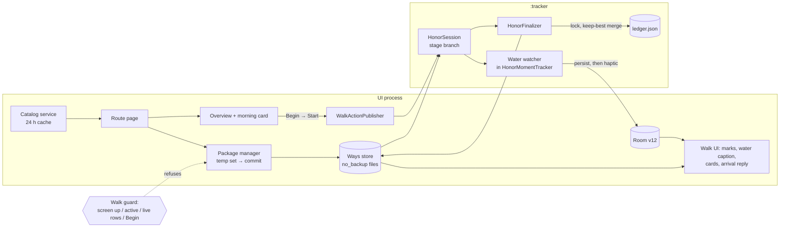

# feat: Honor — pilgrimage stages, iOS v2.0.0 parity, Stage 21-2 (Phase 21)

> **For agentic workers:** execute unit by unit (one unit, or one named cluster, per PR, stacked like Stage 21-1) through the house pattern: an implementation agent, then a correctness review and a parity review, then fixes. Merge only on the owner's word.
>
> **Authority order:** the `/ios-parity port` spec produced in U30 (Swift quotes pinned at `7c200bf`) outranks this plan wherever they disagree; this plan outranks memory. Requirements: `docs/brainstorms/2026-09-28-ios-v200-parity-retarget-requirements.md` (R13, R14, R16, R22, R23; AE8, AE9).
>
> **Unit numbering** continues Phase 21's (Stage 21-1's plan used U1–U29), so commit messages, PR titles and specs that cite "Phase 21 U30" stay unambiguous across the phase's plans.

## Summary

Port iOS slice two (PRs #84 and #85): a walker opens "A pilgrimage", browses the open-pilgrimages catalog, downloads one route at a time, and walks its stages as Honor Ways, with water ahead, service marks, a morning card, an arrival reflection, and a per-route ledger. It's built on Stage 21-1's Way model, Ways store, `:tracker` session and Honor surfaces, behind the same release flag. A port spec comes first. Then come the data layer (importer, catalog, store, package manager, ledger), the `:tracker` stage behaviour (water ahead, finalize writes), and the UI (doors, overview, walk, after). It closes with a combined device checklist.

---

## Problem Frame

Stage 21-1 shipped Honor for your own walks and shared walks. Its Way model already carries every stage field (`WaySource.Pilgrimage`, `WayMoment.pin`, `names`, `text`, `sitMinutes`, `WayMark`, `WayStage`) and the Ways store already allow-lists `pilgrimage:` ids. But nothing can bring a stage onto the phone, walk it as a stage, or remember it afterwards. iOS 2.0.0's Honor sheet offers three doors; Android's offers two. The stage branches left as seams through Stage 21-1 (see Context) are where this plan lands. Android's process split adds problems iOS doesn't have: `:tracker` re-reads a stage's `way.json` at Start and at every revival, and the walk's finalize step can run in either process (see origin: R16).

---

## Requirements

- R13. Catalog, route, packages, ledger: the catalog from the open-pilgrimages index with a 24 h cache and fallback, grouped in walking order, with badges and the sparse note; the route page with its stage list, next/continue row, and Download, Update, Replace and Remove with iOS's confirmations, one route at a time, all-or-nothing, pinned to the index's release, refused mid-walk; validation with iOS's bounds and identity cross-check; a per-route ledger that records only anchored stages, carries kilometres across a redraw with a one-time notice, and survives Replace and Remove. (see origin)
- R14. Walking a stage: no companion, no soft tap, a stage line where a date would be; the dataset's words, local names in iOS's language order, and "Sit?"; services as quiet marks from zoom 13, nearest 40; "water in 280 m" with a soft haptic under iOS's cadence; the morning card at Begin and "the day" mid-walk; the arrival card's closing line with reply here, echoed on the summary under "X of Y km of the stage"; stage surfaces never say "they" or "their" except where iOS ships it. (see origin)
- R16. The pocket bar holds for stages: water ahead, cards, captions, haptics and arrival survive screen off, app switches and a UI reclaim, and a finished stage walk lands linked and in its ledger whatever happens to the UI. (see origin)
- R22. A port spec with Swift quotes pinned at `7c200bf` before implementation; iOS's tests and fixtures ported verbatim; golden traces extended to water ahead. (see origin)
- R23. A device checklist for this stage, run in the owner's combined end-of-stage pass. (see origin)
- R5, R6. Exact strings and thresholds from the Swift; every divergence a recorded platform equivalent or deliberate addition. (see origin)

**Origin acceptance examples:** AE8 (covers R13, R16), AE9 (covers R14).

---

## Scope Boundaries

- Offline maps, the "Save maps for the way" row, Settings → Data → Maps, and the morning card's maps line (Stage 21-3, its own plan). This plan leaves iOS's tiles seams in place, as named in U34 and U38.
- The parity gate and the 2.0.0 release (their own plan).
- Everything iOS deferred inside slice two (see origin, Scope Boundaries): a companion dot for stages, tappable service marks, elevation profiles, route variants, reverse direction, background catalog refresh, route cover images.
- Never built on iOS, so not ported (see origin: R4): a stage mode subtitle, stage Ways listed in Settings → Ways, a camera seed from the resume point, the catalog's "updated" clause.
- Android-original fixes of iOS defects: matched as shipped and filed upstream (R5).

### Deferred to Follow-Up Work

- **iOS PR #91** ("a temple ahead stamps until five", open and ready on pilgrim-ios as of 2026-10-02): if it merges before the parity gate starts, it folds into this stage under R2 as a named fold-in unit. That unit revisits every landed unit its diff touches (U31, U34, U35, U38, U39) and recaptures the water golden traces. U30 specs its diff as a conditional annex, so the work is ready either way.

---

## Context & Research

### Relevant Code and Patterns

- **The Way model and its stage fields:** `P/domain/honor/Way.kt` (`WaySource.Pilgrimage`, `WayMoment.pin`, `names`, `text`, `sitMinutes`, `WayMark`, `WayStage`, `isPilgrimageStage`); `P/domain/honor/WayJson.kt` (a stage round-trip is pinned in `WayCodecTest`).
- **The Ways store:** `P/data/honor/WayStore.kt`. It allow-lists `pilgrimage:` ids, and `list()` already skips the `pilgrimage/` folder. It writes atomically through `writeAtomically` (temp, fsync, move, folder fsync). `retireMany` isn't ported yet.
- **Stage seams Stage 21-1 left:**
  - `P/ui/honor/HonorWaysSheet.kt` (the third section isn't drawn);
  - `P/data/honor/HonorSessionEntity.kt` (`firedMarks` and `lastMarkSeconds` deferred; `HonorSourceKind.PILGRIMAGE` exists);
  - `P/domain/honor/HonorMomentTracker.kt` and `HonorEngine.kt` (the water branch point; mark tunings already in `HonorTuning.kt`);
  - `P/ui/walk/HonorWalkViewModel.kt` (companion hidden and soft-tap caption suppressed on a stage; `isStage` unread by the card);
  - `P/ui/honor/WayMomentHeader.kt` (the stage subline and copy; `localName` already ported);
  - `P/ui/honor/WayPlaceCard.kt` ("Sit?" already ported);
  - `P/ui/honor/HonorArrivalCard.kt` (no closing line or reply row);
  - `P/walk/honor/HonorSessionState.kt` (origin −1, "stage-reflection");
  - `P/walk/honor/HonorFinalizer.kt` (`finalizeClean` and `finalizeRecovered`, where the ledger hooks in);
  - `P/ui/walk/summary/HonorSummaryModel.kt` and `P/honor/HonorWalkRecords.kt` (no stage fields);
  - `P/core/prompt/ActivityContext.kt` and `PromptAssembler.kt` (the stage lexicon form);
  - the stage-line sites (`HonorOverviewModel.kt`, `HonorWaysViewModel.kt`, `WaysListViewModel.kt`);
  - `P/walk/WalkStartRequest.kt` (`HonorSettings.atStart` lacks iOS's `&& !isPilgrimageStage` on the soft tap).
- **A validated fetch on its own client:** `P/data/honor/WayImporter.kt` (15/30 s, the length cap before the body, same-host redirects followed by hand, nothing logged).
- **A cached catalog:**
  - `P/data/collective/routes/CollectiveRouteCatalogService.kt` (caches the served bytes, temp then rename, a CAS sync guard);
  - `P/data/collective/CollectiveRepository.kt` (a TTL re-checked inside the fetch mutex).
- **Gates:**
  - Walk guard: `WaysAvailability` in `P/ui/settings/data/WaysListViewModel.kt` (the flag on, no active walk, no live sessions).
  - Begin hold: `HonorBeginsInFlight` in `P/honor/WaySweeper.kt`.
  - Walk screen up, pre-Start included: `HonorLinkScreen.walkScreenUp`, which `PilgrimNavHost` reports to `HonorLinkRouter.screenChanged`. The package guard reads its screen clause from this, rather than building a second tracker.
  - The flag: `P/core/flags/ReleaseFlags.kt`, with `T/core/flags/FixedReleaseFlags.kt` in tests.
- **Disk full and free space:** `WayMediaDownloadWorker.isDiskFull`; `WhisperModelDownloadWorker` (the free-space probe).
- **Map:**
  - Way pins on their own annotation manager (creation order is z-order), and `MapGlyphBitmaps.kt`;
  - camera reads in `P/ui/walk/map/SeekCrescentRenderer.kt`;
  - `subscribeCameraChanged` / `subscribeMapIdle` in `P/ui/walk/PilgrimMap.kt`;
  - the style-loaded latch ported on 2026-10-02 (`c66f19ae`).
- **The caption and haptic slot:** `softTapMeters` on `HonorWalkViewModel`'s stats model, drawn in `P/ui/walk/WalkStatsSheet.kt`; the soft-tap caption's 20 s life in `HonorWalkViewModel`; the session's ritual dispatch, persisted first, in `HonorSession`.
- **Cards:** `HonorCardLayer` in `P/ui/honor/WayPlaceCard.kt`, hosted on the walk screen, and reserved card ids in `honor_card_states` (as `HONOR_ARRIVAL_CARD_ID`).
- **Tests:**
  - `T/walk/honor/HonorHarness.kt` (in-memory Room, a real store, finalizer and controller);
  - `T/data/honor/WayImporterTest.kt` and `ConnectionCountingServer.kt`;
  - `T/data/MigrationTestDatabases.kt` (builds an exported schema version);
  - `T/data/honor/WaysBackupRulesTest.kt`;
  - the golden harness and corpus under `app/src/test/resources/honor/` (built in U16).
- **The data source:** `../open-pilgrimages` (local), with the `@main` index at v1.12.0 and 8 packaged routes.
  - Live `route.json` carries keys added after the pin (`stampHours`, `schemaVersion`), so decoders ignore unknown keys.
  - Shikoku's `difficulty` is `""`.

### Institutional Learnings

- **A schema version a device has run is frozen** (`unreleased-schema-on-debug-phone`). Schema 11 is on the owner's phone, so U35's columns take version 12 with an additive migration. Check `git status app/schemas` after builds.
- **Catalog sync:** the dedupe guard goes before the launch, and every `catch (Throwable)` rethrows cancellation (Stage 5-C). The TTL check and forced refresh share one mutex; read persisted state with `.first()`, not an eager `.value` (Stage 8-B).
- **Downloads:** the filesystem is the source of truth; re-read on terminal states; delete through the same path function writes use (Stage 5-D). Pin the URL builder's exact shape in a unit test (Stage 5-G's doubled path segment).
- **Untrusted JSON:** validate every path segment that becomes a file; clamp; watch size and offset arithmetic (Stages 2-D and 10-HI).
- **Room transactions:** a nested `withTransaction` isn't a savepoint; use one top-level transaction per item (`room-nested-withtransaction-not-savepoint`).
- **`:tracker`:** a cached `:tracker` carries a previous walk's state into the next, so stage state resets on a fresh start. Test pure decisions across the state cross-product, including the second walk (`cached-tracker-second-walk-race`).
- **Test hygiene:** wall-clock polls for callbacks from real threads, `cancelAndJoin` before `db.close()`, and DataStores with explicit scopes (the flake notes in MEMORY.md).
- **Process:** one combined device pass at the stage's end (`feedback-device-testing-at-the-end`); iOS defects matched as shipped and filed upstream (`feedback_ios_defects_upstream_first`); topic-cluster spec readers with machine-checked quotes (`ios-parity-large-slice-approach`).

### External References

- None needed: iOS at `7c200bf` is the behaviour source, and the repo has strong patterns for every layer. The data contract lives in `../open-pilgrimages` (its `CLAUDE.md` and `docs/`).

---

## Key Technical Decisions

- **Ledger storage:** a file at `noBackupFilesDir/Ways/pilgrimage/<route>/ledger.json`, mirroring iOS's path. Room and DataStore travel in a device transfer; `no_backup` never does, and a Way's progress must not outlive its Ways (origin: R11's exclusion).
- **Ledger writes, two lock layers:** `:tracker`'s finalize, the UI's launch retry and post-Finish finalize, Update's reconcile, and the route page's redraw-notice clear can all write it, sometimes from several threads in one process.
  - A Java file lock belongs to the whole JVM: a second thread asking for it throws `OverlappingFileLockException` instead of waiting. So each write first takes a process-wide per-route lock, then a `FileChannel` lock on a sibling `.lock` file, and releases them in reverse order.
  - Under both, it reads, merges by iOS's keep-best rule (completed is sticky, kilometres take the max), and writes atomically.
  - Records carry the walk's end time, never the clock, so a retry in either process writes identical content.
  - **Order-safe merge:** iOS lets the last record win for `walkedAt` and `stoppedAtFrac`, which is safe only because iOS records walks in the order they end. Android's launch retry can replay an older walk after a newer one, so a record older than the entry's `walkedAt` applies only the sticky completion and the kilometre max. This is a dated Android addition at the gate.
- **Finalize ordering:** the ledger record lands before the Honor marker and before the live rows are deleted, inside the existing write-error retry path. A marker therefore promises the ledger entry the summary reads. The stage's identity (route id, index, name, kilometres) is copied into the session row at Start, so a record never depends on `way.json` surviving.
- **Room schema 12:** additive columns on `honor_sessions` for the fired marks, the quiet hour's last mark time, the water caption (mark id, metres, firing time), and the stage identity. `MIGRATION_11_12`, plus the full 8→12 chain test. Schema 11 stays byte-identical.
  - **Shaped for PR #91 if it's coming:** #91 replaces water's quiet-hour clock with one shared by water and temple notices and adds a fired-stamps set. Once a device runs schema 12, those would cost a schema 13. So at U35's start, with U30's annex in hand, the quiet-hour column is designed as the shared notice clock and a fired-stamps column is reserved, if #91 is still headed for merge.
- **The walk guard for package changes:** wider than a Room probe. Changes are refused while:
  - the walk screen is up, pre-Start included;
  - a walk is active;
  - live Honor session rows exist, which covers a finished walk whose Honor step is pending;
  - a Begin is in flight.

  The guard is checked on entry and again before the commit, and Start waits for an in-flight commit to finish rather than refusing (iOS has no copy to port for a refusal). Without the guard, `:tracker` would read new geometry under old progress. iOS's guard (`activeWalkViewModel`) covers the screen; the extra cases are Android's process split, recorded as a platform equivalent.
  - **A pending finalize mustn't block forever:** when the guard would refuse only because finished walks still have live rows, it runs `HonorFinalizer.finalizePending()` once and checks again. A ledger record the store can never write (an invalid route id) counts as done, as `link()` treats one.
  - **The stage seen at the door is the stage walked:** Begin carries the `WayFileStamp` the overview loaded, and Start refuses with the existing "Gone" copy if the stage's `way.json` has changed since, as it can if an Update committed while the overview or morning card was open. iOS walks the Way it captured at the door; this keeps Android's re-read at Start equivalent.
- **Stage Ways are read from the package, not staged per walk:** parity with iOS, made safe by the guard above. Staging per walk would be an Android-only divergence, and the guard already removes the hazard.
- **Package downloads run in the UI process**, in an app-scoped coroutine with a `StateFlow` phase, while the app is open, like iOS's foreground session. They don't use WorkManager. The temp set lives under `noBackupFilesDir`, never `cacheDir`, which the system may evict mid-download. The launch sweep spares a download in flight. A backgrounded app may stall the download into "the download didn't finish", as on iOS.
- **The catalog cache** lives under `noBackupFilesDir/Pilgrimages/`, with the index fetched through a client that has no HTTP cache, since the CDN sends a 7-day max-age. It's fresh under 24 h, falls back to any age on failure, and Retry forces a fetch (iOS's rules).
- **Map marks:** their own annotation manager, below the moment pins, re-selected on 200 m of movement or an integer zoom change, from a camera report throttled to 4 per second. The UI reads them only; `:tracker` never touches Mapbox.
- **Water ahead lives in `:tracker`,** in `HonorMomentTracker`, using iOS's watcher: on-way water marks, the 300 m look-ahead, a quiet hour of engine seconds with the first caption free, and once per mark. Rows persist before the haptic. The haptic fires in the pocket, under R6's existing deliberate addition. The UI shows the caption from Room for what's left of its 20 s, never replaying it after a revival.
- **`WayStore.list()` skips `pilgrimage:` ids before decoding,** so the sheet and the sweep stop decoding up to 50 MB of stage JSON. Every caller filters stage Ways out except one: the Settings → Ways footer counts them (iOS's `all.count - ways.count`). A new store method returns the stage Way ids with a `way.json` on disk, without decoding, and the footer counts those.
- **Kills mid-commit:** port iOS's `replacing.txt` marker handling exactly. Whether a launch reconciliation of a half-committed install (an Android addition) is worth it is an owner decision raised by U30, with the gap filed upstream either way.

---

## Open Questions

### Resolved During Planning

- **Where does the ledger live, and how do two processes write it?** A no-backup file under two lock layers (a process-wide per-route lock, then the file lock) and an order-safe keep-best merge (Key Technical Decisions). A second database was weighed and rejected (Alternative Approaches Considered).
- **Does schema 11 change?** No. Schema 12 is additive.
- **WorkManager or a foreground coroutine for packages?** A foreground coroutine, as on iOS.
- **Stage a stage's Way per walk?** No. The guard keeps the package stable under a walk.

### Deferred to Implementation

- **The exact column names and types for schema 12:** decided in U35 against the spec's field list, and against U30's PR #91 annex if #91 is still headed for merge.
- **How the live-row fields map to iOS's `HonorStageOutcome`:** U30 pins which of `progress_frac`, `progress_high_water` and `walked_frac` iOS's outcome reads, and which test decides "never anchored".
- **Whether Start's wait on an in-flight package commit needs anything on screen:** commits take well under a second, so U34 measures one on a full route first; if the wait is long enough to notice, the copy becomes an owner decision in U41.
- **The cross-process half of the ledger lock:** Robolectric runs in one JVM, so U33 proves it with a plain JVM test that starts a second JVM on the test classpath (`ProcessBuilder`), holds the file lock there, and asserts the test's writer waits and both records land. The threaded test proves the in-process layer.
- **The owner decisions the spec raises:** at least the kill-mid-commit reconciliation, plus the new iOS defect candidates (the arrival label "Walked their way: <stage>", the overview's synthesized clock and "a quiet way", ledger kilometres as position rather than distance walked, the summary reading the ledger's best). Defaults are parity plus an upstream issue.

---

## Output Structure

    app/src/main/java/org/walktalkmeditate/pilgrim/
      data/honor/pilgrimage/
        PilgrimageModels.kt           index, route and stage wire models, PilgrimageError
        PilgrimageWayImporter.kt      validation, caps, identity cross-check, Way build
        PilgrimageCatalogService.kt   index fetch, 24 h cache, grouping, previews, URLs
        PilgrimagePackageManager.kt   download, update, replace, remove, commit/rollback
        PilgrimageLedger.kt           outcome, ledger, keep-best record, reconcile, store
      ui/honor/pilgrimage/
        PilgrimageCatalogScreen.kt (+ ViewModel)
        PilgrimageRouteScreen.kt (+ ViewModel)
        StageMorningCard.kt
      ui/walk/map/WayMarkPins.kt
    app/src/test/resources/honor/pilgrimage/   iOS's fixtures, verbatim
    docs/parity/2026-10-…-honor-pilgrimage-stages-port.md
    docs/qa/2026-10-…-honor-pilgrimage-stages-qa.md

---

## High-Level Technical Design

> *This illustrates the intended approach and is directional guidance for review, not implementation specification. The implementing agent should treat it as context, not code to reproduce.*

---

## Alternative Approaches Considered

- **A second small database in `noBackupFilesDir` for the ledger:** SQLite's own locking would give cross-process transactions without a hand-rolled lock. Not chosen: it adds a second Room database (DI, its own migration chain and exported schemas, all under the frozen-schema rule) for a few kilobytes of data that iOS keeps as one JSON file. The file with two lock layers stays small and is tested in both its layers.
- **Staging each stage's Way per walk,** as own walks are: removes the package-under-a-walk hazard outright, but diverges from iOS. The wide guard plus the door's file stamp remove it with parity intact.

---

## Implementation Units

### Phase D: Stage 21-2a, the spec and the data layer

### U30. Port spec C: the pilgrimage stage slice

**Goal:** a `/ios-parity port` spec at `7c200bf` for everything U31–U41 build.

**Requirements:** R22, R4, R5.

**Dependencies:** None (the survey and flow analysis from planning are inputs).

**Files:**
- Create: `docs/parity/2026-10-…-honor-pilgrimage-stages-port.md`.

**Approach:**
- Use five topic-cluster readers, each applying all four lenses and writing its own file during the run, with every quote machine-checked against `git show 7c200bf:<path>`:
  - **P1. Wire and catalog:** importer, catalog, grouping, cache, preview, bounds, fixtures, live-data notes.
  - **P2. Package, store and ledger:** lifecycle, marker, rollback, guard, `retireMany`, ledger, finalize and recovery, the Ways footer.
  - **P3. The stage in `:tracker`:** water ahead, the event, the soft-tap and companion branches, the haptic, the caption state, the outcome, origin −1, the glance, the lexicon, the water golden traces.
  - **P4. Doors and pre-walk:** the Ways door, catalog, route page, overview branches, offline note, morning card, preview.
  - **P5. Walk and after:** marks and the camera report, the card body, the water caption, "the day", the arrival reply, the summary.
- Front matter, as in the Stage 21-1 specs:
  - corrections to this plan;
  - notes by unit;
  - the Android additions to record at the gate;
  - the matched-as-shipped table (defects filed upstream as themed pilgrim-ios issues, with E-15 and E-16 resolved here);
  - proposed owner decisions with recommendations.
- Fold in the flow analysis's 15 gaps, and pin:
  - which live-row fields (`progress_frac`, `progress_high_water`, `walked_frac`) and which anchor test map to iOS's `HonorStageOutcome` and its nil-when-never-anchored rule;
  - past walks reading a stage's redrawn geometry and kilometres after an Update (matched as shipped, if confirmed);
  - walked stages that `retireMany` keeps piling up across Replaces, outside Settings → Ways' total;
  - `walkedAt` taken from the walk's end time, where iOS uses the record time (invisible, since iOS never reads it; a gate note).
- Spec iOS PR #91's diff as a conditional annex (Scope Boundaries).

**Test expectation:** none — specification document.

**Verification:**
- Every behaviour U31–U41 implement appears as a Swift quote, and every quote matches its pinned lines.

### U31. The stage importer and its fixtures

**Goal:** a downloaded `route.json` and `stage-NN.json` become a validated `Way`, or fail with iOS's errors and copy.

**Requirements:** R13, R5.

**Dependencies:** U30.

**Files:**
- Create: `P/data/honor/pilgrimage/PilgrimageModels.kt`, `P/data/honor/pilgrimage/PilgrimageWayImporter.kt`.
- Create: `app/src/test/resources/honor/pilgrimage/` (iOS's `index.json`, `index-pilgrimages.json`, `route.json`, `stage-00.json`, `stage-01.json`, verbatim).
- Test: `T/data/honor/pilgrimage/PilgrimageWayImporterTest.kt` (ported, 20).

**Approach:**
- Decoding:
  - flat wire models, ignoring unknown keys;
  - bounds checked before any integer conversion;
  - string caps by grapheme;
  - local names limited to `[a-z]{2,3}` keys, at most 20 pairs;
  - moment kinds other than waypoints skipped, and unknown mark kinds dropped.
- **The identity cross-check:** `route.json` against the catalog entry, and each stage against `pilgrimage:<route>:<i>`, its route, index, count and name. A failure gives "this route isn't walkable yet".
- **The build:** the Way's `source`, `stage`, `marks`, moments with `pin` and `at`, and geometry, with iOS's `minLengthMeters` check.
- Nothing from a package is logged.

**Patterns to follow:** `P/data/honor/WayImporter.kt` and `TourManifest.kt`; `P/domain/honor/SwiftText.kt`.

**Test scenarios:**
- Happy path (ported): both fixtures build their Ways, with marks, names, `sitMinutes`, and `pin` against `at`.
- Error path (ported): one rejecting test per bound, among them a non-contiguous stage index, a mark count over 400, an `offLineMeters` over 100,000, a gain over 30,000, and hours where the maximum is below the minimum.
- Error path: a stage whose id, route, index, count or name disagrees with the route row is "this route isn't walkable yet".
- Edge case: live-data keys (`stampHours`, `schemaVersion`) are ignored; an empty `difficulty` is kept and skipped by every line.
- Edge case: a moment of an unknown kind is skipped, and a mark of an unknown kind dropped, without failing the stage.

**Verification:**
- The ported tests pass, with iOS's fixtures byte-identical.

### U32. The catalog service

**Goal:** the open-pilgrimages index, fetched, validated, grouped and cached exactly as iOS does.

**Requirements:** R13.

**Dependencies:** U30, U31 (shared models).

**Files:**
- Create: `P/data/honor/pilgrimage/PilgrimageCatalogService.kt`.
- Modify: `P/di/` (bindings).
- Test: `T/data/honor/pilgrimage/PilgrimageCatalogServiceTest.kt` (ported, 37).

**Approach:**
- **The fetch:** `https://cdn.jsdelivr.net/gh/walktalkmeditate/open-pilgrimages@main/index.json`, on a client with no HTTP cache, 15 s and 30 s timeouts, the declared length checked first, a 256 KB streamed cap, and HTTP 200 only. Nothing from the fetch is logged.
- **The cache:** fresh under 24 h; on failure, the cached copy at any age; with no cache, "the routes are out of reach right now". Stored under `noBackupFilesDir/Pilgrimages/catalog.json` as the fetch time plus the parsed catalog. The TTL check and Retry's forced fetch share one mutex.
- **Index rows:** a route is listed only with valid `ways` and a valid id and distance. The name is `en`, else the first locale. For duplicates, the first wins.
- **Grouping:** follows `pilgrimages[].sections`, skipping unshipped sections and dropping empty or unnamed pilgrimages. Unclaimed routes trail with no header, and every route appears exactly once.
- **Route previews:** cached per release (`route-<id>-<release>.json`).
- **Package URLs:** `@<release>/routes/<id>/ways/<file>`, with the release and id validated before any URL or path is built.

**Patterns to follow:** `CollectiveRouteCatalogService.kt`, `CollectiveRepository.kt` (the TTL inside the mutex), `WayImporter.kt` (the client).

**Test scenarios:**
- Happy path (ported): `index-pilgrimages.json` groups Shikoku's legs in walking order, while Kumano, which lists only unshipped sections, drops; a loose route trails under no header.
- Edge case (ported): a sparse route carries "few places marked yet"; a route without `ways` is unlisted; a `../etc/passwd` id is unlisted.
- Error path: offline with a cache past 24 h serves the cache; offline with no cache shows the out-of-reach copy; a body over 256 KB is refused.
- Edge case: a fetch within 24 h makes no request (MockWebServer counts); Retry forces one.
- Happy path: the URL builder's exact shape for `route.json`, `stage-07.json` and `stage-107.json`.

**Verification:**
- The ported tests pass; no HTTP cache is configured on the client.

### U33. The Ways store's pilgrimage tree, `retireMany`, and the ledger

**Goal:** the on-disk shape for installed routes, retiring stages, and a ledger two processes can write safely.

**Requirements:** R13, R16, AE8.

**Dependencies:** U30, U31.

**Files:**
- Modify: `P/data/honor/WayStore.kt` (the `pilgrimage/<route>/{route.json, release.txt, ledger.json}` tree, `replacing.txt`, `stageWayId`, the route-id check, `retireMany`, `list()` skipping `pilgrimage:` ids before decoding, a method listing stage Way ids without decoding, and `sweepTempFiles` reaching `pilgrimage/` and each `pilgrimage/<route>/` folder).
- Create: `P/data/honor/pilgrimage/PilgrimageLedger.kt`.
- Test: `T/data/honor/WayStoreTest.kt` (extended), `T/data/honor/pilgrimage/PilgrimageLedgerTest.kt` (ported, 11).

**Approach:**
- **`retireMany`** keeps a walked stage's `way.json`, replies and link, and counts live-session Way ids as walked, so a stage whose finalize is pending is never deleted.
- **The ledger:**
  - the outcome;
  - `record`, keeping the best: completed is sticky, kilometres take the max, and `stoppedAtFrac` follows iOS's rule exactly;
  - `next`, giving "start with stage 1", "next: stage N", "continue from where you stopped", or "you have walked the whole way";
  - `progressLine`;
  - `reconcile`, keeping an entry whose name matches and whose distance is within 5%, carrying dropped kilometres to `carriedKm`, and setting a one-time notice;
  - all under the cross-process lock described in Key Technical Decisions, with the walk's end time on every record.

**Patterns to follow:** `WayStore.writeAtomically`; iOS's `PilgrimageLedger.swift`.

**Test scenarios:**
- Happy path (ported): an anchored, completed stage records; a second, shorter walk of it keeps the completion and the longer distance.
- Covers AE8. A stage walk that never anchored records nothing; one anchored midway and ended early makes `next` read "continue from where you stopped".
- Edge case (ported): an Update that renames stage 3 drops its entry into `carriedKm`, and the notice shows once; an entry within 5% of its old distance survives.
- Integration: two writers recording different stages concurrently, one per thread, both land (the in-process lock); the same record written twice produces an identical file.
- Integration: a second JVM holding the file lock makes the test's writer wait, and both records land (the cross-process lock).
- Edge case: an older walk's record replayed after a newer one keeps the newer `walkedAt` and `stoppedAtFrac`, and still applies the completion and the kilometre max.
- Edge case: `retireMany` keeps a walked stage and a stage named by a live session row, and deletes the rest.
- Edge case: `list()` never decodes a `pilgrimage:` Way (a store spy counts decodes), while the stage-id listing still counts them.
- Edge case: a stale temp file left by a killed ledger or `replacing.txt` write is swept at the usual age cutoff.

**Verification:**
- The ported ledger tests pass; the cross-process merge loses nothing.

### U34. The package manager

**Goal:** Download, Update, Replace and Remove, one route at a time, all-or-nothing, pinned to the index's release, refused mid-walk.

**Requirements:** R13, R16.

**Dependencies:** U31, U32, U33.

**Files:**
- Create: `P/data/honor/pilgrimage/PilgrimagePackageManager.kt`.
- Modify: `P/walk/honor/HonorFinalizer.kt` or `P/PilgrimApp.kt` (the launch temp sweep and the marker cleanup, UI process only), `P/honor/BeginHonorWalk.kt` / Start (wait for a commit in flight; refuse with "Gone" on a changed `WayFileStamp`).
- Test: `T/data/honor/pilgrimage/PilgrimagePackageManagerTest.kt` (ported: 22, plus lifecycle 8 and streaming 2).

**Approach:**
- **A transaction:**
  - download every file into a temp set under `noBackupFilesDir`;
  - validate each through U31;
  - enforce the 50 MB total on bytes received ("the download didn't finish");
  - commit by saving the stage Ways and the route tree;
  - on a failed commit, remove the whole route, as iOS's `rollBack` does (it doesn't restore the prior install);
  - log nothing from the download, a parse failure, or a rejected commit.
- **The other operations:** Replace writes `replacing.txt` (checking for busy first, the flow-analysis gap), and replacing a route with itself runs as an Update. Update reconciles the ledger, and Remove leaves `ledger.json`.
- **Single-flight and the guard:** reentrancy is refused; the walk guard from Key Technical Decisions is checked on entry and before the commit ("finish your walk first"); and the phase is published as a `StateFlow`.
- **Slice-three seams** for Stage 21-3: tiles removal on Remove and Replace, `removeRegions(atOrAbove:)` on Update, `PilgrimageError.mapTooLarge`, and `isBusy` counting a save.

**Patterns to follow:** iOS's `PilgrimagePackageManager.swift`; `WayMediaDownloadWorker.isDiskFull`; `WaysAvailability`; `HonorBeginsInFlight`.

**Test scenarios:**
- Happy path (ported): a two-stage download installs both stages, `route.json` and `release.txt`.
- Error path (ported): a stage that fails validation leaves nothing installed; a body crossing 50 MB is "the download didn't finish"; a failed Update commit removes the route, as iOS does.
- Edge case (ported): Replace with another route removes the old route's stages but keeps its walked stages and ledger; Replace with the same route runs as an Update.
- Error path: each operation is refused while the walk screen is up, a walk is active, live session rows exist, or a Begin is in flight; Start waits for a commit in flight.
- Edge case: live rows left only by a finished walk's pending finalize trigger one `finalizePending()`, after which the operation proceeds.
- Edge case: an Update committed while a stage's overview was open makes that overview's Start refuse with "Gone".
- Edge case: a second download while one runs is refused, and the in-flight Replace's marker survives.
- Integration: a launch with a stale temp set and a half-written marker cleans up as iOS's `installed()` does, and never in `:tracker`.

**Verification:**
- The ported package tests pass; no operation can change a stage under a live walk.

### Phase E: Stage 21-2b, the stage in `:tracker`

### U35. Water ahead, the stage session, and Room schema 12

**Goal:** a stage walks in `:tracker` as iOS's does: no soft tap, water ahead with its haptic, and the state persisted and revived.

**Requirements:** R14, R16, R22, AE9.

**Dependencies:** U30, U31 (fixtures).

**Files:**
- Modify:
  - `P/domain/honor/HonorMomentTracker.kt`, `HonorEngine.kt` (the water watcher and `markAhead`);
  - `P/walk/honor/HonorSession.kt`, `HonorSessionState.kt` (the stage branch; the caption state; stage identity at Start);
  - `P/data/honor/HonorSessionEntity.kt`, `P/data/PilgrimDatabase.kt` (`MIGRATION_11_12`), `app/schemas/.../12.json`;
  - `P/walk/WalkStartRequest.kt` (no soft tap on a stage);
  - `P/audio/honor/HonorHaptics.kt` and `HonorAudioPorts.kt` (the water haptic).
- Test:
  - `T/domain/honor/HonorMomentTrackerTest.kt` (iOS's +6);
  - `T/walk/honor/HonorSessionTest.kt` (stages);
  - `T/data/PilgrimDatabaseMigrationTest.kt` (11→12 and the full 8→12 chain);
  - `T/domain/honor/HonorGoldenTraceTest.kt` (water traces).

**Approach:**
- **The water watcher** (iOS's):
  - only `water` marks within 60 m of the line, sorted by fraction, and only while on the Way;
  - a quiet hour of engine seconds, with pauses out and sittings in, and the first caption free;
  - scanning skips marks behind, breaks at the first unfired mark more than 300 m ahead, and fires each mark once;
  - a mark skipped during the quiet hour can still speak later if it's within 300 m;
  - it ignores the recording, sitting and paused gates, as iOS does.
- **Persist before ritual:** the session persists the fired set, the last mark time and the caption before the haptic.
- **Soft tap:** never on a stage.
- **Stage identity** (route id, index, name, kilometres) is copied into the row at Start.
- **Revival** restores the fired set and the quiet hour, and never replays a caption.
- **Golden traces:** extend U16's capture harness with stage fixtures and assert water events.

**Patterns to follow:** U15's tracker and U16's golden harness; U17's session persistence; U6/U14's migrations.

**Test scenarios:**
- Covers AE9. Nine on-way water marks: the first announces within 300 m ahead; marks passed within the next hour stay silent; a fountain 250 m off the line never announces.
- Edge case: a mark skipped during the quiet hour speaks once the hour ends if it's still within 300 m.
- Edge case: water fires while recording or sitting, as iOS does.
- Integration: a `:tracker` revival keeps the fired set and quiet hour; the UI shows the caption for what's left of its 20 s and doesn't replay it.
- Edge case: a cached `:tracker`'s second walk starts with an empty fired set (the second-walk lesson).
- Integration: 11→12 opens through Room's identity check; the full 8→12 chain keeps walks, events and stats; schema 11 is byte-identical.
- Happy path: the water golden traces match iOS's events, fix for fix.
- Edge case: a stage start never schedules a soft tap.

**Verification:**
- The tests pass; `12.json` is the only new schema file.

### U36. Finalize: the ledger record, recovery, and the reflection reply

**Goal:** a finished stage walk lands linked and in its ledger whatever happens to the UI; the arrival's closing line takes a reply.

**Requirements:** R13, R14, R16, AE8.

**Dependencies:** U33, U35.

**Files:**
- Modify: `P/walk/honor/HonorFinalizer.kt` (the clean and recovered records, in order, inside the retry path), `P/honor/HonorReplies.kt` (origin −1, "stage-reflection", at `stage.end.at`), `P/walk/WalkLifecycleObserver.kt` (the insert sites).
- Test: `T/walk/honor/HonorFinalizerTest.kt` (stages), `T/walk/honor/PilgrimageStageWalkTest.kt` (iOS's 19, +5 replies, +5 recovery).

**Approach:**
- **A clean finish:** link, then record with the outcome from the live row, before the marker and the live-row delete. A package Way is never re-saved at walk end.
- **A recovered finish:** link without arrival numbers, then record with the row's outcome at the walk's end time. Android's continuously written row is fresher than iOS's checkpoint, recorded as a dated platform equivalent.
- **Failures:** a failed record is a retry at the next launch, like a failed link.
- **The reflection reply:** files under origin −1. The recordings sink outlives Stop, and discard drops it.

**Patterns to follow:** U17's finalizer and its retry; U22's reply insert sites.

**Test scenarios:**
- Covers AE8. A stage begun more than 60 m away and never anchored: no cards, captions, arrival or ledger entry, but the walk is linked.
- Covers AE8. Anchored midway, then ended early with the UI process dead: the ledger offers "continue from where you stopped".
- Integration: a `:tracker` kill after `finishWalkAtomic`: the next launch's retry records exactly once.
- Error path: a failed ledger write leaves no marker and retries.
- Happy path (ported): a reflection reply filed at the closing line plays on a later walk; a discard drops it.

**Verification:**
- The ported stage-walk tests pass, and no path leaves a marker without its ledger entry.

### Phase F: Stage 21-2c, the stage on screen

### U37. The third door: the Ways sheet, the catalog, and the route page

**Goal:** "A pilgrimage" opens the catalog, and a route page offers stages and the package actions with iOS's copy and confirmations.

**Requirements:** R13, R5.

**Dependencies:** U32, U33, U34.

**Files:**
- Modify: `P/ui/honor/HonorWaysSheet.kt`, `P/ui/navigation/PilgrimNavHost.kt`.
- Create: `P/ui/honor/pilgrimage/PilgrimageCatalogScreen.kt` and its ViewModel, `PilgrimageRouteScreen.kt` and its ViewModel.
- Test: `T/ui/honor/pilgrimage/PilgrimageCatalogViewModelTest.kt`, `PilgrimageRouteViewModelTest.kt`, `PilgrimageScreensSemanticsTest.kt`.

**Approach:**
- **The Ways sheet:** "A pilgrimage", "Walk a pilgrimage", and the footer.
- **The catalog:**
  - group headers and an initial plate;
  - the "on your phone" and "update ready" badges;
  - the card line, extended for the installed route;
  - "few places marked yet";
  - the unreachable copy with "try again".
- **The route page:**
  - the summary, the sparse note, and the button (Download, Update or "On your phone");
  - "stage d of n", errors, and the redraw notice;
  - the next row and the stage list with its facts line;
  - "reaching for the stages…", and Remove in the overflow;
  - every alert with iOS's copy: "Replace?", "Remove?" / "Keep it", "Download this route first?" / "Not now", and "finish your walk first".
- **The live phase:** both the catalog and the route page collect the package manager's phase on every entry, so leaving a route page mid-download and coming back, or a configuration change, shows the download in progress rather than idle.
- **Process death:** a route page restored after process death shows idle, since the download died with the process; never a resumed download.

**Patterns to follow:** U21's sheet and dialog routes (`honorSheet`); U28's Ways sheet sections.

**Test scenarios:**
- Happy path: the sheet's third section opens the catalog; a row opens its route page.
- Happy path (ported): the next row reads each of its four forms from ledger fixtures.
- Error path: "finish your walk first" mid-walk; the unreachable copy offline with no cache; a retry failure shows the rust line.
- Edge case: the redraw notice shows once and clears.
- Edge case: a route page created while a download runs shows its live phase, not idle; after process death it shows idle.
- Happy path: semantics labels match iOS (from U30).

**Verification:**
- The tests pass; with the flag off, no door exists.

### U38. The overview's stage branches and the morning card

**Goal:** a stage's overview, its morning card at Begin, and "the day" mid-walk.

**Requirements:** R14.

**Dependencies:** U37.

**Files:**
- Modify: `P/ui/honor/HonorOverviewScreen.kt`, `HonorOverviewViewModel.kt`, `HonorOverviewModel.kt`, `WayMomentHeader.kt` (`WayStageLine`, "N along the stage"), `WayMomentPreview.kt`, the walk options sheet.
- Create: `P/ui/honor/pilgrimage/StageMorningCard.kt`.
- Test: `T/ui/honor/HonorOverviewViewModelTest.kt` (stages), `T/ui/honor/pilgrimage/StageMorningCardTest.kt`.

**Approach:**
- **The overview:**
  - the stage line in the date slot;
  - the voice toggle hidden;
  - Begin labelled "Walk this stage";
  - the offline note, shown once ever.
- **The morning card:** at the overview's Begin, with the theme, narrative, facts, warnings and weather. "walk" navigates, and Start still starts the walk.
- **"the day":** the options row mid-walk reopens the card with "close".
- **The preview:** "1.2 km along the stage".
- The tiles seams stay (`mapsLine`, `isStageSaved`).

**Patterns to follow:** U21's overview; `HonorCardLayer` for the reopen.

**Test scenarios:**
- Happy path: the stage overview shows "stage 1 of 33 · 24 km · hard", no voice toggle, and Begin read as "Walk this stage".
- Edge case: the offline note shows once, then never again.
- Happy path: Begin opens the morning card; "walk" opens the walk screen pre-Start; "the day" reopens it mid-walk.
- Edge case: the iOS defects the spec matches as shipped, such as the synthesized clock and "a quiet way" on a stage overview.

**Verification:**
- The tests pass, and the strings match the spec.

### U39. On the walk: marks, the water caption, cards, and the arrival reply

**Goal:** the stage's walk screen draws service marks, shows the water caption, carries the dataset's words, and takes the arrival reflection.

**Requirements:** R14, R16.

**Dependencies:** U35, U36, U38.

**Files:**
- Create: `P/ui/walk/map/WayMarkPins.kt`.
- Modify: `P/ui/walk/PilgrimMap.kt` (the marks manager and the camera report), `P/ui/walk/HonorWalkViewModel.kt`, `P/ui/honor/HonorOverviewScreen.kt` and `HonorOverviewViewModel.kt` (marks on the overview), `P/ui/honor/WayPlaceCard.kt`, `HonorArrivalCard.kt`, `P/ui/walk/WalkStatsSheet.kt` (the caption slot), `P/ui/walk/map/MapGlyphBitmaps.kt`.
- Test: `T/ui/walk/map/WayMarkPinsTest.kt` (ported, 6), `T/ui/walk/HonorWalkViewModelTest.kt` (stages), `T/ui/honor/HonorOnWalkSemanticsTest.kt` (stages).

**Approach:**
- **Marks:** zoom 13 or more, nearest 40, at 18 dp, below the moment pins and never tappable. They're re-selected every 200 m or on an integer zoom change, from a camera report throttled to 4 per second; the overview's start empty until the camera reports.
- **Z-order:** `PilgrimMap` creates the moment pins' manager lazily, and creation order is z-order. So the marks manager is created in the same step, before it, whenever the Way carries marks, or the marks would draw above the pins.
- **The water caption:** "water in <distance>" in the soft-tap slot, for what's left of its 20 s, read from Room.
- **Card bodies:** the text, else "A place on the way.", local names in iOS's order, and "Sit?" with its subline.
- **The arrival card's stage form:** "you walked the stage", the stage name, the places passed with the walked kilometres or "the whole stage", the closing line, and the reply row in its four states.
- **E-15 and E-16** follow the spec.

**Patterns to follow:** U22's pins, cards, caption slot and arrival card.

**Test scenarios:**
- Happy path (ported): `WayMarkPins` picks the nearest 40 within the zoom gate and none below zoom 13.
- Edge case: the marks re-select after 200 m and on an integer zoom change, but not on a fractional change.
- Integration: a water event in Room shows the caption for its remaining life after a UI restart; an expired one shows nothing.
- Happy path: a stage card shows the dataset's text, a local name in iOS's order, and "Sit?".
- Happy path: the arrival card shows the closing line and "reply here", which records to origin −1.
- Happy path: the stage surfaces' semantics labels match iOS.
- Edge case: the marks manager exists below the moment pins' manager even when the pins' manager is created first.

**Verification:**
- The tests pass, and the stage surfaces say "they" only where iOS does.

### U40. After the walk: the summary, the prompt, the Ways footer, and the glance

**Goal:** a stage walk reads as a stage afterwards.

**Requirements:** R14, R13.

**Dependencies:** U36.

**Files:**
- Modify: `P/ui/walk/summary/HonorSummaryModel.kt`, `HonorSummarySection.kt`, `P/honor/HonorWalkRecords.kt`, `P/core/prompt/ActivityContext.kt`, `PromptAssembler.kt`, `P/ui/settings/data/WaysListScreen.kt` (the package footer).
- Test: `T/ui/walk/summary/HonorSummaryModelTest.kt` (stages), `T/core/prompt/PracticeLexiconTest.kt` (the stage form), `T/ui/settings/data/WaysListViewModelTest.kt` (the footer).

**Approach:**
- **The summary:** "the stage you walked", "14.1 km of 24.2 km of the stage" (from the ledger, as iOS ships it), the closing line only when arrived, and "your reply". There's no delta for a stage.
- **The prompt:** the stage lexicon form, with the route name from the installed package, else the slug, and "stage N of M".
- **Settings → Ways:** the footer "the X keeps its N stages on its route page", with N from U33's stage-id count (iOS's `all.count - ways.count`). U30 rules whether iOS also counting walked stages a Replace retired is matched as shipped, and the footer test follows that ruling.
- **The glance:** "their way, walked" stays, matched as shipped.

**Patterns to follow:** U23's summary model and lexicon.

**Test scenarios:**
- Happy path: an arrived stage walk shows the stage block with the closing line and "your reply".
- Edge case: an unanchored stage walk's summary matches the spec's quote for a stage with no ledger entry.
- Edge case: a summary of a stage later walked further shows the ledger's best, as iOS ships it (matched as shipped).
- Happy path: the stage lexicon names the route and "stage N of M".
- Happy path: the Ways footer names the installed route and its stage count, counted as U30 rules.

**Verification:**
- The tests pass.

### U41. The stage's device checklist

**Goal:** the checklist for the combined end-of-stage device pass.

**Requirements:** R23.

**Dependencies:** U31–U40.

**Files:**
- Create: `docs/qa/2026-10-…-honor-pilgrimage-stages-qa.md`.

**Approach:**
- **Cover:**
  - the catalog online, offline from the cache, and with no cache;
  - a route download, Update, Replace and Remove, including a mid-walk refusal and a backgrounded download;
  - a simulated stage walked from a desk with the U19 harness, in airplane mode: water ahead with its haptic in the pocket, marks by zoom, cards, the morning card and "the day", arrival with a reflection reply;
  - a UI kill and a `:tracker` kill mid-stage, with the ledger landing;
  - "continue from where you stopped";
  - the summary and the route page's next row.
- **Run** in the same sitting as any outstanding checks, as the owner prefers. The offline-maps half of R23's airplane-mode row is Stage 21-3's.

**Test expectation:** none — device checklist.

**Verification:**
- The checklist covers every device-only risk the units flag.

---

## System-Wide Impact

- **Interaction graph:**
  - The package manager writes stage Ways that `:tracker` reads at Start and on revival.
  - The finalizer in either process writes the ledger.
  - Launch maintenance in the UI process sweeps temps and markers.
  - The Ways sheet, Settings → Ways and the expiry sweep all list Ways, and must skip stage Ways cheaply.
- **Error propagation:** package failures surface as iOS's copy on the route page, never crashes. A ledger or link failure is a retry at the next launch, never a lost record.
- **State lifecycle risks:**
  - a half-committed install after a kill (U34, plus an owner decision);
  - a stage deleted with its finalize pending (U33's walked set);
  - concurrent ledger writers (U33's lock);
  - a cached `:tracker`'s second walk (U35).
- **Unchanged invariants:**
  - own and shared Ways behave as Stage 21-1 built them;
  - schema 11's shape;
  - the flag-off build, which has no pilgrimage network calls, doors or launch work;
  - `:tracker` makes no Mapbox calls and enqueues no WorkManager work.

---

## Risks & Dependencies

| Risk | Mitigation |
|------|------------|
| A package change under a live walk gives the walk new geometry. | U34's wide guard, checked on entry and before the commit; Start refuses during a commit. |
| A kill mid-commit leaves a half install. | Port iOS's marker handling; U30 raises a launch reconciliation as an owner decision; file upstream. |
| Two processes lose a ledger entry. | The file lock, the keep-best merge, and end-time-dated records (U33). |
| A finalize without a ledger. | The ledger record lands before the marker, inside the retry path (U36). |
| Live data drifts past the pin (new keys, empty fields). | Ignore unknown keys, and keep live-data fixtures alongside iOS's (U31). |
| CI load flakes as the suite grows. | Wall-clock polls, `cancelAndJoin` teardowns, generous budgets on real-thread waits (house flake rules). |

**Dependencies:** the open-pilgrimages `@main` index and CDN (live); Stage 21-1 merged or stacked beneath; the owner's device pass at the end.

---

## Phased Delivery

### Phase D: Stage 21-2a (U30–U34)
- The spec, then the data layer, all testable without a walk.

### Phase E: Stage 21-2b (U35–U36)
- The stage in `:tracker` and finalize. This is where the pocket bar is won.

### Phase F: Stage 21-2c (U37–U41)
- The screens, then the device checklist.

---

## Documentation / Operational Notes

- **CLAUDE.md:** update the phasing section when Stage 21-2 completes.
- **The parity gate's rows:** record the Android additions (the wide package guard, the fresher recovery outcome, any reconciliation the owner chooses).
- **Credit:** ODbL attribution ("© OpenStreetMap contributors") already sits in About.

---

## Sources & References

- **Origin document:** [docs/brainstorms/2026-09-28-ios-v200-parity-retarget-requirements.md](../brainstorms/2026-09-28-ios-v200-parity-retarget-requirements.md)
- **Stage 21-1 plan:** [docs/plans/2026-09-29-001-feat-honor-groundwork-own-shared-walks-plan.md](2026-09-29-001-feat-honor-groundwork-own-shared-walks-plan.md) (Global Constraints and the `:tracker` architecture carry forward).
- **Specs:** `docs/parity/2026-09-29-honor-own-walk-port.md`, `docs/parity/2026-10-01-honor-shared-walk-port.md` (the stage branch points, E-15, E-16).
- **iOS at `7c200bf`:**
  - the design and plan: `docs/superpowers/specs/2026-09-03-honor-slice-two-pilgrimage-stages-design.md`, `docs/superpowers/plans/2026-09-04-honor-slice-two-ios.md`;
  - PRs #84 and #85;
  - `Pilgrim/Models/Honor/Pilgrimage*.swift`, `Pilgrim/Scenes/Honor/Pilgrimage*View.swift`, `StageMorningCard.swift`.
- **Data:** `../open-pilgrimages` (index v1.12.0).
