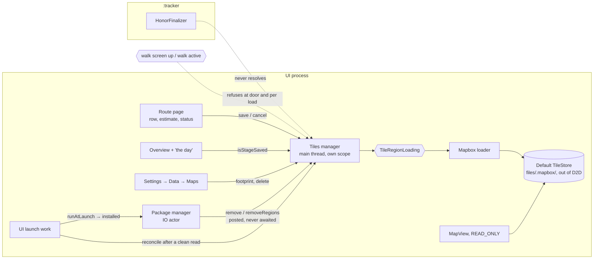

# feat: Honor — offline maps per stage, iOS v2.0.0 parity, Stage 21-3 (Phase 21)

> **For agentic workers:** execute unit by unit (one unit per PR, stacked like Stage 21-2) through the house pattern: an implementation agent, then a correctness review and a parity review, then fixes. Merge only on the owner's word.
>
> **Authority order:** the `/ios-parity port` spec produced in U42 (Swift quotes pinned at `7c200bf`) outranks this plan wherever they disagree; this plan outranks memory. Requirements: `docs/brainstorms/2026-09-28-ios-v200-parity-retarget-requirements.md` (R15, R16, R21, R22, R23; AE10).
>
> **Unit numbering** continues Phase 21's (Stage 21-2's plan used U30–U41), so commit messages, PR titles and specs that cite "Phase 21 U42" stay unambiguous across the phase's plans.
>
> **Path shorthand:** `P/` is `app/src/main/java/org/walktalkmeditate/pilgrim/`, `T/` is `app/src/test/java/org/walktalkmeditate/pilgrim/`, `R/` is `app/src/main/res/`. iOS paths are at `7c200bf` in `../pilgrim-ios`.

## Summary

Port iOS slice three (PR #86) in seven units. U42 is a port spec. U43 is the corridor and size maths in pure Kotlin. U44 is a tiles manager that talks to Mapbox only through an interface with a fake, as iOS does. U45 is the one Mapbox-touching loader, plus launch wiring in the UI process only. U46 and U47 add the route page's "Save maps for the way" row, the morning card's line, and Settings → Data → Maps. U48 is the device checklist. Saved state is read from Mapbox's own tile store every time, so Room schema 12 is untouched. Saves run in the app while it's open, like Stage 21-2's stage downloads. Everything sits behind the existing release flag, except the backup rule that keeps Mapbox's folder out of a device transfer.

---

## Problem Frame

Stage 21-2 shipped pilgrimage stages, but a stage's basemap still needs a connection. A walker on the Kumano Kodo or a Shikoku mountain pass often has none. iOS 2.0.0 lets the walker save the whole route's maps before leaving, and Stage 21-2 left every seam for it:
- the package manager's nullable `PilgrimageTiles` hook, called on Remove, Replace and Update;
- `PilgrimageError.MAP_TOO_LARGE` and its line;
- the route model's `isBusy`, whose comment names Stage 21-3;
- `StageMorningCard(mapsLine:)`, passed `null` by both callers.

Android has no offline Mapbox code at all. Its process split adds constraints iOS doesn't have:
- `:tracker` must never touch the tile store, because two processes on one store is unsupported.
- Android restarts the UI process far more often than iOS, sometimes mid-walk.
- The default tile store sits inside the folder that a device-to-device transfer copies (see origin: R15, R6).

---

## Requirements

- R15. One opt-in "Save maps for the way · ~N MB" on the route page, sized before the tap, saves every stage's corridor in both the light and dark styles at z11–14 with no terrain DEM.
  - Progress reads stage by stage. Cancel keeps what's done. A re-tap resumes at the first gap, skipping only stages whose region is complete and still matches the current line.
  - The estimate counts packs and is calibrated per route after that route's first save.
  - The morning card says whether today's maps are saved. Settings → Data → Maps shows what's saved and deletes it after a confirmation.
  - Nothing is orphaned: Remove and Replace take the maps; Update removes retired stages' maps and downloads nothing; a launch reconciliation sweeps anything the installed route doesn't own.
  - Saves run while the app is open and resume on the next tap. They're refused mid-walk, allow cellular, and stay out of cloud backup and device-to-device transfer. (see origin)
- R21. Behind the release flag: no Maps row, no route-page row and no tiles launch work with the flag off. (see origin)
- R16. The pocket bar is unchanged: Mapbox stays out of `:tracker`, and nothing a walk needs waits on the tile store. (see origin)
- R22. A port spec with Swift quotes pinned at `7c200bf` before implementation. iOS's tests port alongside as each unit's parity tests, and platform-object builders get Robolectric `.build()` tests. (see origin)
- R23. This stage's half of the airplane-mode row (a simulated stage walked with and without saved maps), plus saved maps staying out of a device-to-device transfer, in the owner's combined end-of-stage pass. (see origin)
- R5, R6. Exact strings and thresholds from the Swift. Every divergence is a recorded platform equivalent or deliberate addition. (see origin)
- R24's needs. Every Android addition this stage makes is listed for the gate with its reason. (see origin)

**Origin acceptance example:** AE10 (covers R15). All 33 stages are saved, then an Update redraws stage 12 and shortens the route to 30 stages:
- stages 30–32 lose their maps and nothing downloads;
- the route page reads "Save maps for the way · 29 of 30 saved";
- stage 12's morning card says there are no offline maps for today.

---

## Scope Boundaries

- **iOS PR #91** ("a temple ahead says it stamps until five", merged 2026-10-02 as `e551b11`, with about ten commits past the head the Stage 21-2 annex read) is folded in by its own plan, after this one and before the gate (owner decision, 2026-10-06). It touches the stage engine, not maps. This plan only leaves room in the UI launch work for its stamp-hours restamp step, beside the tiles reconcile, as iOS's `reconcilePilgrimageAtLaunch` places it.
- **iOS PR #92** (Mapbox telemetry off on iOS) is a check of Android's existing opt-out at the gate (origin R2). Android turns telemetry off only when a map style loads (`PilgrimMap.kt`), so a save started before any map has loaded runs under Mapbox's default state. The gate's #92 check covers the tiles path too.
- The parity gate and the 2.0.0 release (their own plan).
- **Never built on iOS, so not ported:**
  - the debug "simulate no signal for maps" toggle (removed by `d331b61` before the pin);
  - refreshing expired tiles (a re-tap resumes, it doesn't refresh);
  - a wifi-only setting;
  - saving one stage at a time;
  - z15–16 tiles and the terrain DEM;
  - background or scheduled saves.
- Android-original fixes of iOS defects: matched as shipped and filed upstream (R5; `feedback_ios_defects_upstream_first`).
- **Mapbox upgrades past 11.23.1:**
  - 11.24's one-store-per-process rule;
  - 11.29's overzoom fixes;
  - 11.32's `PARTIAL_LOAD` error.

  The default-store choice below stays valid under 11.24.

### Deferred to Follow-Up Work

- **The #91 fold-in plan.** It needs a spec refresh against the merged `e551b11` (the Stage 21-2 spec's annex read `534f170`). It ports `stampHours`, the temple-ahead notice on schema 12's `honor_notices` table, the shared notice clock, the launch restamp, and the golden-trace recapture.
- **iOS fixes for this stage's filed defects** fold in under R2 if they land before the gate starts.

---

## Context & Research

### Relevant Code and Patterns

- **The seams Stage 21-2 left:**
  - `P/data/honor/pilgrimage/PilgrimagePackageManager.kt`: `interface PilgrimageTiles { remove; removeRegions(atOrAbove); val isSaving }`. The constructor takes `tiles: PilgrimageTiles? = null`, and the `@Inject` constructor passes none. The seam is called from Replace, Update and Remove inside the manager's actor on `Dispatchers.IO`, and "must not call back into it". `FakeTiles` is in `T/data/honor/pilgrimage/PilgrimagePackageManagerTest.kt`, which also notes that iOS's `testRemoveReplaceAndUpdateReachTheTilesManager` is deferred to this stage.
  - `P/data/honor/pilgrimage/PilgrimageModels.kt`: `PilgrimageError.MAP_TOO_LARGE`, with its line already in `R/values/strings.xml`.
  - `P/ui/honor/pilgrimage/PilgrimageRouteViewModel.kt`: `PilgrimageRouteModel.isBusy(phase, held)`, the package phase only. `reload()` reads `installed()` and catches its throw.
  - `P/ui/honor/pilgrimage/PilgrimageRouteScreen.kt`: the download button, the row's slot underneath.
  - `P/ui/honor/pilgrimage/StageMorningCard.kt`: `mapsLine: String?`, drawn after the weather line. `P/ui/honor/HonorOverviewScreen.kt` and `P/ui/walk/ActiveWalkScreen.kt` (`StageDaySheet`) pass `null`.
  - `P/ui/honor/HonorOverviewViewModel.kt`: the offline note, unchanged by this stage (iOS defect D1).
- **The walk signals:** `P/data/honor/pilgrimage/PilgrimageWalkGuard.kt` has `PilgrimageWalkSignals.walkScreenUp()` (iOS's clause) and `walkActive()` (a walk row open, as after a UI reclaim). Both are cheap, so the tiles guard reads them without the package guard's `finalizePending()` pass.
- **Launch work:**
  - `P/walk/honor/HonorFinalizer.kt` sets `packageLaunchWork = { if (releaseFlags.honor) packageManager.get().runAtLaunch() }`. It's resolved only in the UI process, through `Provider`, because `HonorFinalizer` is also built in `:tracker`.
  - `PilgrimagePackageManager.runAtLaunch()` returns `Unit` today.
  - `P/PilgrimApp.kt` returns early in non-main processes, before `MapboxOptions.accessToken`.
- **Settings:**
  - `P/ui/settings/data/DataCard.kt`: "Export & Import", then "Ways" when `showsWays`.
  - `P/ui/settings/SettingsScreen.kt`;
  - `P/ui/settings/data/WaysListScreen.kt` and `WaysListViewModel.kt`, the closest screen pattern;
  - `P/ui/navigation/PilgrimNavHost.kt`, whose `Routes.WAYS_LIST` is the route pattern.
- **Geometry:** `P/domain/honor/WayGeometry.kt`, which says the corridor, `simplified` and `ringContains` aren't ported yet; `T/domain/honor/WayGeometryTest.kt`.
- **Maps:** `P/ui/walk/PilgrimMap.kt` loads `Style.LIGHT` / `Style.DARK`, the same URIs as iOS's `.light` / `.dark`. Android adds no runtime DEM.
- **Disk full:** `WayMediaDownloadWorker.isDiskFull`, which iOS's loader mapping also reads.
- **Backup rules:** `R/xml/data_extraction_rules.xml` (device transfer includes `file` "."), `R/xml/backup_rules.xml`, and `T/data/honor/WaysBackupRulesTest.kt`, which asserts the rules by parsing the XML.
- **Builder tests:** `T/ui/walk/PilgrimMapCameraBuildersTest.kt` already builds Mapbox option objects under Robolectric.
- **The debug harness:** `app/src/debug/kotlin/org/walktalkmeditate/pilgrim/debug/honor/HonorDebugReceiver.kt` and `WayReplayer.kt` (replays a stage from the desk).
- **The flag:** `P/core/flags/ReleaseFlags.kt`; `T/core/flags/FixedReleaseFlags.kt` in tests.

### Institutional Learnings

- **Schema 12 is frozen** on the owner's phone (`unreleased-schema-on-debug-phone`). This stage adds no Room state. If one turns out to be needed, it's schema 13 with a migration.
- **Platform-object builder rule** (CLAUDE.md, Stage 2-F): every Mapbox option builder the loader constructs gets a Robolectric `.build()` test on the production code path. The fake loader still serves the manager's tests.
- **Off Main:** the route page's estimate and status do real work: a corridor and a z11 sweep per stage, and 33 SHA-256 hashes (Stage 2-E: `viewModelScope` defaults to Main). iOS does this on the main thread (the survey's D8, a performance note, not filed). Android doesn't.
- **Async singletons:** re-read the source of truth on terminal states, and use a `Deferred` for the first answer (Stages 5-C and 5-D). The tiles manager's cold-cache wait is this shape.
- **Test hygiene:**
  - wall-clock polls for callbacks from real threads (`robolectric-drain-real-thread-flake`);
  - `cancelAndJoin` before teardown (`ci-vm-scope-leak-main-swap-uoe`);
  - DataStores with explicit scopes (Stage 8-B).
- **Process:**
  - one combined device pass at the stage's end (`feedback-device-testing-at-the-end`);
  - iOS defects matched as shipped and filed upstream (`feedback_ios_defects_upstream_first`);
  - topic-cluster spec readers with machine-checked quotes, which read the big Stage 21-2 spec by heading and line range, never whole (`ios-parity-large-slice-approach`).

### External References

The planning research is in the session scratchpad and is restated here where it decides something.
- **Mapbox Android 11.23.1 / common 24.23.1, checked with `javap`:**
  - `TileStore.create()`; `create(path)` is deprecated; `setRootPath` exists.
  - `OfflineManager` is `@MainThread` throughout.
  - TileStore callbacks arrive on Mapbox worker threads, and style-pack callbacks on a background thread.
  - `TileStoreUsageMode` and the `MapsResourceOptions` tile-store setters are deprecated; the map defaults to the default store in READ_ONLY mode.
  - The error types are `TileRegionErrorType` / `StylePackErrorType`.
  - 11.23.1 can report success for a partially loaded region, so completeness is judged by counts.
- **The default store is `filesDir/.mapbox/tile_store`**, from the SDK's initializer and Mapbox's own instrumentation tests. Not yet confirmed on the device (U48).
- light-v11 and dark-v11 carry one vector `composite` source (streets-v8, terrain-v2, bathymetry-v2), so descriptors with no `tilesets` include no DEM, and both styles share packs.

---

## Key Technical Decisions

- **Where saved maps live (owner decision, 2026-10-06):** Mapbox's default store (`TileStore.create()`, under `filesDir/.mapbox/`), with `.mapbox/` excluded from device transfer and, explicitly, from cloud backup.
  - iOS keeps a dedicated `pilgrimage-tiles` folder, excluded from iCloud. Copying that would need the deprecated `create(path)`, or a `setRootPath` that must run before anything touches Mapbox and can't sit behind the flag.
  - It would also strand the existing default store and its map cache, and it cuts against 11.24's one-store rule.
  - The map already reads the default store in READ_ONLY mode, so nothing writes `MapboxMapsOptions` (whose setters delegate to deprecated natives).
  - The exclusion is static XML, so it ships unflagged and also stops today's ambient map cache travelling in a transfer.
  - Gate row: a platform equivalent for iOS's dedicated folder.
- **One process:** only the UI process builds the tiles manager and its loader, reached through `Provider`s. Building the manager touches no Mapbox class until its first store call. `:tracker` never resolves it (proved by a test).
- **One thread for the engine:** the tiles manager is confined to the main thread, as iOS's `@MainActor` manager is.
  - The loader calls `OfflineManager` there and hops every SDK callback back to it: TileStore's, and `OfflineManager`'s style-pack callbacks alike, which Mapbox also delivers on a background thread.
  - The package manager's seam calls (`remove`, `removeRegions`) arrive on IO under its actor. They post to the manager's thread in order and return without waiting, since Mapbox's removal is asynchronous anyway. They never call back into the package manager.
  - `isSaving` reads the phase.
  - The manager's scope has an exception handler that logs and ends the save as failed, so a Mapbox error on the main thread never crashes the UI process.
  - U42 pins the exact mechanics.
- **The manager takes precomputed stages:** its status, footprint, estimate, save and `isStageSaved` take one value per stage (index, convex rings, corridor hash), built by U43's pure functions on IO by the caller. The manager never decodes a Way or builds a corridor, so none of that work reaches the main thread. iOS's ported tests are adapted to this input.
- **The walk guard:** `walkScreenUp()` or `walkActive()`, at the door and again before each load, as iOS checks before each load.
  - The package guard's wider clauses (live Honor rows, a Begin in flight, the `finalizePending()` pass) guard `:tracker` reading a changing package. Tiles never reach `:tracker`, and the finalize pass is too heavy to run before each of about 35 loads.
  - A refusal at the door doesn't cancel a pending launch sweep (iOS's rule).
  - **The read suspends where iOS's doesn't:** `walkActive()` is a Room query, while iOS's `isWalkActive` is a synchronous closure. So a save claims its one-at-a-time slot synchronously, before the door's read, and a refusal releases it. The generation is re-checked after every guard read, right before a pack or region load starts. Otherwise a cancel landing during the read would start a stale load whose completion is ignored, leaving the save hung, and a second tap during the door's read would start a second loop.
  - Gate row: iOS's clause plus Android's revived walk.
- **Saves run in the UI process,** in the tiles manager's own app-scoped coroutine, so leaving the route page never cancels one. No WorkManager and no foreground service (R15).
  - Backgrounded or screen-off, a save runs until Android freezes the app or cuts its network. Then it either resumes when the app thaws or ends as "the download didn't finish", and the next tap resumes at the first gap.
  - A thaw may also leave Mapbox's native load in "saving" with no progress. The recovery is cancel, then a re-tap, which resumes at the first gap.
  - This is Stage 21-2's download rule. But a route's maps run to about 240 MB (iOS measures "a minute or two on wifi" for the Francés), against a stage package's 1.3 MB, so leaving the app mid-save is the normal case. U48 checks both a locked phone and an app sent to the background for over a minute during a long save.
- **No new Room state:** status, `isStageSaved` and the footprint are always derived from the store: regions, the stored corridor hash, resource counts, and complete style packs.
  - The per-route calibration lives in a Preferences DataStore under iOS's key, `pilgrimage.tiles.bytesPerPack.<routeId>`.
  - DataStore travels in a device transfer, which is harmless for a size figure and matches iOS's UserDefaults.
- **The cold cache waits for the store:**
  - On iOS, readers use the loader's cache, which is cold for under a second after launch (D6).
  - Android restarts the UI process far more often, mid-walk included, so "the day" would routinely read "no offline maps for today".
  - Readers and the package hooks therefore wait, with a bound, for the loader's first store answer after process start. iOS's own reconcile already rides on the store's answer, not the cache.
  - Past the bound, a reader answers "unknown", and the morning card gets no maps line (`mapsLine = null`, which draws nothing) rather than telling a walker with no signal that saved maps are missing.
  - U42 confirms this is a platform equivalent, not a divergence, or raises it as an owner decision with D6 filed either way.
- **The launch reconcile:**
  - It runs in the same UI launch work, right after `runAtLaunch()`, flag on only.
  - `runAtLaunch()` returns the installed route's id and stage count.
  - If `runAtLaunch()` throws, the sweep is skipped this launch. This is an Android-only path: iOS's `installed()` can't throw. Its one `installed()` swallows read failures. On Android the throw comes only from a store root that can't be resolved or a failed retire of a killed Replace's route.
  - Anything else reads as nothing installed and sweeps every saved map, as on iOS (D3, filed): a `route.json` that no longer decodes, an unreadable `route.json` or `release.txt`, or a pilgrimage folder that can't be listed.
  - The #91 plan adds its restamp step beside it.
- **Estimate and status off Main,** from the stages' corridors. The page keeps only rings and hashes, not up to 50 MB of decoded Ways. Both are keyed on the installed release, so an Update re-reads them (AE10).
- **Matched as shipped and filed upstream** (U42 groups these into one or two themed pilgrim-ios issues):
  - D1, the offline note staying after a save;
  - D2, summed region bytes possibly double-counting shared packs: measured in U48 before filing;
  - D3, the sweep when the installed route can't be read or decoded;
  - D4, "33 of 33 saved";
  - D5, style packs never removed;
  - D6, the cold cache;
  - D7, "Tap to save again" not refreshing;
  - a 11.23.1 partial load counted as done;
  - Delete leaving bytes in the ambient cache;
  - the orphan paths a failed Update rollback or a killed Replace leaves until the next launch;
  - #122 item 5 (the disk-full line names voices);
  - #121 item 5 (a route page reopened mid-download hides the row until it's reopened).
- **No debug offline switch:** iOS removed it before the pin, and R23's check is airplane mode. The debug harness instead gains a clear-map-cache command, so a region is proved rather than the ambient cache, and a tiles report (regions, bytes, packs) for D2's measurement.

---

## Open Questions

### Resolved During Planning

- **Where does the store live, and how does it stay out of a transfer?** The default store with a `.mapbox/` exclusion (Key Technical Decisions; owner, 2026-10-06).
- **Where does #91 go?** Its own fold-in plan after this one (owner, 2026-10-06).
- **Does schema 12 change?** No, and no new table is needed.
- **WorkManager or a foreground coroutine?** A foreground coroutine, as on iOS and as Stage 21-2's downloads.
- **Which walk guard?** The screen and active-walk clauses, at the door and before each load.

### Deferred to Implementation

- **The confinement mechanics:** whether the manager runs on `Dispatchers.Main.immediate` or a single-thread dispatcher handed to the loader, and how tests drive it (U44 against the fake; U45 on device).
- **The cold cache's details** (U42 decides, U44 builds):
  - the bound itself;
  - what counts as the store's first answer: a failed or stale refresh should end the wait too, or a waiter could sit out the whole bound;
  - what the package hooks do past the bound (they have no caller waiting on them);
  - keeping the hooks, the reconcile and a save's start in one order on the manager's thread, so a waiting remove's cancel never stops a save that started after it.
- **How the callers build the per-stage values without holding decoded Ways:** decode each stage on IO once per release, keep its rings and hash, and drop the Way (U46, U47).
- **D2's verdict** after U48 compares the summed figure with the store directory's size.
- **The exact debug harness actions** and their names (U45).
- **Whether the Maps row should follow the Ways row's walk gating.** The default is iOS's: shown whenever the flag is on, Delete included, since deleting maps mid-walk can't reach `:tracker`. U42 confirms.

---

## Output Structure

    app/src/main/java/org/walktalkmeditate/pilgrim/
      domain/honor/WayGeometry.kt              + corridor, simplified, ringContains, corridorContains
      data/honor/pilgrimage/
        PilgrimageTilesDescriptors.kt          zooms, pack root, region version, tileCount
        TileRegionLoading.kt                   the Mapbox-free seam and its value types
        PilgrimageTilesManager.kt              status, estimate, save, cancel, remove, reconcile
        MapboxTileRegionLoader.kt              the only Mapbox offline file
      ui/honor/pilgrimage/PilgrimageMapsRow.kt (+ model)
      ui/settings/data/OfflineMapsScreen.kt (+ ViewModel)
    app/src/main/res/xml/data_extraction_rules.xml, backup_rules.xml
    app/src/test/java/org/walktalkmeditate/pilgrim/data/honor/pilgrimage/FakeTileRegionLoader.kt
    docs/parity/2026-10-…-honor-offline-maps-port.md
    docs/qa/2026-10-…-honor-offline-maps-qa.md

---

## High-Level Technical Design

> *This illustrates the intended approach and is directional guidance for review, not implementation specification. The implementing agent should treat it as context, not code to reproduce.*

---

## Alternative Approaches Considered

- **iOS's dedicated folder** via `setRootPath(noBackupFilesDir/pilgrimage-tiles)`. It needs no XML, but the move can't be flagged, so every map changes stores in flag-off builds too and Stage 21-0's map pass would need re-running. It also strands the old store, and a failed `setRootPath` silently lands saves back in `filesDir` unless its result is checked. Rejected by the owner, 2026-10-06.
- **Mapbox's `estimateTileRegion`** instead of the pack count. It's more precise, but it needs the network, and iOS doesn't use it. It's at most a development cross-check of the 4 MB seed.
- **Cancelling a save when the app leaves the foreground,** to mirror iOS's pause exactly. Not chosen: Stage 21-2's downloads already let Android decide, and the resume-on-tap rule makes both outcomes equivalent for the walker.

---

## Implementation Units

### Phase G: Stage 21-3a, the spec and the engine

### U42. Port spec D: offline maps

**Goal:** a `/ios-parity port` spec at `7c200bf` for everything U43–U48 build.

**Requirements:** R22, R4, R5, R6.

**Dependencies:** None. The planning survey, the Mapbox research and the flow analysis are inputs.

**Files:**
- Create: `docs/parity/2026-10-…-honor-offline-maps-port.md`.

**Approach:**
- **Four topic-cluster readers,** each applying all four lenses and writing its own file during the run, with every quote machine-checked against `git show 7c200bf:<path>`:
  - **C1. Geometry and estimate (pure):** the corridor, simplify, ring tests, `tileCount`, the constants, the corridor hash, `packCount` / estimate / calibrate, and `megabytes`.
  - **C2. The tiles engine:** the seam and the fake, status / `isStageSaved` / footprint, the save loop, cancel and generations, the error map, remove / `removeRegions` / reconcile / the sweep generation, the package hooks, and the launch call.
  - **C3. The Mapbox platform:** the loader (store, descriptors, glyphs, pixel ratio, cache and refresh, the settled projection, partial packs, error mapping), the map's store at launch, backup and transfer, threading, and the 11.24 note.
  - **C4. Surfaces and copy:** the route row (`isBusy`, `mapsRowIsHeld`, its refresh triggers), the morning-card line from the overview and from "the day", Settings → Data → Maps with its confirmation, the unchanged offline note, every string, and flag gating.
- **Read iOS's design and plan for intent only** (`docs/superpowers/specs/2026-09-14-honor-slice-three-offline-tiles-design.md`, `docs/superpowers/plans/2026-09-14-honor-slice-three-offline-tiles.md`). Where they disagree with the code, the code wins (z11–14, no DEM, `bytesPerPack`, Update downloads nothing, `reconcile(installed: (routeId, stageCount)?)`).
- **The Stage 21-2 spec's seams section and its deferred-test notes:** grep the headings and read those sections by line range. The file is about 766 KB.
- **Front matter,** as in the earlier Phase 21 specs:
  - corrections to this plan;
  - notes by unit;
  - the Android additions to record at the gate (the default store and its exclusion, the walk-guard clauses, the cold-cache wait if confirmed, the off-Main estimate, the skipped sweep after a thrown launch read);
  - the matched-as-shipped table (Key Technical Decisions' list, filed as one or two themed pilgrim-ios issues);
  - proposed owner decisions with recommendations.
- **Pin the interplay with #91's merged launch step** (`reconcilePilgrimageAtLaunch`, `restampStageHours`) only as far as where the restamp sits. Its behaviour belongs to the #91 plan.

**Test expectation:** none — specification document.

**Verification:**
- Every behaviour U43–U48 implement appears as a Swift quote, and every quote matches its pinned lines.
- The upstream issues are filed and linked from the spec.

### U43. The corridor, the descriptors, and the corridor hash

**Goal:** a stage's line becomes iOS's convex-part corridor, its z11 pack count, and its hash, in pure Kotlin.

**Requirements:** R15, R22.

**Dependencies:** U42.

**Files:**
- Modify: `P/domain/honor/WayGeometry.kt` (`corridor(halfWidthMeters)`, `corridorContains`, `simplified`, `ringContains`).
- Create: `P/data/honor/pilgrimage/PilgrimageTilesDescriptors.kt` (z11–14, pack root z11, `regionVersion = 2`, the glyph-mode constant, `tileCount(rings, zooms)`, slippy-tile maths, `tileTouches`).
- Create: the corridor hash, a pure function U44 calls. U42 decides where it sits.
- Test: `T/domain/honor/WayGeometryCorridorTest.kt` (ported, 9); `T/data/honor/pilgrimage/PilgrimageTilesDescriptorsTest.kt` (ported, 5); the hash tests ported from `PilgrimageTilesManagerTests.swift`.

**Approach:**
- **Simplify:** Douglas–Peucker at 25 m in local metres from the first point. Both ends are kept, the stack is explicit, a point is kept only above the tolerance (strict), and fewer than 3 points pass through.
- **Parts, in line order:** for each vertex, the segment's quad when the segment has length, then the vertex's 2h square. Every part is a closed counterclockwise 5-point ring.
- **The hash:** SHA-256 in lowercase hex over the region version, then each ring point's `(lat × 1e6)` and `(lon × 1e6)`, rounded half away from zero, in emission order. It's device-local, so byte equality with iOS isn't required, but the inputs and their order are.
- **Rounding:** use `Math.round` / `roundToLong` semantics for Swift's `.rounded()` (half away from zero), never `kotlin.math.round` (half-even).

**Execution note:** test-first. Port iOS's tests before the code.

**Patterns to follow:** the existing `WayGeometry` projection helpers and their tests.

**Test scenarios:**
- Happy path (ported): every corridor test, including a diagonal square reaching about 707 m, one point giving one square, two identical points giving two squares and no quad, and an empty input giving none.
- Happy path (ported): `tileCount` counts distinct z11 cells across parts, with the per-part box rejection, and two stages sharing a cell count it once (the `[2, 1]` alone and `2` together fixture).
- Edge case: a line that crosses itself still yields only convex parts, and every input point is inside its own corridor (`corridorContains`).
- Edge case: the hash changes when one point moves by 1e-6° and not when it moves by less than half of that. It also changes with `regionVersion`.

**Verification:**
- The ported tests pass, with iOS's fixtures verbatim.

### U44. The tiles seam, the fake loader, and the tiles manager

**Goal:** the engine that sizes, saves, cancels, removes and reconciles a route's maps, tested entirely against a fake.

**Requirements:** R15, AE10, R16, R22.

**Dependencies:** U43.

**Files:**
- Create: `P/data/honor/pilgrimage/TileRegionLoading.kt`. It holds the interface and value types: the request (id, rings, hash, `acceptExpired`, equality ignoring rings), the style-pack request, the region summary with `isComplete = required > 0 && completed >= required`, the four loading errors, the load handle, and the store change (regions, packs).
- Create: `P/data/honor/pilgrimage/PilgrimageTilesManager.kt`, implementing `PilgrimageTiles`.
- Modify: `P/data/honor/pilgrimage/PilgrimagePackageManager.kt`, only if the seam needs more than its three members. The route page reads the manager directly.
- Test: `T/data/honor/pilgrimage/FakeTileRegionLoader.kt` and `FakeTileRegionLoaderTest.kt` (ported, 4); `PilgrimageTilesManagerTest.kt` (ported, 24); `PilgrimageTilesManagerLifecycleTest.kt` (ported, 10).

**Approach:**
- **Inputs:** one precomputed value per stage (index, convex rings, corridor hash), never a decoded Way (Key Technical Decisions).
- **Status:**
  - `isStageSaved` means complete and the hash matches.
  - `status` gives none, `partial(saved, of)`, or `saved(bytes)`, which needs both style packs.
  - `footprint` counts every region with the route prefix, stale ones included, so Delete reaches them.
- **Estimate:** `packCount` over every stage's rings at z11, times the route's bytes-per-pack (seed 4,000,000). The manager calibrates only after a fully successful save, by integer division, written only when bytes and packs are both at least 1.
- **The save loop:**
  - one save at a time, its slot claimed synchronously before the door's guard read;
  - the walk guard at the door, which doesn't bump the sweep generation;
  - bump the generation, then the phase `saving(0, 2 + n)`;
  - the light and dark packs, skipped when present;
  - one region snapshot, then the stages by index, skipping current ones, each load preceded by the guard and a generation check after the guard's read, and followed by the generation check;
  - calibrate, then idle;
  - on an error with the generation still current, cancel the in-flight load and publish `failed`.
- **Cancel:** bump the generation, cancel in flight, resume the pending load as incomplete, then idle. Done regions stay.
- **Hooks:**
  - `remove` cancels a save and removes every region with the prefix. It leaves style packs.
  - `removeRegions(atOrAbove)` removes the higher indices and downloads nothing.
  - `reconcile(installed: (routeId, stageCount)?)` bumps the generation and sweeps on the store's next answer: every `pilgrimage:` region not owned by the installed route below its stage count.
- **Signals:** a phase `StateFlow` and a regions-changed `SharedFlow` that fires on region changes only.
- **Errors:**
  - disk full becomes `DISK_FULL`;
  - too many tiles becomes `MAP_TOO_LARGE`;
  - a failure or cancellation becomes `INCOMPLETE`;
  - a guard refusal becomes `WALK_IN_PROGRESS` (U42 confirms the enum names).
- **Confinement and the cold-cache wait** follow Key Technical Decisions. The calibration store is an injected interface, so tests use an in-memory one.

**Execution note:** test-first. iOS's 38 manager and fake tests are the behaviour contract.

**Patterns to follow:** `PilgrimagePackageManager` (an app-scoped scope plus a `StateFlow` phase, and the injected-dispatcher constructor for tests); iOS's `FakeTileRegionLoader.swift` (which never answers a refresh inline).

**Test scenarios:**
- Happy path (ported): a full save loads both packs, then every stage in index order, publishes progress per step, calibrates, and goes idle.
- Happy path: AE10. With all 33 saved, Update's `removeRegions(atOrAbove: 30)` plus stage 12's new line reads `partial(29, of: 30)`; stage 12 isn't saved; nothing loads.
- Edge case (ported): a re-tap skips complete, current stages and resumes at the first gap. A stale hash re-loads that stage only.
- Edge case (ported): every region saved but a pack missing reads `partial(n, of: n)` (D4, matched).
- Error path (ported): a walk starting mid-save fails the next load's guard with "finish your walk first", and the regions already done stay.
- Edge case (Android, the suspending guard): a cancel that lands while the guard's walk read is suspended starts no further load, and the save ends. A second save call during the door's read runs no second loop.
- Error path (ported): disk full and too many tiles map to their errors; a late callback after cancel never resumes twice.
- Edge case (ported, lifecycle): the reconcile runs on the store's answer, not the cache; a packs-only change doesn't run it; a save past the door cancels a pending sweep, but a refused save doesn't; it's idempotent; with nothing installed it sweeps every `pilgrimage:` region.
- Edge case: a reader asked before the store's first answer waits for it, then answers from it. Past the bound it answers "unknown". A failed first refresh also ends the wait.
- Integration: `remove` called from another thread while a save runs cancels the save and removes the route's regions, and returns without waiting.

**Verification:**
- All ported tests pass. The engine has no Mapbox import.

### U45. The Mapbox loader, the backup rules, and the launch wiring

**Goal:** the only code that touches Mapbox's offline API, wired into the package manager and the UI launch work, with the store out of a device transfer.

**Requirements:** R15, R16, R21, R22, R6.

**Dependencies:** U44.

**Files:**
- Create: `P/data/honor/pilgrimage/MapboxTileRegionLoader.kt`.
- Modify:
  - `R/xml/data_extraction_rules.xml` (exclude `.mapbox/` in device transfer, and explicitly in cloud backup);
  - `R/xml/backup_rules.xml` (the same, explicitly);
  - `P/data/honor/pilgrimage/PilgrimagePackageManager.kt` (the `@Inject` constructor passes the tiles manager when the flag is on; `runAtLaunch()` returns the installed route's id and stage count);
  - `P/walk/honor/HonorFinalizer.kt` (the package launch work runs the reconcile after a clean `runAtLaunch()`);
  - the Hilt module that provides the manager and loader;
  - `app/src/debug/kotlin/org/walktalkmeditate/pilgrim/debug/honor/HonorDebugReceiver.kt` (a clear-map-cache command and a tiles report).
- Test:
  - `T/data/honor/pilgrimage/MapboxTileRegionLoaderTest.kt` (the pure parts of iOS's 7, plus the Robolectric `.build()` tests);
  - `T/data/honor/WaysBackupRulesTest.kt` (the `.mapbox/` exclusion);
  - `T/data/honor/pilgrimage/PilgrimagePackageManagerTest.kt` (ported `testRemoveReplaceAndUpdateReachTheTilesManager`);
  - `T/walk/honor/HonorFinalizerTest.kt` (or the existing launch-work test): the reconcile runs after a clean read and is skipped after a thrown one, and the flag-off and `:tracker` paths never resolve the tiles provider.

**Approach:**
- **The store:** `TileStore.create()`, held strongly, never `create(path)`.
- **Descriptors:** `OfflineManager().createTilesetDescriptor` for `Style.LIGHT` and `Style.DARK` at z11–14, with no `tilesets` and `pixelRatio` set to the screen density, as iOS passes its screen scale. U42 confirms.
- **Style packs:** loaded separately with `IDEOGRAPHS_RASTERIZED_LOCALLY`, set explicitly.
- **A region:** a `MultiPolygon` of every convex ring (`Point.fromLngLat`, longitude first), metadata `{"corridorHash": …}`, `acceptExpired` from the request, and `NetworkRestriction.NONE`.
- **The cache and its refresh:**
  - `regions()` answers from the cache and starts a refresh.
  - Stale refreshes are dropped by a generation.
  - A failed refresh still drains its waiters.
  - The settled projection `(id, isComplete, hash)` fires regions-changed only on a real change, a load success, or a removal.
  - A partially loaded pack doesn't count as present.
- **Threading:** every `OfflineManager` call on the main thread; every SDK callback hopped back to it, TileStore's and the style-pack callbacks alike.
- **Errors:**
  - `DISK_FULL` (either type) becomes disk full.
  - So does an error whose message passes `WayMediaDownloadWorker.isDiskFull`'s ENOSPC test, applied through a message-taking helper beside it. Mapbox's errors here are plain records with a type and a message, not Throwables, where iOS's are NSErrors. U42 records this as a platform equivalent.
  - `TILE_COUNT_EXCEEDED` becomes too many tiles.
  - `CANCELED` becomes cancelled.
  - Anything else is a failure.
- **The map:** no `MapboxMapsOptions` writes. The default store and READ_ONLY mode are already what the map uses (Key Technical Decisions).
- **Builder tests:** the loader builds its option objects through internal functions that the Robolectric tests call, covering `TileRegionLoadOptions`, `TilesetDescriptorOptions` and `StylePackLoadOptions` (CLAUDE.md rule). Natives (`TileStore`, `OfflineManager`) stay device-only.

**Patterns to follow:** `PilgrimMapCameraBuildersTest` for Mapbox builders under Robolectric; `WaysBackupRulesTest` for the XML rules; Stage 21-2's `Provider<PilgrimagePackageManager>` in `HonorFinalizer` for UI-only resolution.

**Test scenarios:**
- Happy path: the three option builders `.build()` with the loader's own values (zooms 11 and 14, the glyph mode, metadata carrying the hash, `acceptExpired` from the request, a `MultiPolygon` with longitude first). `TilesetDescriptor` is native-only, so the region-options test builds without real descriptors.
- Happy path (ported, pure): the settled projection ignores byte and count progress; packs count only when complete; the error map covers every SDK type and the disk-full message test.
- Happy path: the rules exclude `.mapbox/` from device transfer and from cloud backup, alongside the existing `transcript_contexts/` and device-token exclusions. The Ways stay out through `noBackupFilesDir`, which the existing include-domain assertion pins.
- Integration (ported): Remove, Replace and Update reach the tiles manager with the right route id and count, through the real package manager and a fake tiles manager.
- Error path: a thrown `runAtLaunch()` skips the reconcile; a clean read with nothing installed reconciles with `null`.
- Edge case: the flag-off launch work and a `:tracker`-built `HonorFinalizer` never resolve the tiles manager's provider.

**Verification:**
- The tests pass, `assembleDebug` builds, and the store path and rules are confirmed on device in U48.

### Phase H: Stage 21-3b, the surfaces and the checklist

### U46. The route page's maps row

**Goal:** "Save maps for the way" under the download button, with its estimate, progress, cancel, saved state and errors.

**Requirements:** R15, AE10, R21, R5.

**Dependencies:** U44 (U45 for the device).

**Files:**
- Create: `P/ui/honor/pilgrimage/PilgrimageMapsRow.kt` and its model (`megabytes`, `label`, `savedLine`, `savingLine`).
- Modify: `P/ui/honor/pilgrimage/PilgrimageRouteViewModel.kt` (`isBusy` with a save; `mapsRowIsHeld`; the stages' corridors, estimate and status, off Main, keyed on the installed release; refreshing on regions-changed and on the phase returning to idle), `PilgrimageRouteScreen.kt`, `R/values/strings.xml`.
- Test: `T/ui/honor/pilgrimage/PilgrimageMapsRowModelTest.kt` (ported from `PilgrimageMapsRowTests.swift`, 5 of its 6; the morning-card line's test is U47's); `PilgrimageRouteViewModelTest.kt` (the maps row, plus ported `testTheMapsRowIsHeldOnlyWhileThePackageDownloads`).

**Approach:**
- **Shown** only when the route is installed and has stage Ways, inside the button's column. It stays hidden until the first off-Main estimate and status have landed, as the page's stage list waits on `isLoadingStages`, so it never flashes a plausible wrong "~1 MB".
- **Disabled** only while a package download runs. A save doesn't disable it, so its cancel stays reachable.
- **Saving:** "maps · stage d of n" (packs excluded from both counts) and "cancel".
- **Saved:** the moss check and "maps saved · N MB", a button that saves again, with iOS's accessibility label (D7 matched).
- **Otherwise:** the full-width "Save maps for the way · s of m saved" or "· ~N MB".
- **Failed:** the error's line in rust underneath, including the disk-full voices line (#122 item 5, matched).
- **`megabytes`:** decimal megabytes, rounded half away from zero, with a floor of 1.
- **The tap** starts the save in the manager's scope, so leaving the page never stops it. The error is carried by the phase.
- **`isBusy`** also counts a save, holding the download button and Remove.

**Patterns to follow:** U37's route page and its live-phase collection; the existing `DownloadButton`.

**Test scenarios:**
- Happy path (ported): `megabytes` gives "1 MB" for 400 KB and rounds 2.5 MB up; each label form; the saving line's arithmetic.
- Happy path: AE10. After the Update, the row reads "Save maps for the way · 29 of 30 saved" once the page reloads on the new release.
- Edge case (ported): the row is held while a package download runs, and not while a save runs.
- Edge case: leaving the page mid-save and coming back shows the live progress; the save completed off-page shows "maps saved".
- Error path: a refused save shows "finish your walk first" until the next tap; a full disk shows the voices line.
- Integration: the estimate and status are computed off Main, and the ViewModel never holds decoded stage Ways.
- Edge case: before the first estimate and status land, no row is drawn.
- Happy path: the saved-state button's semantics carry the spec's pinned label ("maps saved, N MB. Tap to save again").

**Verification:**
- The tests pass, and the strings match the spec. With the flag off, no row is drawn.

### U47. The morning card's line and Settings → Data → Maps

**Goal:** the card says whether today's maps are saved, and Settings shows and deletes what's saved.

**Requirements:** R15, AE10, R21, R5.

**Dependencies:** U44, U46 (`megabytes`).

**Files:**
- Modify:
  - `P/ui/honor/HonorOverviewViewModel.kt` (the stage's saved flag on load and on regions-changed, stages only);
  - `P/ui/honor/HonorOverviewScreen.kt` and `P/ui/walk/ActiveWalkScreen.kt` (pass the line; "the day" computes it once at the tap);
  - `P/ui/settings/data/DataCard.kt`, `P/ui/settings/SettingsScreen.kt`, `P/ui/navigation/PilgrimNavHost.kt`, `R/values/strings.xml`.
- Create: `P/ui/settings/data/OfflineMapsScreen.kt` and `OfflineMapsViewModel.kt`.
- Test:
  - `T/ui/honor/HonorOverviewViewModelTest.kt` (the maps line);
  - `T/ui/honor/pilgrimage/StageMorningCardTest.kt` (the line's place);
  - `T/ui/settings/data/OfflineMapsViewModelTest.kt` (ported, 4, plus Delete);
  - the morning-card line's test from `PilgrimageMapsRowTests.swift`.

**Approach:**
- **Inputs:** the overview, "the day" and the Maps screen build their per-stage values (index, rings, hash) on IO, as the route page does (U46).
- **The line:** "maps saved for today", or "no offline maps for today — save on wifi" (U+2014), in fog, after the weather line.
  - From the overview it's always present for a stage, unless the cold-cache read timed out ("unknown" draws no line).
  - From "the day" it's read once, when the sheet first appears, including a sheet restored open after process death (`showStageDay` is `rememberSaveable`). The sheet opens at once and the line fills in when the store answers, so nothing on the walk screen waits on the tile store (R16).
- **The Data card:** a "Maps" row after "Ways", with the detail "none saved" or "<route> · N MB", reloaded on appear and on regions-changed. It's shown whenever the flag is on (R21), as on iOS, unless U42 rules otherwise.
- **The Maps screen:**
  - title "Maps";
  - when saved: the route name, "N MB · S of T stages", and "Delete maps";
  - when empty: "no maps saved", with no link to save;
  - "Delete maps?" / "Removes the saved basemap. The route's stages stay on your phone." / "Delete" (destructive) / "Cancel".
  - Delete removes the route's regions and reloads on the regions-changed signal, since the seam's removal returns before it lands. It never starts a save.
- **Settings' readers** wait for the store's first answer like the others, so neither the row nor the screen flashes "none saved" right after launch.

**Patterns to follow:** `WaysListScreen` and its ViewModel; `Routes.WAYS_LIST`; the Data card's Ways row.

**Test scenarios:**
- Happy path: a saved stage's overview card reads "maps saved for today"; an unsaved one reads the dash line.
- Happy path: AE10. Stage 12, redrawn by the Update, reads "no offline maps for today — save on wifi".
- Edge case: "the day" opened right after a UI process restart reads the saved line for a saved stage (the cold-cache wait). A sheet restored open after process death computes its line too.
- Edge case: a cold-cache read past its bound gives the card no maps line, never the "no offline maps" line.
- Happy path (ported): the Maps screen shows the route, bytes and stage count for saved or partial maps, and "no maps saved" when empty.
- Happy path: Delete asks first; "Cancel" keeps the maps; "Delete" removes them and, once the regions-changed signal arrives, the row reads "none saved".
- Edge case: Settings opened right after launch shows the saved figure, not a flash of "none saved".
- Edge case: with the flag off, neither the Data card row nor the route exists.

**Verification:**
- The tests pass, and the strings match the spec.

### U48. The stage's device checklist

**Goal:** the checklist for the combined end-of-stage device pass.

**Requirements:** R23, R15.

**Dependencies:** U42–U47.

**Files:**
- Create: `docs/qa/2026-10-…-honor-offline-maps-qa.md`.

**Approach:**
- **The store:**
  - Confirm the path: `run-as … ls files/.mapbox/`.
  - Confirm `.mapbox/` stays out of a device-to-device transfer, alongside Stage 21-2's G2 row.
- **Size:** the estimate against the saved figure against the store directory's size, on the Nakahechi and on one long route (the 4 MB seed and D2).
- **Airplane mode:**
  - clear the map cache with the debug command first;
  - render the overview, the walk at z16, and below z11, in light and dark, with and without saved maps;
  - a stage replayed from the desk with the WayReplayer harness (R23's row).
- **The morning card's line,** from the overview and from "the day", including right after a UI kill.
- **The engine's lifecycle:**
  - cancel and resume;
  - a walk started mid-save;
  - locking the phone mid-save;
  - during the long route's save, sending the app to the background (home, then another app) for over a minute, then returning: record whether the load resumes, ends as "the download didn't finish", or stalls in "saving";
  - a cellular save;
  - Delete and re-save, and whether Delete frees disk.
- **The package hooks:**
  - Remove and Replace take the maps;
  - an Update shrinking the route, if a release is available (AE10 is otherwise unit-tested);
  - a kill mid-Replace, then the relaunch's sweep.
- **TalkBack** on the row's states, the Maps screen and the Delete confirmation.
- **The flag off:** no rows, and no tiles launch work.
- **Run** in the same sitting as any outstanding checks, as the owner prefers.

**Test expectation:** none — device checklist.

**Verification:**
- The checklist covers every device-only risk the units flag, and D2's measurement decides that defect's filing.

---

## System-Wide Impact

- **Interaction graph:**
  - The package manager's Remove, Replace and Update reach the tiles manager through the seam.
  - The UI launch work reads what's installed and then reconciles.
  - The map display reads the same default store the loader writes.
  - Settings, the route page, the overview and "the day" all read the manager.
- **Error propagation:** a save's failures surface as the row's rust line and the phase, never as a crash. A failed launch read skips the sweep. A failed removal heals at the next launch.
- **State lifecycle risks:**
  - a save outliving its page (by design);
  - generation races between cancel, remove and late callbacks (U44);
  - orphans until the next launch (matched);
  - the cold cache after a UI restart (U44).
- **API surface parity:** `PilgrimageTiles` gains members only if U44 needs them. The route page reads the manager directly.
- **Unchanged invariants:**
  - schema 12;
  - `:tracker` makes no Mapbox calls;
  - the flag-off build makes no tiles calls and draws no rows;
  - the map's behaviour online.

  The one unflagged change is the backup rule, which also stops the ambient map cache travelling in a transfer.

---

## Risks & Dependencies

| Risk | Mitigation |
|------|------------|
| A Mapbox offline call off the main thread crashes, or an SDK callback (TileStore's or a style pack's) touches state off-thread. | One confinement for the engine; the loader hops every callback (U44, U45); an exception handler on the manager's scope; the device pass exercises a full save. |
| A cancel during the guard's suspending walk read hangs the save, or a double tap starts two. | The slot is claimed before the read, and the generation is re-checked after it (U44, with tests). |
| The launch sweep deletes saved maps. | It's skipped after a thrown launch read; an installed route that can't be read or decoded is matched and filed (D3). |
| 11.23.1 reports success for a partial region. | Completeness by counts, as iOS; the row reads partial; filed. |
| `:tracker` builds the tiles manager. | `Provider`s resolved only in UI launch work; a test. |
| Robolectric can't load Mapbox natives. | Builder tests only; the real loader is device-only; the engine runs against the fake. |
| The estimate is wrong by double. | U48 measures it; D2 decides the filing; calibration corrects it per route after the first save. |
| The store isn't where the research says. | U48 confirms the path before the transfer row; the rule names `.mapbox/` as a folder, which covers both the tile store and the map cache. |
| CI load flakes as the suite grows. | Wall-clock polls, `cancelAndJoin` teardowns, generous budgets (house flake rules). |

**Dependencies:** Stage 21-2 merged (main at `ca6424db`); a Mapbox token in `local.properties` for the device pass; the owner's combined device pass.

---

## Phased Delivery

### Phase G: Stage 21-3a (U42–U45)
- The spec, then the pure maths, the engine against the fake, and the Mapbox loader with the launch wiring.

### Phase H: Stage 21-3b (U46–U48)
- The route row, then the morning-card line and Settings, then the checklist. U46 and U47 could run in parallel after U44, but they stack serially as PRs.

---

## Documentation / Operational Notes

- **CLAUDE.md:** update the phasing section when Stage 21-3 completes, and name the #91 fold-in plan as next.
- **The parity gate's rows:** the default store and its exclusion; the walk-guard clauses; the cold-cache wait (if U42 confirms it as a platform equivalent); the off-Main estimate; the skipped sweep after a thrown launch read; the message-based disk-full check; the unflagged backup rule.
- **Memory:** record the store's confirmed path and D2's measurement after U48.

---

## Sources & References

- **Origin document:** [docs/brainstorms/2026-09-28-ios-v200-parity-retarget-requirements.md](../brainstorms/2026-09-28-ios-v200-parity-retarget-requirements.md)
- **Stage 21-2 plan and spec:** [docs/plans/2026-10-02-001-feat-honor-pilgrimage-stages-plan.md](2026-10-02-001-feat-honor-pilgrimage-stages-plan.md); `docs/parity/2026-10-02-honor-pilgrimage-stages-port.md` (its "Stage 21-3 seams" section and deferred tests).
- **iOS at `7c200bf`:**
  - PR #86 (`905996e`, commits `8018a55..8cf8d40`) and `d331b61`;
  - `Pilgrim/Models/Honor/TileRegionLoading.swift`, `PilgrimageTilesDescriptors.swift`, `PilgrimageTilesManager.swift`, `MapboxTileRegionLoader.swift`, `WayGeometry.swift`;
  - `Pilgrim/Scenes/Honor/PilgrimageMapsRow.swift`, `PilgrimageRouteView.swift`, `StageMorningCard.swift`, `HonorOverviewView.swift`;
  - `Pilgrim/Scenes/Settings/OfflineMapsView.swift`, `SettingsCards/DataCard.swift`;
  - `Pilgrim/AppDelegate.swift`;
  - the tests under `UnitTests/Honor/`;
  - the design and plan under `docs/superpowers/`.
- **iOS past the pin:** PR #91 (`e551b11`) for the launch step's placement only; PR #92 (`10540d0`) for the gate.
- **Mapbox:** the Android 11.23.1 API reference (TileStore, OfflineManager, TilesetDescriptorOptions, StylePackLoadOptions, MapboxMapsOptions) and the offline guides; the maps-android CHANGELOG entries for 11.18 to 11.32.
